# ArgoCD CRD Testing Analysis

## Problem Statement

### The Cascading Error Problem

When managing a GitOps repository that controls a central ArgoCD installation on a Kubernetes management cluster, small changes to ArgoCD Custom Resource Definitions (CRDs) can trigger catastrophic cascading failures. This is particularly dangerous because:

1. **ApplicationSets** can generate dozens or hundreds of Applications from a single template
2. **Applications** control the lifecycle of deployed workloads
3. **Projects** define security boundaries and sync policies
4. **Repositories** control access to source code

A seemingly minor change—like modifying a label selector in an ApplicationSet, adjusting sync policies, or changing a project's destination rules—can unintentionally:

- **Delete production workloads** across multiple clusters
- **Orphan resources** leaving dangling infrastructure
- **Break security boundaries** by changing project permissions
- **Cascade through dependencies** where one app deletion triggers others

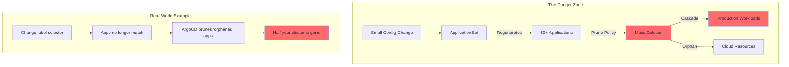

### Scope of the Problem

The testing challenge spans multiple dimensions:

| Dimension | Challenge |
|-----------|-----------|
| **Multi-Cluster** | Changes affect both management cluster (where ArgoCD runs) and workload clusters |
| **Resource Types** | Applications, ApplicationSets, Projects, Repositories, Secrets |
| **Sync Policies** | Auto-sync, prune, self-heal behaviors are hard to predict |
| **Dependencies** | Apps can depend on other apps, creating complex graphs |
| **State** | Testing requires understanding current cluster state vs. desired state |

### Why This Is Hard

1. **No Native Dry-Run**: ArgoCD doesn't have a comprehensive "what-if" analysis mode
2. **State Dependency**: Effects depend on what's currently deployed
3. **Template Expansion**: ApplicationSets generate apps dynamically
4. **Cross-Cluster**: Changes can affect clusters ArgoCD manages remotely
5. **Timing**: Sync waves and hooks create temporal dependencies

---

## Proposed Solutions

### Approach 1: Ephemeral Preview Environments

Create temporary, isolated ArgoCD instances that mirror production configuration to test changes before they reach the real environment.

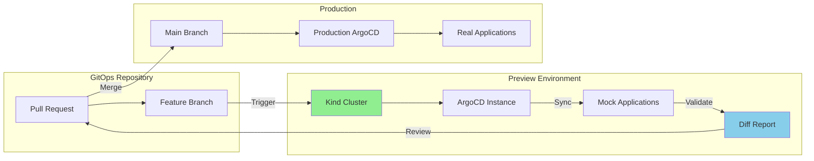

#### How It Works

1. **On PR Creation**: Spin up a local Kind cluster with ArgoCD installed
2. **Mirror Config**: Copy production ArgoCD configuration (sanitized)
3. **Apply Changes**: Apply the proposed changes to the preview ArgoCD
4. **Generate Diff**: Compare what ArgoCD *would* do vs. current state
5. **Report**: Generate human-readable report of all affected resources
6. **Cleanup**: Destroy preview environment after review

#### Implementation Components

```
preview-environment/
├── scripts/
│   ├── create-preview.sh       # Spin up Kind + ArgoCD
│   ├── mirror-config.sh        # Copy sanitized prod config
│   ├── apply-changes.sh        # Apply PR changes
│   ├── generate-diff.sh        # Compute impact analysis
│   └── cleanup.sh              # Tear down environment
├── templates/
│   ├── kind-config.yaml        # Kind cluster configuration
│   ├── argocd-values.yaml      # ArgoCD Helm values for preview
│   └── mock-clusters.yaml      # Fake cluster endpoints
└── ci/
    └── preview-workflow.yaml   # GitHub Actions / GitLab CI
```

#### Pros

| Advantage | Description |
|-----------|-------------|
| **High Fidelity** | Tests against real ArgoCD behavior, not simulations |
| **Full Scope** | Can test ApplicationSets, sync policies, waves, hooks |
| **Isolated** | No risk to production during testing |
| **Reproducible** | Same test can be run multiple times |
| **CI/CD Integration** | Can block merges until preview passes |

#### Cons

| Disadvantage | Description |
|--------------|-------------|
| **Resource Intensive** | Requires spinning up Kubernetes clusters |
| **Slow** | 5-15 minutes to create environment and run tests |
| **State Mismatch** | Preview won't have actual deployed resources |
| **Secrets Handling** | Must sanitize/mock sensitive data |
| **Complexity** | Significant infrastructure to maintain |
| **Cluster Simulation** | Can't fully simulate multi-cluster scenarios |

---

### Approach 2: Static Analysis and Policy Engine

Use static analysis tools and policy engines to validate ArgoCD manifests before they're applied, catching dangerous patterns without running ArgoCD.

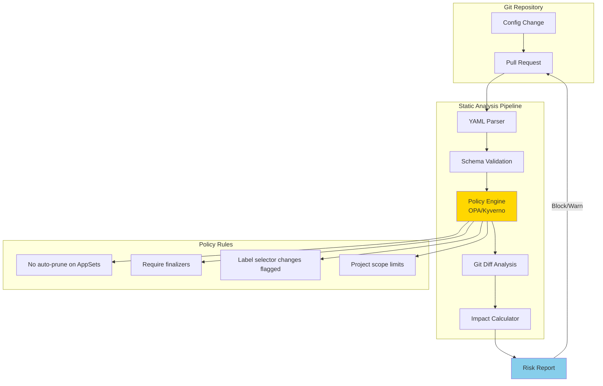

#### How It Works

1. **Schema Validation**: Validate all ArgoCD CRDs against their schemas
2. **Policy Enforcement**: Apply OPA/Kyverno policies for dangerous patterns
3. **Diff Analysis**: Analyze git diff to identify high-risk changes
4. **Impact Calculation**: Estimate blast radius based on selectors and generators
5. **Risk Scoring**: Assign risk scores to changes for human review

#### Policy Examples

```yaml
# Example OPA Policy: Flag ApplicationSet selector changes
package argocd.applicationset

deny[msg] {
    input.kind == "ApplicationSet"
    old_selector := data.old.spec.generators[_].selector
    new_selector := input.spec.generators[_].selector
    old_selector != new_selector
    msg := sprintf("ApplicationSet '%s' selector changed - requires manual review", [input.metadata.name])
}

# Example: Require preservation policy on ApplicationSets
deny[msg] {
    input.kind == "ApplicationSet"
    not input.spec.preserveResourcesOnDeletion
    msg := sprintf("ApplicationSet '%s' must have preserveResourcesOnDeletion: true", [input.metadata.name])
}

# Example: Limit auto-sync with prune
deny[msg] {
    input.kind == "Application"
    input.spec.syncPolicy.automated.prune == true
    input.spec.syncPolicy.automated.selfHeal == true
    not input.metadata.annotations["argocd.argoproj.io/prune-approved"]
    msg := sprintf("Application '%s' has aggressive sync policy without approval annotation", [input.metadata.name])
}
```

#### Implementation Components

```
static-analysis/
├── schemas/
│   ├── application.json        # ArgoCD Application schema
│   ├── applicationset.json     # ApplicationSet schema
│   └── appproject.json         # AppProject schema
├── policies/
│   ├── applicationset.rego     # OPA policies for AppSets
│   ├── application.rego        # OPA policies for Apps
│   ├── project.rego            # OPA policies for Projects
│   └── common.rego             # Shared policy rules
├── analyzers/
│   ├── selector_analyzer.py    # Detect selector changes
│   ├── blast_radius.py         # Calculate impact scope
│   └── dependency_graph.py     # Map app dependencies
└── ci/
    └── analysis-workflow.yaml  # CI pipeline definition
```

#### Pros

| Advantage | Description |
|-----------|-------------|
| **Fast** | Runs in seconds, no cluster needed |
| **Cheap** | No infrastructure costs |
| **Preventive** | Catches issues before they can occur |
| **Customizable** | Policies tailored to your organization |
| **Auditable** | Policy decisions are logged and traceable |
| **Shift Left** | Developers get feedback immediately |

#### Cons

| Disadvantage | Description |
|--------------|-------------|
| **Limited Scope** | Can't test actual ArgoCD behavior |
| **False Positives** | May flag safe changes as dangerous |
| **No State Awareness** | Doesn't know what's currently deployed |
| **Template Blindness** | Can't fully evaluate ApplicationSet generators |
| **Policy Maintenance** | Policies must evolve with ArgoCD versions |
| **Incomplete Coverage** | Some issues only manifest at runtime |

---

### Approach 3: Hybrid Staged Rollout with Canary Testing

Combine static analysis with a staged deployment approach where changes are tested on a subset of targets before full rollout.

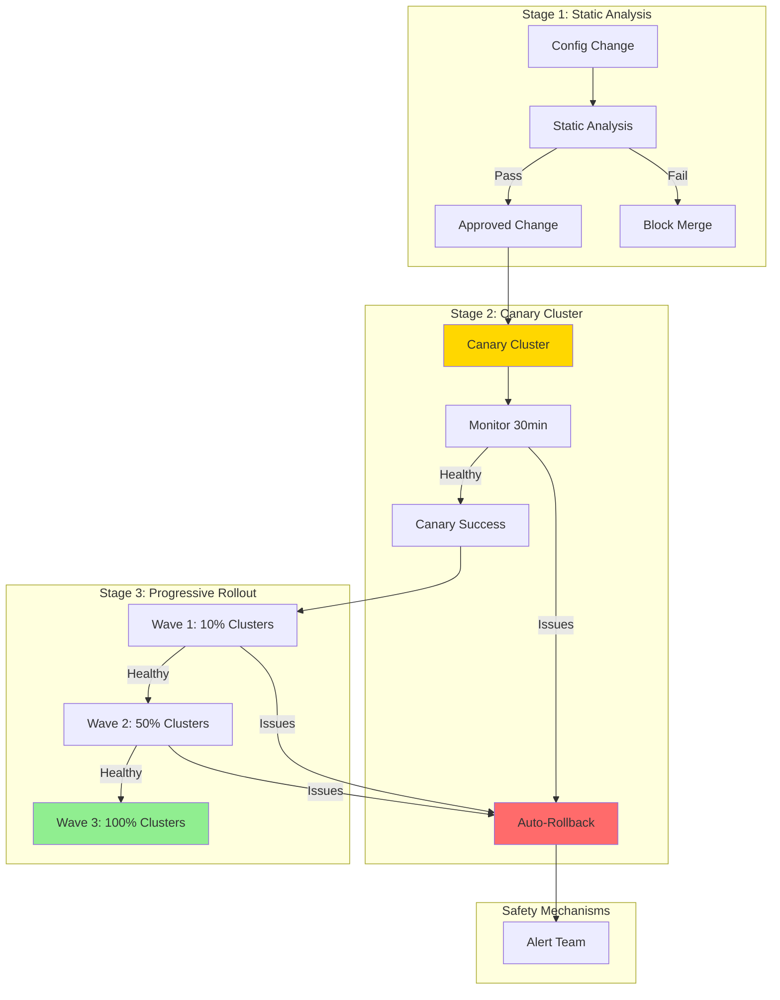

#### How It Works

1. **Static Analysis Gate**: All changes must pass static analysis first
2. **Canary Deployment**: Changes deploy to a designated canary cluster
3. **Health Monitoring**: Automated checks verify cluster health post-change
4. **Progressive Rollout**: If canary is healthy, roll out to more clusters in waves
5. **Automatic Rollback**: Any issues trigger immediate rollback

#### Implementation Components

```
staged-rollout/
├── static-analysis/            # From Approach 2
│   └── ...
├── canary/
│   ├── canary-cluster.yaml     # Canary cluster designation
│   ├── health-checks.yaml      # What to monitor
│   └── rollback-policy.yaml    # When to rollback
├── waves/
│   ├── wave-config.yaml        # Cluster groupings
│   └── promotion-rules.yaml    # When to promote
├── monitoring/
│   ├── alerts.yaml             # Alert definitions
│   └── dashboards/             # Grafana dashboards
└── ci/
    ├── canary-workflow.yaml    # Canary deployment
    └── promotion-workflow.yaml # Wave promotion
```

#### Cluster Wave Configuration Example

```yaml
# wave-config.yaml
waves:
  - name: canary
    clusters:
      - canary-cluster-1
    waitTime: 30m
    healthChecks:
      - type: argocd-sync-status
      - type: pod-health
      - type: custom-metric
        query: "sum(rate(http_errors_total[5m])) < 0.01"
    
  - name: wave-1
    clusters:
      - dev-cluster-1
      - dev-cluster-2
    waitTime: 1h
    requireApproval: false
    
  - name: wave-2
    clusters:
      - staging-cluster-1
      - staging-cluster-2
    waitTime: 2h
    requireApproval: true
    
  - name: wave-3
    clusters:
      - prod-cluster-1
      - prod-cluster-2
      - prod-cluster-3
    waitTime: 0
    requireApproval: true
```

#### Pros

| Advantage | Description |
|-----------|-------------|
| **Defense in Depth** | Multiple layers of protection |
| **Real Testing** | Canary tests against real workloads |
| **Limited Blast Radius** | Issues caught before full rollout |
| **Automatic Recovery** | Rollback without human intervention |
| **Production Confidence** | Changes proven in lower environments first |
| **Flexible** | Can adjust wave sizes and timing |

#### Cons

| Disadvantage | Description |
|--------------|-------------|
| **Slow** | Full rollout takes hours or days |
| **Infrastructure** | Requires dedicated canary cluster |
| **Complexity** | Most complex to implement and maintain |
| **Partial Coverage** | Canary may not exercise all code paths |
| **Drift Risk** | Clusters can drift during staged rollout |
| **Operational Overhead** | Requires monitoring and on-call support |

---

---

### Approach 4: Namespaced Environment Promotion (Dev/Staging/Prod for ArgoCD CRDs)

This approach treats ArgoCD CRDs themselves as deployable artifacts that flow through environments, similar to how applications are promoted. The key insight is that ArgoCD can manage multiple "instances" of the same logical configuration in different namespaces, allowing you to test changes on the same management cluster without affecting production workloads.

```mermaid
flowchart TB
    subgraph "Single Management Cluster"
        subgraph "argocd-dev namespace"
            DevArgo[ArgoCD Dev Instance]
            DevProjects[Dev Projects]
            DevApps[Dev ApplicationSets]
            DevRepos[Dev Repositories]
        end
        
        subgraph "argocd-staging namespace"
            StagingArgo[ArgoCD Staging Instance]
            StagingProjects[Staging Projects]
            StagingApps[Staging ApplicationSets]
            StagingRepos[Staging Repositories]
        end
        
        subgraph "argocd namespace (prod)"
            ProdArgo[ArgoCD Production]
            ProdProjects[Prod Projects]
            ProdApps[Prod ApplicationSets]
            ProdRepos[Prod Repositories]
        end
    end
    
    subgraph "Workload Clusters"
        DevCluster[Dev Workload Cluster]
        StagingCluster[Staging Workload Cluster]
        ProdCluster1[Prod Cluster 1]
        ProdCluster2[Prod Cluster 2]
    end
    
    DevArgo --> DevCluster
    StagingArgo --> StagingCluster
    ProdArgo --> ProdCluster1
    ProdArgo --> ProdCluster2
    
    style DevArgo fill:#90EE90
    style StagingArgo fill:#FFD700
    style ProdArgo fill:#ff9999
```

#### Core Concept: ArgoCD CRDs as Templated, Promotable Artifacts

Instead of having one set of ArgoCD CRDs, you maintain templated versions that render differently per environment:

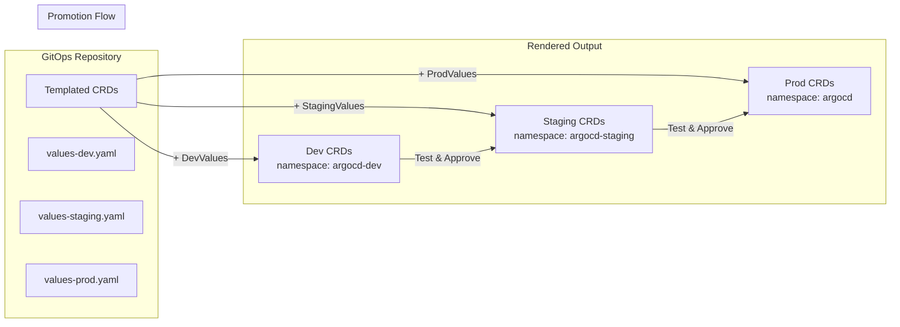

#### How It Works

**1. Multiple ArgoCD Instances on One Cluster**

You run separate ArgoCD instances in different namespaces. Each instance:
- Has its own set of Projects, Repositories, ApplicationSets
- Manages a different set of target clusters (or namespaces within clusters)
- Can be configured with different sync policies and permissions

```yaml
# argocd-dev instance - more permissive, faster sync
apiVersion: argoproj.io/v1alpha1
kind: ArgoCD
metadata:
  name: argocd
  namespace: argocd-dev
spec:
  server:
    route:
      enabled: true
      host: argocd-dev.example.com
  applicationSet:
    enabled: true
  # Dev-specific: aggressive sync for fast feedback
  controller:
    appSync: 30s
```

**2. Templated CRD Structure**

```
gitops-repo/
├── argocd-config/
│   ├── base/                           # Shared templates
│   │   ├── kustomization.yaml
│   │   ├── projects/
│   │   │   └── platform-project.yaml   # Templated Project
│   │   ├── applicationsets/
│   │   │   └── workload-apps.yaml      # Templated ApplicationSet
│   │   └── repositories/
│   │       └── gitops-repo.yaml        # Templated Repository
│   │
│   ├── overlays/
│   │   ├── dev/
│   │   │   ├── kustomization.yaml      # Dev-specific patches
│   │   │   ├── namespace-patch.yaml    # namespace: argocd-dev
│   │   │   └── values-patch.yaml       # Dev cluster targets
│   │   │
│   │   ├── staging/
│   │   │   ├── kustomization.yaml
│   │   │   ├── namespace-patch.yaml    # namespace: argocd-staging
│   │   │   └── values-patch.yaml       # Staging cluster targets
│   │   │
│   │   └── prod/
│   │       ├── kustomization.yaml
│   │       ├── namespace-patch.yaml    # namespace: argocd
│   │       └── values-patch.yaml       # Prod cluster targets
```

**3. Environment-Specific Targeting**

Each environment's ArgoCD instance targets different clusters/namespaces:

```yaml
# base/applicationsets/workload-apps.yaml
apiVersion: argoproj.io/v1alpha1
kind: ApplicationSet
metadata:
  name: workload-applications
  # namespace injected by overlay
spec:
  generators:
    - clusters:
        selector:
          matchLabels:
            environment: "{{environment}}"  # Templated
  template:
    metadata:
      name: '{{name}}-{{cluster}}'
    spec:
      project: "platform-{{environment}}"   # Templated project reference
      source:
        repoURL: '{{metadata.annotations.gitops-repo}}'
        path: 'workloads/{{name}}'
        targetRevision: "{{targetRevision}}" # dev=HEAD, staging=staging, prod=main
      destination:
        server: '{{server}}'
        namespace: '{{namespace}}'
```

```yaml
# overlays/dev/values-patch.yaml
apiVersion: argoproj.io/v1alpha1
kind: ApplicationSet
metadata:
  name: workload-applications
spec:
  generators:
    - clusters:
        selector:
          matchLabels:
            environment: "dev"
  template:
    spec:
      project: "platform-dev"
      source:
        targetRevision: "HEAD"  # Dev tracks latest commits
```

```yaml
# overlays/prod/values-patch.yaml
apiVersion: argoproj.io/v1alpha1
kind: ApplicationSet
metadata:
  name: workload-applications
spec:
  generators:
    - clusters:
        selector:
          matchLabels:
            environment: "prod"
  template:
    spec:
      project: "platform-prod"
      source:
        targetRevision: "main"  # Prod only deploys from main branch
```

**4. Project Isolation**

Each environment has its own ArgoCD Project with appropriate permissions:

```yaml
# base/projects/platform-project.yaml
apiVersion: argoproj.io/v1alpha1
kind: AppProject
metadata:
  name: platform-{{environment}}
spec:
  description: "Platform services for {{environment}}"
  sourceRepos:
    - '*'
  destinations:
    - namespace: '*'
      server: '{{destinationServer}}'  # Templated per environment
  clusterResourceWhitelist:
    - group: '*'
      kind: '*'
```

**5. Promotion Workflow**

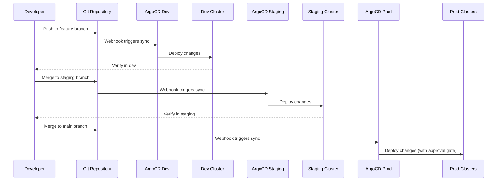

#### Management Cluster Self-Management Pattern

For changes that affect the management cluster itself (where ArgoCD runs), use a special "bootstrap" pattern:

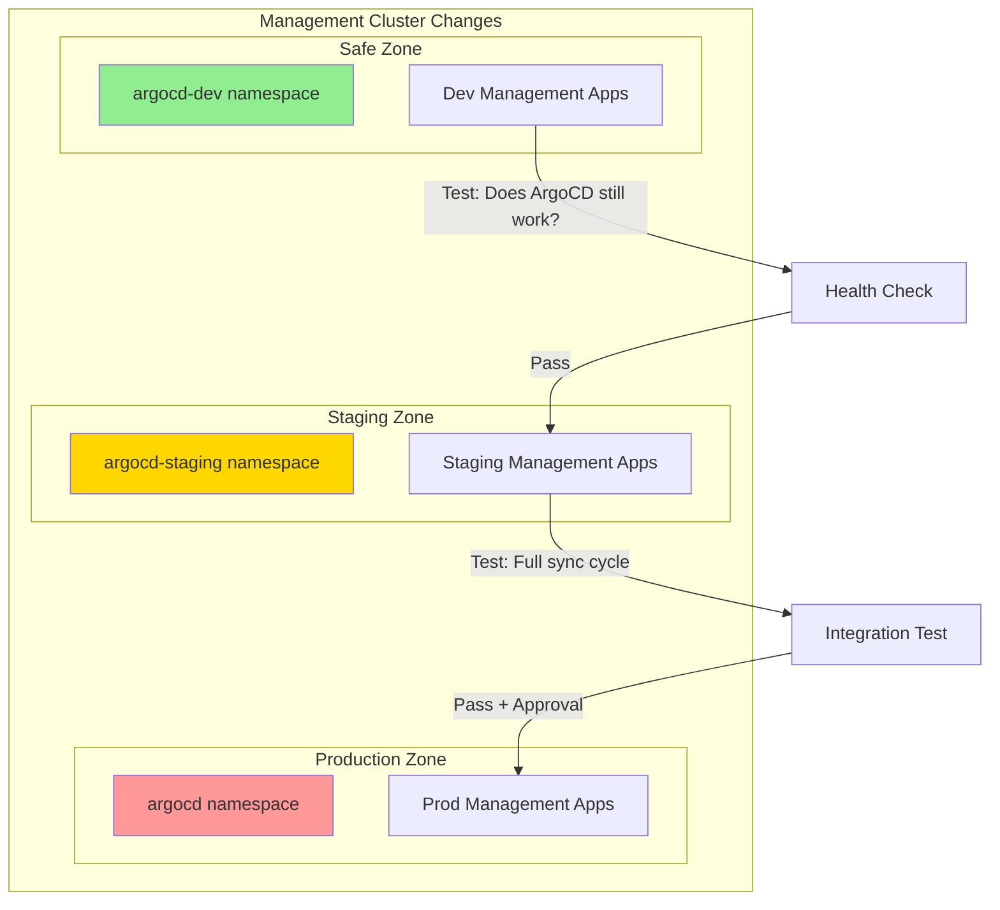

```yaml
# Management cluster self-management ApplicationSet
apiVersion: argoproj.io/v1alpha1
kind: ApplicationSet
metadata:
  name: management-cluster-services
  namespace: argocd-{{environment}}
spec:
  generators:
    - list:
        elements:
          - name: crossplane
            namespace: crossplane-system
          - name: cert-manager
            namespace: cert-manager
          - name: external-secrets
            namespace: external-secrets
  template:
    metadata:
      name: 'mgmt-{{name}}-{{environment}}'
    spec:
      project: management-{{environment}}
      source:
        repoURL: https://github.com/org/gitops-repo
        path: 'management-cluster/{{name}}'
        targetRevision: '{{targetRevision}}'
      destination:
        server: https://kubernetes.default.svc  # Same cluster
        namespace: '{{namespace}}-{{environment}}'  # Namespaced!
      syncPolicy:
        automated:
          prune: "{{pruneEnabled}}"  # false for dev, true for prod
          selfHeal: true
```

#### Key Design Decisions

**Namespace Isolation Strategy**

| Component | Dev | Staging | Prod |
|-----------|-----|---------|------|
| ArgoCD Instance | `argocd-dev` | `argocd-staging` | `argocd` |
| Projects | `*-dev` suffix | `*-staging` suffix | No suffix |
| Target Clusters | Dev clusters only | Staging clusters | Prod clusters |
| Git Branch | `HEAD` / feature | `staging` | `main` |
| Sync Policy | Aggressive | Moderate | Conservative |
| Prune | Disabled | Enabled | Enabled + Approval |

**Branch-to-Environment Mapping**

```yaml
# Git branch strategy
branches:
  feature/*:
    deploys_to: dev
    auto_sync: true
    prune: false
    
  staging:
    deploys_to: staging
    auto_sync: true
    prune: true
    requires: dev_tests_pass
    
  main:
    deploys_to: prod
    auto_sync: false  # Manual approval required
    prune: true
    requires: 
      - staging_tests_pass
      - manual_approval
```

#### Implementation Components

```
namespaced-environments/
├── argocd-instances/
│   ├── dev/
│   │   ├── argocd-install.yaml      # ArgoCD CR for dev instance
│   │   ├── ingress.yaml             # argocd-dev.example.com
│   │   └── rbac.yaml                # Dev RBAC (more permissive)
│   ├── staging/
│   │   ├── argocd-install.yaml
│   │   ├── ingress.yaml
│   │   └── rbac.yaml
│   └── prod/
│       ├── argocd-install.yaml
│       ├── ingress.yaml
│       └── rbac.yaml                # Prod RBAC (restrictive)
│
├── argocd-config/
│   ├── base/                        # Templated CRDs
│   └── overlays/                    # Environment-specific
│       ├── dev/
│       ├── staging/
│       └── prod/
│
├── cluster-secrets/
│   ├── dev-clusters.yaml            # Cluster credentials for dev
│   ├── staging-clusters.yaml
│   └── prod-clusters.yaml
│
└── promotion/
    ├── promote-to-staging.sh        # Merge dev → staging
    ├── promote-to-prod.sh           # Merge staging → main
    └── rollback.sh                  # Emergency rollback
```

#### Handling the "ArgoCD Managing Itself" Problem

The trickiest part is when ArgoCD needs to manage its own configuration. Here's a safe pattern:

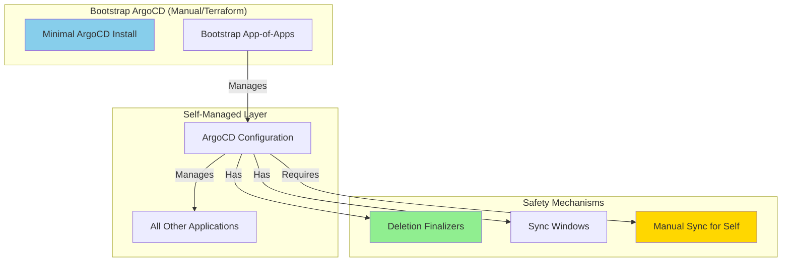

```yaml
# The "App of Apps" that manages ArgoCD itself
apiVersion: argoproj.io/v1alpha1
kind: Application
metadata:
  name: argocd-self-manage
  namespace: argocd
  # CRITICAL: Finalizer prevents accidental deletion
  finalizers:
    - resources-finalizer.argocd.argoproj.io
spec:
  project: argocd-system
  source:
    repoURL: https://github.com/org/gitops-repo
    path: argocd-config/overlays/prod
    targetRevision: main
  destination:
    server: https://kubernetes.default.svc
    namespace: argocd
  syncPolicy:
    # CRITICAL: No auto-sync for self-management
    automated: null
    syncOptions:
      - CreateNamespace=false
      - PrunePropagationPolicy=foreground
      - PruneLast=true
```

#### Pros

| Advantage | Description |
|-----------|-------------|
| **Single Cluster** | No need for separate management clusters per environment |
| **Real Testing** | Test on actual management cluster, not simulation |
| **Familiar Pattern** | Dev/staging/prod is well-understood by teams |
| **Gradual Rollout** | Changes proven in dev before reaching prod |
| **Isolation** | Namespace boundaries prevent cross-contamination |
| **Git-Native** | Promotion is just branch merges |
| **Auditable** | Git history shows exactly what changed when |
| **Rollback** | Git revert rolls back configuration |

#### Cons

| Disadvantage | Description |
|--------------|-------------|
| **Resource Overhead** | Multiple ArgoCD instances consume cluster resources |
| **Complexity** | More moving parts to understand and maintain |
| **Drift Risk** | Environments can drift if promotion is delayed |
| **Template Complexity** | Kustomize/Helm overlays add abstraction |
| **Cluster Credentials** | Each ArgoCD instance needs cluster secrets |
| **Not Full Isolation** | All instances share management cluster resources |
| **Namespace Conflicts** | Must carefully manage namespace naming |

#### When to Use This Approach

This approach is ideal when:
- You have a single management cluster that can't be replicated
- You want to test ArgoCD CRD changes before they affect production
- Your team is comfortable with GitOps promotion workflows
- You need to manage both management cluster services AND workload clusters
- You want the safety of staged rollout without infrastructure duplication

---

## Comparison Matrix

| Criteria | Approach 1: Preview Env | Approach 2: Static Analysis | Approach 3: Hybrid Staged | Approach 4: Namespaced Envs |
|----------|------------------------|----------------------------|--------------------------|----------------------------|
| **Implementation Effort** | High | Medium | Very High | Medium-High |
| **Ongoing Maintenance** | Medium | Low | High | Medium |
| **Feedback Speed** | 5-15 min | Seconds | Hours-Days | Minutes-Hours |
| **Accuracy** | High | Medium | Very High | High |
| **Infrastructure Cost** | Medium | None | High | Low-Medium |
| **Multi-Cluster Testing** | Limited | None | Full | Full |
| **State Awareness** | Partial | None | Full | Full |
| **Risk Reduction** | High | Medium | Very High | High |
| **CI/CD Integration** | Good | Excellent | Good | Excellent |
| **Developer Experience** | Good | Excellent | Fair | Good |
| **Mgmt Cluster Safety** | Good | Limited | N/A (needs multiple) | Excellent |
| **Single Cluster Viable** | Yes | Yes | No | Yes |

---

## Recommendation

### For Single Management Cluster Scenarios

If you have a single management cluster (the most common case), I recommend **Approach 4 (Namespaced Environments)** combined with **Approach 2 (Static Analysis)**:

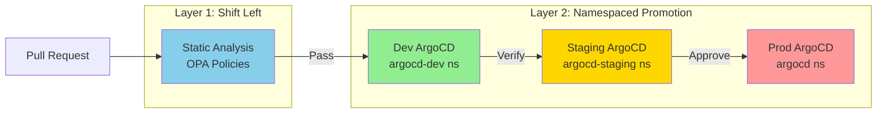

This combination gives you:
- **Fast feedback** from static analysis (seconds)
- **Real testing** on actual management cluster infrastructure
- **Safe promotion** through dev → staging → prod
- **No additional clusters** required

### Recommended Implementation Roadmap

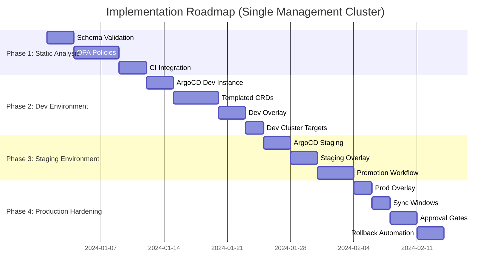

### Phase Details

**Phase 1: Static Analysis Foundation (Week 1-2)**
- Implement schema validation for all ArgoCD CRDs
- Create OPA policies for high-risk patterns:
  - ApplicationSet selector changes require review
  - Prune policies must have approval annotations
  - Project destination changes are flagged
- Integrate into CI/CD to block dangerous merges

**Phase 2: Dev Environment (Week 2-4)**
- Deploy ArgoCD instance in `argocd-dev` namespace
- Create Kustomize base templates for all CRDs
- Create dev overlay with:
  - `namespace: argocd-dev` patches
  - Dev cluster targeting
  - Aggressive sync (30s interval)
  - Prune disabled for safety
- Point dev ArgoCD at dev/test workload clusters

**Phase 3: Staging Environment (Week 4-6)**
- Deploy ArgoCD instance in `argocd-staging` namespace
- Create staging overlay with:
  - Staging cluster targeting
  - Moderate sync (3m interval)
  - Prune enabled
- Implement promotion workflow:
  - Merge to `staging` branch triggers staging sync
  - Health checks validate staging deployment
  - Manual approval gate for prod promotion

**Phase 4: Production Hardening (Week 6-8)**
- Create prod overlay (uses existing `argocd` namespace)
- Implement sync windows (maintenance windows only)
- Add approval gates for production changes
- Create rollback automation scripts
- Document runbooks for common scenarios

### For Multi-Cluster Scenarios

If you have multiple management clusters (rare but possible), you can combine Approach 4 with Approach 3:
- Use namespaced environments within each management cluster
- Use staged rollout across management clusters
- Canary management cluster gets changes first

---

## Next Steps

1. **Discuss**: Review this analysis and decide which approach(es) to pursue
2. **Scope**: Define which ArgoCD resources are highest priority
3. **Requirements**: Create detailed requirements for chosen approach
4. **Design**: Develop technical design with specific tooling choices
5. **Implement**: Build incrementally with testing at each stage

---

## Questions for Discussion

1. **Cluster topology**: How many workload clusters does ArgoCD manage? Do you have separate dev/staging/prod workload clusters already?
2. **Feedback time**: What's the acceptable feedback time for developers? (Seconds for static analysis, minutes for dev environment sync)
3. **Existing tooling**: Do you have existing OPA/Kyverno infrastructure? What CI/CD platform are you using?
4. **Risk tolerance**: How aggressive should safety measures be? Should prod changes require manual approval?
5. **Resource constraints**: Can the management cluster handle 2-3 ArgoCD instances? (Each is ~500MB RAM)
6. **Branch strategy**: Do you already have a dev/staging/main branch workflow, or would this be new?
7. **Management cluster services**: What services run on the management cluster that ArgoCD manages? (Crossplane, cert-manager, external-secrets, etc.)
8. **Self-management**: Should ArgoCD manage its own configuration, or should that be handled separately (Terraform, manual)?
