# ArgoCD CRD Testing - Decision Log

## Overview

This document captures the decisions made while planning the implementation of safe ArgoCD CRD testing and promotion workflows. It references the analysis in `argocd-testing-analysis.md` (frozen reference document).

> **Note**: This document is for historical context and decision rationale. The source of truth for implementation is:
> - `argocd-crd-testing-requirements.md` - Requirements for all phases
> - `argocd-crd-testing-design.md` - Design for all phases

## Context

We are designing a system to safely test changes to ArgoCD CRDs (ApplicationSets, Applications, Projects, Repositories) before they affect production workloads. The primary concern is preventing cascading errors where small configuration changes unintentionally delete or break production applications.

### Key Constraint

We have a **single management cluster** where ArgoCD runs. This rules out approaches that require multiple management clusters for canary testing.

---

## Bootstrap Workflow Context

Understanding the bootstrap workflow is essential context for designing the ArgoCD CRD testing approach. The management cluster is created through a multi-phase bootstrap process orchestrated by the `mk8` tool.

### High-Level Bootstrap Flow

```mermaid
flowchart LR
    subgraph "Phase 1: Local Bootstrap"
        User[User Machine]
        Kind[Kind Cluster]
        User --> |mk8 creates| Kind
    end
    
    subgraph "Phase 2: Cloud Provisioning"
        Kind --> |Crossplane creates| MgmtCluster[Management Cluster]
        Kind --> |ArgoCD syncs| GitOps[GitOps Repo]
    end
    
    subgraph "Phase 3: Handoff"
        MgmtCluster --> |Self-manages via| MgmtArgo[ArgoCD on Mgmt]
        Kind --> |Deleted| Gone[🗑️]
    end
    
    subgraph "Phase 4: Steady State"
        MgmtArgo --> |Manages| MgmtCluster
        MgmtArgo --> |Creates| Workloads[Workload Clusters]
    end
    
    style Kind fill:#87CEEB
    style MgmtCluster fill:#90EE90
    style Gone fill:#ffcccc
```

### Detailed Bootstrap Sequence

#### Phase 1: Ephemeral Bootstrap Cluster Creation

The user runs `mk8` on their local machine. The orchestrator creates a Kind (Kubernetes in Docker) cluster that serves as a temporary bootstrap environment.

**State after Phase 1:**
- Kind cluster running locally with Crossplane and ArgoCD installed
- User has provided cloud and git credentials
- No cloud resources exist yet

#### Phase 2: GitOps Repository Setup and Cloud Provisioning

The orchestrator creates/configures the GitOps repository and begins provisioning the management cluster in the cloud.

**State after Phase 2:**
- GitOps repository exists with bootstrap configuration
- Management cluster is being provisioned in the cloud
- ArgoCD on Kind is syncing from GitOps repo
- Crossplane on Kind is creating cloud resources

#### Phase 3: Control Handoff

Once the management cluster has enough capability to manage itself, control is transferred from the ephemeral Kind cluster to the permanent management cluster.

**Handoff Criteria (before Kind can be deleted):**
- ArgoCD running on management cluster
- Crossplane running on management cluster
- Management cluster ArgoCD connected to GitOps repo
- Core services installed and healthy
- Management cluster can provision its own resources

#### Phase 4: Ephemeral Cluster Deletion and Steady State

The Kind cluster is deleted, and the management cluster continues building itself from the GitOps repository.

**Steady State:**
- No local Kind cluster (deleted)
- Management cluster is fully self-managing
- ArgoCD on management cluster watches GitOps repo
- Crossplane on management cluster provisions workload clusters
- All changes flow through GitOps repository

#### Phase 5: Ongoing Workload Cluster Management

After the management cluster is operational and self-managing, the `mk8` orchestrator continues to serve as the primary interface for managing workload clusters. Users interact with `mk8` to create, maintain, and delete workload clusters without needing to directly manipulate Crossplane resources or the GitOps repository.

**mk8 Workload Cluster Operations:**

| Operation | What mk8 Does | What Happens in GitOps |
|-----------|---------------|------------------------|
| `mk8 cluster create` | Generates cluster definition, commits to GitOps repo | ArgoCD syncs, Crossplane provisions new cluster |
| `mk8 cluster list` | Queries management cluster for cluster status | Reads from Crossplane/ArgoCD state |
| `mk8 cluster update` | Modifies cluster definition, commits change | ArgoCD syncs, Crossplane applies updates |
| `mk8 cluster delete` | Removes cluster definition from GitOps repo | ArgoCD syncs, Crossplane deprovisions cluster |

**Key Points:**
- `mk8` is the user-facing interface; users don't need to know GitOps/Crossplane details
- All cluster operations flow through the GitOps repository (audit trail)
- ArgoCD and Crossplane do the actual work; `mk8` orchestrates
- Same pattern applies to cluster updates and deletions
- `mk8` can also install common services on workload clusters via ArgoCD ApplicationSets

### Bootstrap Timeline Visualization

### Implications for ArgoCD CRD Testing

This bootstrap workflow has several implications for our testing approach:

1. **GitOps Repository is Central**: All configuration flows through the GitOps repository. This is where our templated ArgoCD CRDs will live.

2. **Bootstrap vs. Steady-State**: During bootstrap, the Kind cluster's ArgoCD is in control. After handoff, the management cluster's ArgoCD takes over. Our testing approach focuses on the **steady-state** scenario.

3. **Single Management Cluster**: After bootstrap, there is exactly one management cluster. This reinforces why we chose Approach 4 (Namespaced Environments) - we can't spin up additional management clusters for testing.

4. **ArgoCD Self-Management**: The management cluster's ArgoCD manages itself via the GitOps repo. This is the "ArgoCD managing itself" pattern we need to handle carefully.

5. **Workload Clusters are Downstream**: The management cluster provisions and manages workload clusters. Changes to ArgoCD CRDs can affect both the management cluster AND all workload clusters.

This is why we need the namespaced environment approach - to test changes in `argocd-dev` before they reach the production `argocd` namespace that controls everything.

---

## Decisions Made

### Decision 1: Phased Implementation Approach (4 Phases)

**Decision**: Implement in four sequential phases, each building on the previous:

| Phase | Scope | Approach | Focus |
|-------|-------|----------|-------|
| 1 | Management Cluster | Namespaced Environments (Approach 4) | Safe testing of ArgoCD CRD changes on the single management cluster |
| 2 | Both Cluster Types | Basic Static Analysis | Schema validation + basic safety policies (~3-4 days effort) |
| 3 | Workload Clusters | Canary Deployment (Approach 3) | Progressive rollout across multiple workload clusters |
| 4 | Both Cluster Types | Advanced Static Analysis | Change detection policies, blast radius analysis |

**Rationale**:
- Phase 1 first because management cluster is the foundation—if it breaks, everything breaks
- Phase 2 second to get quick wins from schema validation and basic safety policies with minimal effort
- Phase 3 third because workload cluster canary requires stable management cluster and benefits from basic static analysis
- Phase 4 last to add more sophisticated (but more complex) static analysis capabilities
- Sequential (not parallel) to manage complexity
- Splitting static analysis into basic (Phase 2) and advanced (Phase 4) allows early value while keeping complex features on the roadmap

---

### Decision 2: Management Cluster Testing Approach

**Decision**: Use **Approach 4 (Namespaced Environment Promotion)** for the management cluster

**Implementation**:
- Three ArgoCD namespaces: `argocd-dev`, `argocd-staging`, `argocd` (prod)
- Templated ArgoCD CRDs using Kustomize base + overlays
- Each namespace contains its own ArgoCD configuration resources

**Trade-offs Accepted**:
- Resource overhead of multiple ArgoCD instances (~500MB RAM each)
- Complexity of Kustomize templating for CRDs
- Need to manage namespace isolation carefully

---

### Decision 3: Branch Strategy

**Decision**: Feature branches → `staging` branch → `main` branch

| Branch | Environment | Deployment |
|--------|-------------|------------|
| Feature branches (`feature/*`, `fix/*`, etc.) | Dev (`argocd-dev`) | Automatic on push |
| `staging` | Staging (`argocd-staging`) | PR required to merge |
| `main` | Production (`argocd`) | PR required to merge |

**Notes**:
- PRs to `staging` and `main` may trigger additional validations (CI/CD, approvals) not defined in this context
- Feature branches represent "dev" environment in the dev/staging/prod model

---

### Decision 4: ArgoCD Bootstrap and Self-Management

**Decision**: **Hybrid approach** - Bootstrap via mk8 orchestrator, day-2 management via namespaced ArgoCD

**How it works**:
1. `mk8` orchestrator creates ephemeral Kind cluster
2. `mk8` installs initial ArgoCD and Crossplane on Kind cluster
3. Kind cluster provisions management cluster in cloud
4. `mk8` installs initial ArgoCD on management cluster (via Kind)
5. After handoff, ArgoCD configuration is managed via the dev/staging/prod namespaced approach
6. ArgoCD does NOT manage its own installation (only its configuration/CRDs)

**What mk8 manages**: ArgoCD and Crossplane installation/upgrades
**What GitOps manages**: ArgoCD configuration (Applications, ApplicationSets, Projects, Repositories)

---

### Decision 5: Target Environment Context

**Decision**: This is a **platform service cluster** for development, testing, and demos

**Primary users**:
- Developers
- Product owners
- Customers and upper management (for demos)

**Workload characteristics**:
- Most applications are dev/test/demo—deployed elsewhere for production
- Some utility programs with internal and cross-organizational use
- Availability requirements: Minutes of downtime acceptable during business hours, hours acceptable nights/weekends

**Data durability**:
- Cloud-managed resources (managed databases, blob storage)
- Automatic backups provided by cloud services
- No special HA design required

---

### Decision 6: CI/CD Platform

**Decision**: **Deferred** - Platform not yet selected

**Constraints**:
- Will be a modern platform (Jenkins, GitHub Actions, GitLab CI, Argo Workflows, or similar)
- Must support webhooks (trigger and receive)
- Must have rich API for integration
- Design should be platform-agnostic where possible

---

## Pending Decisions

The following decisions are deferred to the design phase of their respective implementation phases:

### Deferred to Phase 2: Basic Static Analysis

- Static analysis tooling selection (OPA/Conftest, Kyverno CLI, custom, or combination)
- Specific basic safety policies to implement
- CI/CD integration patterns

### Deferred to Phase 3: Workload Cluster Canary

- Canary scope definition (dedicated canary cluster vs. environment-based vs. rotating)
- Wave configuration and timing
- Health check criteria
- Rollback automation approach

### Deferred to Phase 4: Advanced Static Analysis

- Change detection implementation approach
- Blast radius calculation methodology
- Integration with existing tooling from Phase 2

---

## Implementation Phases (Finalized - 4 Phases)

### Phase 1: Management Cluster Namespaced Environments

**Goal**: Enable safe testing of ArgoCD CRD changes on the management cluster using dev/staging/prod namespace isolation.

**Scope**:
- Kustomize base templates for ArgoCD CRDs (Applications, ApplicationSets, Projects, Repositories)
- Environment overlays (dev, staging, prod) with namespace patching
- ArgoCD instances in `argocd-dev` and `argocd-staging` namespaces (prod uses existing `argocd`)
- Promotion workflow: feature branch → staging branch (PR) → main branch (PR)
- Integration with mk8 bootstrap process

**Out of Scope**:
- Static analysis (Phases 2 and 4)
- Workload cluster management (Phase 3)
- CI/CD platform-specific implementation

**Deliverables**:
- GitOps repository structure for templated ArgoCD CRDs
- Kustomize base and overlay configurations
- ArgoCD instance configurations for dev/staging namespaces
- Documentation for promotion workflow
- Updates to mk8 bootstrap to support this structure

---

### Phase 2: Basic Static Analysis

**Goal**: Add fast feedback loop to catch obvious errors and dangerous patterns before deployment.

**Scope**:
- Schema validation for ArgoCD CRDs (Level 1 - trivial to implement)
- Basic safety policies (Level 2 - ~5-10 policies, 1-2 days effort)
- CI/CD integration to validate PRs
- Coverage for both management cluster and workload cluster configurations

**Example Basic Safety Policies**:
- ApplicationSet must have `preserveResourcesOnDeletion: true`
- Application with `prune: true` must have approval annotation
- Project destinations cannot be `*`
- Repository URLs must match allowed patterns
- Application `targetRevision` cannot be empty

**Out of Scope**:
- Change detection policies (Phase 4)
- Blast radius analysis (Phase 4)
- Workload cluster canary deployment (Phase 3)

**Deliverables**:
- Schema validation configuration
- Basic safety policy definitions
- CI/CD workflow templates (platform-agnostic)
- Documentation for policy authoring and maintenance

**Estimated Effort**: ~3-4 days

---

### Phase 3: Workload Cluster Canary Deployment

**Goal**: Enable progressive rollout of changes across multiple workload clusters.

**Scope**:
- Canary cluster designation strategy
- Wave-based rollout configuration
- Health monitoring and promotion criteria
- Rollback automation
- Integration with basic static analysis from Phase 2

**Out of Scope**:
- Management cluster changes (covered by Phase 1)
- Advanced static analysis (Phase 4)

**Deliverables**:
- Canary deployment configuration
- Wave definitions
- Health check configurations
- Rollback procedures
- Documentation and runbooks

---

### Phase 4: Advanced Static Analysis

**Goal**: Add sophisticated change detection and impact analysis capabilities.

**Scope**:
- Change detection policies (Level 3 - compare old vs. new, flag dangerous field changes)
- Blast radius analysis (Level 4 - estimate impact of changes)
- Enhanced CI/CD integration
- Custom tooling as needed

**Example Advanced Capabilities**:
- Detect label selector changes in ApplicationSets
- Flag project destination changes
- Calculate "this change affects N applications across M clusters"
- Warn about changes to sync policies

**Out of Scope**:
- Basic functionality (covered by Phases 1-3)

**Deliverables**:
- Change detection policies/tooling
- Blast radius analysis tooling
- Enhanced CI/CD workflows
- Documentation

**Estimated Effort**: 1-2 weeks (significantly more complex than Phase 2)
- Rollback procedures
- Documentation and runbooks

---

## Discussion Log

*Record of key discussion points and their outcomes*

### 2025-12-06: Initial Analysis Review

**Topic**: Management cluster testing challenge

**Discussion**: The user raised concern about testing changes that affect the management cluster itself, since it cannot be easily replicated or canaried.

**Outcome**: Proposed Approach 4 (Namespaced Environment Promotion) which allows testing on the same management cluster using namespace isolation. This was accepted as the primary approach.

---

### 2025-12-06: Bootstrap Workflow Context

**Topic**: Understanding the mk8 bootstrap process

**Discussion**: User provided detailed context about how the management cluster is created:
1. mk8 creates ephemeral Kind cluster locally
2. Kind cluster runs Crossplane and ArgoCD to provision management cluster in cloud
3. Control hands off to management cluster's ArgoCD
4. Kind cluster is deleted
5. mk8 continues to be used for workload cluster lifecycle management

**Outcome**: Added comprehensive bootstrap workflow documentation with diagrams to the decisions document. This context is essential for understanding why there's only one management cluster and how ArgoCD configuration management fits into the overall system.

---

### 2025-12-06: Phased Implementation Approach

**Topic**: Sequencing of implementation phases

**Discussion**: User proposed three phases:
1. Management cluster (namespaced environments)
2. Workload clusters (canary deployment)
3. Static analysis (both cluster types)

AI suggested swapping phases 2 and 3, putting static analysis before workload canary because:
- Static analysis is lower complexity
- Provides immediate value for both cluster types
- Workload canary benefits from having static analysis in place

AI also suggested parallel implementation of static analysis, but user declined due to complexity concerns.

**Outcome**: Agreed on sequential phases:
1. Phase 1: Management Cluster (Namespaced Environments)
2. Phase 2: Static Analysis (Both Cluster Types)
3. Phase 3: Workload Clusters (Canary Deployment)

---

### 2025-12-06: Branch Strategy and ArgoCD Management

**Topic**: Git branch strategy and ArgoCD self-management

**Discussion**: User clarified:
- Branch strategy: Feature branches (dev) → `staging` branch → `main` branch
- PRs required for staging and main merges
- ArgoCD installation managed by mk8 orchestrator (not self-managed)
- ArgoCD configuration (CRDs) managed via GitOps with namespaced environments

**Outcome**: Documented hybrid approach where mk8 handles ArgoCD installation/upgrades, and GitOps handles ArgoCD configuration through the dev/staging/prod namespace pattern.

---

### 2025-12-06: Target Environment Context

**Topic**: Understanding the use case and availability requirements

**Discussion**: User clarified this is a platform service cluster for:
- Development, testing, and demos
- Primary users: developers, product owners, customers/management (demos)
- Some utility programs with internal/cross-org use
- Availability: Minutes of downtime OK during business hours, hours OK nights/weekends
- Data durability via cloud-managed resources with automatic backups

**Outcome**: Documented target environment context. This informs decisions about how aggressive safety mechanisms need to be (moderate, not extreme) and confirms that the phased approach is appropriate for this use case.

---

### 2025-12-06: CI/CD Platform

**Topic**: CI/CD platform selection

**Discussion**: Platform not yet decided. Will be something like Jenkins, GitHub Actions, GitLab CI, or Argo Workflows.

**Outcome**: Decision deferred. Design should be platform-agnostic where possible, assuming modern platform with webhook support and rich API.

---

### 2025-12-06: Static Analysis Complexity and 4-Phase Approach

**Topic**: Understanding static analysis complexity and refining phase structure

**Discussion**: User asked about the complexity of implementing static analysis. AI explained four levels:
1. **Level 1 - Schema Validation**: Very easy (~1-2 hours), off-the-shelf tooling
2. **Level 2 - Basic Safety Policies**: Easy-medium (~1-2 days), 5-10 policies
3. **Level 3 - Change Detection**: Medium (~3-5 days), requires git diff analysis
4. **Level 4 - Blast Radius Analysis**: Hard (~1-2 weeks), custom tooling required

User decided to split static analysis into two phases to get early value from easy wins while keeping advanced capabilities on the roadmap.

**Outcome**: Revised to 4-phase approach:
1. Phase 1: Management Cluster Namespaced Environments
2. Phase 2: Basic Static Analysis (Schema + Safety Policies, ~3-4 days)
3. Phase 3: Workload Cluster Canary Deployment
4. Phase 4: Advanced Static Analysis (Change Detection + Blast Radius)

---

### 2025-12-06: Documentation Structure

**Topic**: Creating authoritative requirements and design documents

**Discussion**: User requested creation of requirements and design documents that will serve as the source of truth for implementation. Key points:
- Phase 1 requirements and design should be complete and self-consistent
- Phases 2, 3, 4 requirements captured but acknowledged as needing further refinement
- This decisions document becomes context-only, not source of truth
- Different AI tool will handle detailed design and implementation

**Outcome**: 
- Updated this document's frontmatter to indicate it's context-only
- Creating `argocd-crd-testing-requirements.md` with requirements for all 4 phases
- Creating `argocd-crd-testing-design.md` with design for all 4 phases
- Phase 1 fully specified; Phases 2-4 captured but marked as needing refinement
