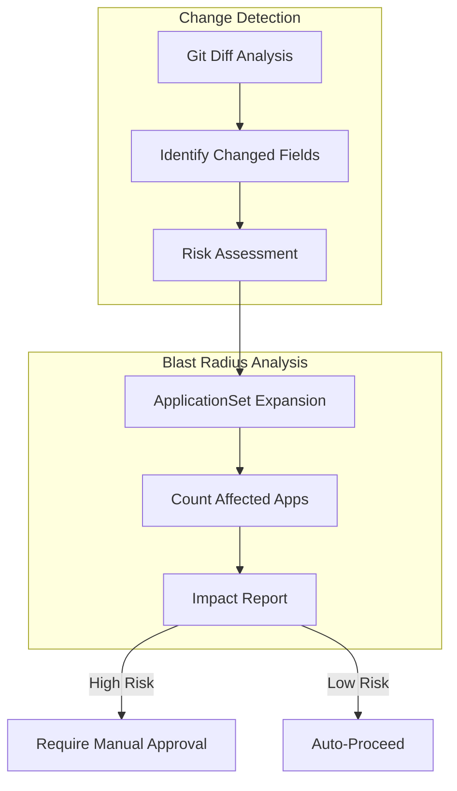

# Design Document: ArgoCD CRD Advanced Static Analysis

## Document Status

**Status**: 📝 DRAFT - Concepts captured, needs detailed design

## Related Documents

- **Requirements**: `requirements.md` in this directory
- **Architecture Decisions**: 
  - `.claude/architecture/ADR-001-argocd-testing-approaches-analysis.md`
  - `.claude/architecture/ADR-002-argocd-testing-implementation-strategy.md`
- **Prerequisites**: 
  - `.claude/specs/argocd-gitops-promotion/` (Phase 1)
  - `.claude/specs/argocd-crd-basic-static/` (Phase 2)
  - `.claude/specs/workload-cluster-gitops/` (Phase 3)

---

## Overview

This document describes the conceptual design for implementing advanced static analysis capabilities including change detection and blast radius analysis.

### Conceptual Design

---

## Change Detection Concept

Detect changes to high-risk fields:
- ApplicationSet `spec.generators[*].selector`
- AppProject `spec.destinations`
- Application `spec.syncPolicy`
- Repository `spec.url`

---

## Blast Radius Analysis Concept

For ApplicationSet changes:
1. Parse the old and new ApplicationSet
2. Simulate template expansion for both
3. Compare generated Applications
4. Report: "This change affects N applications across M clusters"

---

## Implementation Complexity

This phase requires custom tooling:
- Git diff parsing
- ApplicationSet template simulation
- State comparison logic
- Report generation

Estimated effort: 1-2 weeks

---

## Security Considerations

- Analysis results may reveal infrastructure details
- Reports should be access-controlled
- Custom tooling must be secure

---

## Testing Strategy

- Blast radius calculation accuracy tests
- Change detection coverage tests
- Report generation tests

---

## Notes for Detailed Design

Before implementation, the following needs detailed design:

1. **Diff Parsing**: How to extract meaningful changes from git diff
2. **Template Simulation**: How to expand ApplicationSet templates without ArgoCD
3. **Impact Calculation**: Algorithm for counting affected resources
4. **Report Format**: Human-readable and machine-readable formats
5. **Threshold Configuration**: How to configure risk levels
