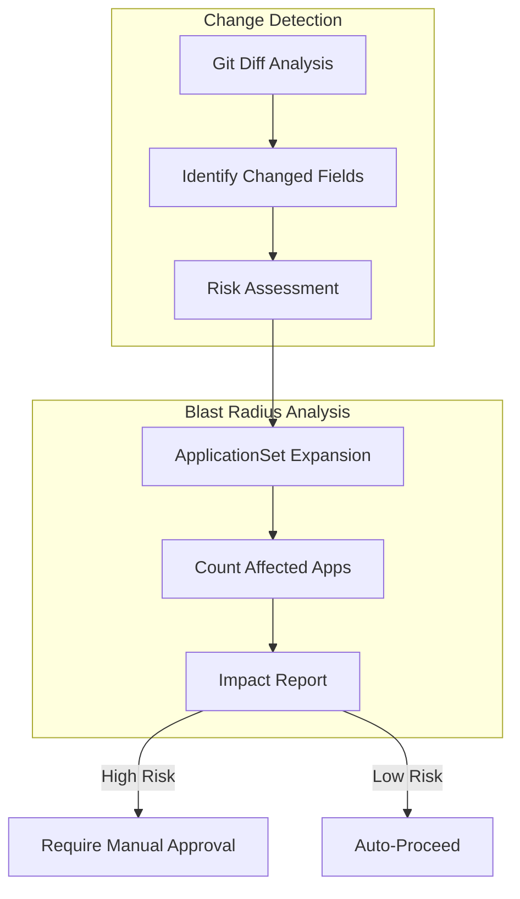

# Requirements Document: ArgoCD CRD Advanced Static Analysis

## Document Status

**Status**: 📝 DRAFT - Needs refinement before implementation

## Related Documents

- **Design**: `design.md` in this directory
- **Architecture Decisions**: 
  - `.claude/architecture/ADR-001-argocd-testing-approaches-analysis.md`
  - `.claude/architecture/ADR-002-argocd-testing-implementation-strategy.md`
- **Prerequisites**: 
  - `.claude/specs/argocd-gitops-promotion/` (Phase 1)
  - `.claude/specs/argocd-crd-basic-static/` (Phase 2)
  - `.claude/specs/workload-cluster-gitops/` (Phase 3)

---

## Introduction

This document specifies requirements for implementing advanced static analysis capabilities including change detection and blast radius analysis.

### Problem Statement

Basic static analysis (Phase 2) catches obvious errors, but some dangerous changes are only dangerous in context. For example, changing an ApplicationSet selector might be safe or catastrophic depending on what applications currently match. Advanced static analysis provides deeper insight into the impact of changes.

### Solution Overview

This phase (Phase 4 of 4) implements advanced static analysis:

### Target Environment

- **Use Case**: Platform service cluster for development, testing, and demos
- **Users**: Developers, product owners, customers/management (demos)
- **CI/CD Platform**: Not yet selected (design must be platform-agnostic)

### Glossary

- **Change Detection**: Identifying which fields in a configuration have changed
- **Blast Radius**: The scope of impact a change will have (number of affected resources)
- **Risk Assessment**: Evaluating the danger level of a change based on what changed and its impact

---

## Requirements

### Requirement 4.1: Change Detection Policies

**User Story**: As a platform engineer, I want dangerous field changes detected so that high-risk modifications are flagged for review.

#### Acceptance Criteria (Draft)

1. WHEN an ApplicationSet selector is modified THEN the change SHALL be flagged for review
2. WHEN an AppProject destination is modified THEN the change SHALL be flagged for review
3. WHEN a sync policy is changed from manual to auto THEN the change SHALL be flagged for review

### Requirement 4.2: Blast Radius Analysis

**User Story**: As a platform engineer, I want to understand the impact of changes so that I can make informed decisions.

#### Acceptance Criteria (Draft)

1. WHEN an ApplicationSet is modified THEN the system SHALL calculate how many applications are affected
2. WHEN a Project is modified THEN the system SHALL identify which applications use that project
3. WHEN analysis is complete THEN a human-readable report SHALL be generated

---

## Edge Cases and Constraints

### Edge Cases

- ApplicationSet generators that depend on external data
- Circular dependencies between resources
- Very large blast radius (hundreds of applications)
- Changes that affect resources not in the repository

### Constraints

- Requires custom tooling (no off-the-shelf solution)
- Must not significantly slow down PR feedback time
- Analysis accuracy depends on having complete information
- Estimated effort: 1-2 weeks

---

## Notes for Refinement

This document captures requirements from initial planning discussions. Before implementation, the following should be refined:

1. **Change Detection Scope**: Which fields are considered high-risk
2. **Blast Radius Calculation**: Algorithm for estimating impact
3. **Risk Thresholds**: What constitutes low/medium/high risk
4. **Report Format**: Design of the impact report
5. **Integration**: How this integrates with Phase 2 basic analysis
