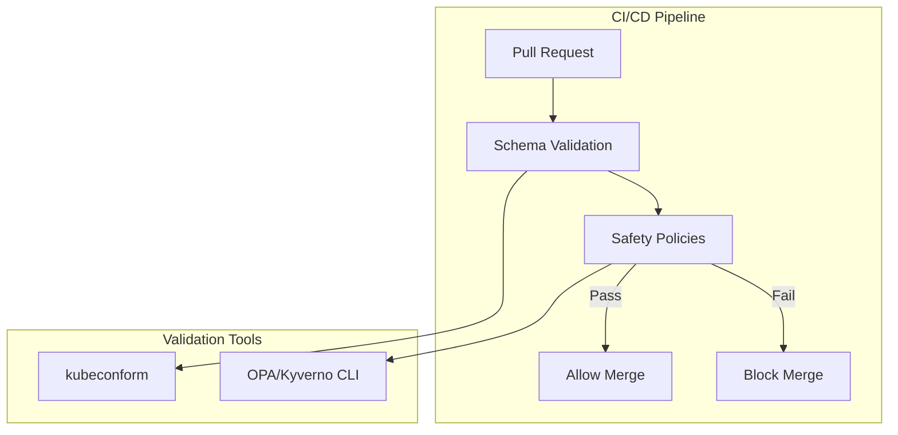

# Design Document: ArgoCD CRD Basic Static Analysis

## Document Status

**Status**: 📝 DRAFT - Concepts captured, needs detailed design

## Related Documents

- **Requirements**: `requirements.md` in this directory
- **Architecture Decisions**: 
  - `.claude/architecture/ADR-001-argocd-testing-approaches-analysis.md`
  - `.claude/architecture/ADR-002-argocd-testing-implementation-strategy.md`
- **Prerequisite**: `.claude/specs/argocd-gitops-promotion/` (Phase 1)

---

## Overview

This document describes the conceptual design for implementing basic static analysis of ArgoCD CRDs. This phase adds fast feedback through schema validation and basic safety policies.

### Conceptual Design

---

## Schema Validation Concept

- Use `kubeconform` or similar tool
- Validate against ArgoCD CRD schemas
- Run on every PR
- Block merge on failure

---

## Basic Safety Policies Concept

| Policy | Purpose |
|--------|---------|
| ApplicationSet preserveResourcesOnDeletion | Prevent mass deletion on AppSet removal |
| Application prune requires annotation | Prevent accidental prune enablement |
| Project destinations not wildcard | Prevent overly permissive projects |
| Repository URL pattern matching | Prevent typos in repo URLs |
| Application targetRevision not empty | Prevent accidental HEAD tracking |

---

## Tooling Options (To Be Decided)

- **OPA/Conftest**: Rego-based policies, powerful but steeper learning curve
- **Kyverno CLI**: YAML-based policies, easier to read/write
- **Custom validators**: Python/Go scripts for specific checks

---

## Security Considerations

- CI/CD secrets managed by platform (not in repo)
- Policy definitions are code-reviewed like any other change

---

## Testing Strategy

- Policy unit tests (known-good and known-bad inputs)
- Integration tests with sample ArgoCD CRDs

---

## Notes for Detailed Design

Before implementation, the following needs detailed design:

1. **Tooling Selection**: Evaluate and select validation tools
2. **Policy Implementation**: Write actual policy rules
3. **CI/CD Workflow**: Create platform-agnostic workflow templates
4. **Error Reporting**: Design clear, actionable error messages
5. **Schema Updates**: Process for keeping schemas current
