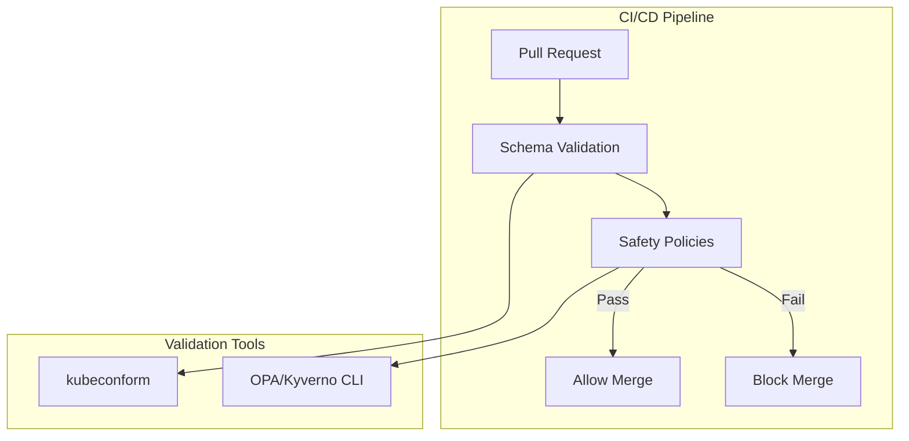

# Requirements Document: ArgoCD CRD Basic Static Analysis

## Document Status

**Status**: 📝 DRAFT - Needs refinement before implementation

## Related Documents

- **Design**: `design.md` in this directory
- **Architecture Decisions**: 
  - `.claude/architecture/ADR-001-argocd-testing-approaches-analysis.md`
  - `.claude/architecture/ADR-002-argocd-testing-implementation-strategy.md`
- **Prerequisite**: `.claude/specs/argocd-gitops-promotion/` (Phase 1)

---

## Introduction

This document specifies requirements for implementing basic static analysis of ArgoCD CRDs. This phase adds fast feedback through schema validation and basic safety policies, catching obvious errors before deployment with minimal implementation effort (~3-4 days).

### Problem Statement

Even with namespaced environment promotion (Phase 1), dangerous configuration errors can still reach production if they pass through dev and staging unnoticed. Static analysis provides an additional layer of protection by catching common mistakes before they're deployed anywhere.

### Solution Overview

This phase (Phase 2 of 4) implements basic static analysis:

### Target Environment

- **Use Case**: Platform service cluster for development, testing, and demos
- **Users**: Developers, product owners, customers/management (demos)
- **CI/CD Platform**: Not yet selected (design must be platform-agnostic)

### Glossary

- **Schema Validation**: Checking that YAML files conform to the expected structure defined by CRD schemas
- **Safety Policy**: A rule that prevents dangerous configuration patterns
- **Static Analysis**: Analyzing configuration files without running them

---

## Requirements

### Requirement 2.1: Schema Validation

**User Story**: As a platform engineer, I want ArgoCD CRDs validated against their schemas so that syntax errors and typos are caught before deployment.

#### Acceptance Criteria (Draft)

1. WHEN a PR is created THEN all ArgoCD CRD files SHALL be validated against their schemas
2. WHEN validation fails THEN the CI pipeline SHALL block the merge
3. WHEN validation fails THEN the error message SHALL identify the file, line, and specific error
4. WHEN new ArgoCD versions are released THEN schemas SHALL be updatable

### Requirement 2.2: Basic Safety Policies

**User Story**: As a platform engineer, I want basic safety policies enforced so that common dangerous patterns are prevented.

#### Acceptance Criteria (Draft)

1. WHEN an ApplicationSet is created/modified THEN it SHALL have `preserveResourcesOnDeletion: true`
2. WHEN an Application has `prune: true` THEN it SHALL require an approval annotation
3. WHEN an AppProject is created/modified THEN destinations SHALL NOT be `*` (wildcard)
4. WHEN a Repository is created/modified THEN the URL SHALL match allowed patterns
5. WHEN an Application is created/modified THEN `targetRevision` SHALL NOT be empty

### Requirement 2.3: CI/CD Integration

**User Story**: As a platform engineer, I want static analysis integrated into CI/CD so that validation happens automatically on every PR.

#### Acceptance Criteria (Draft)

1. WHEN a PR is created THEN static analysis SHALL run automatically
2. WHEN static analysis fails THEN the PR SHALL be blocked from merging
3. WHEN static analysis passes THEN the result SHALL be visible in the PR
4. WHEN policies are updated THEN CI/CD configuration SHALL be updatable without code changes

---

## Edge Cases and Constraints

### Edge Cases

- ArgoCD CRD schemas change between versions
- Network issues during CI/CD validation
- Policy conflicts with legitimate use cases
- Large PRs with many files to validate

### Constraints

- CI/CD platform not yet selected (design must be platform-agnostic)
- Must not significantly slow down PR feedback time
- Policies must be maintainable by the team
- Must work with the Kustomize structure from Phase 1

---

## Notes for Refinement

This document captures requirements from initial planning discussions. Before implementation, the following should be refined:

1. **Tooling Selection**: Decide between OPA/Conftest, Kyverno CLI, or custom validators
2. **Policy Specifics**: Define exact policy rules and their severity levels
3. **CI/CD Integration**: Design platform-agnostic workflow templates
4. **Schema Management**: Define process for updating schemas with ArgoCD versions
