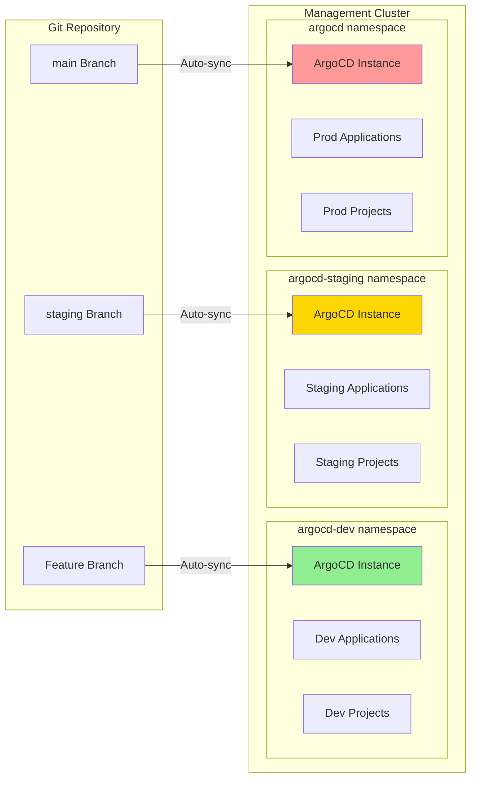
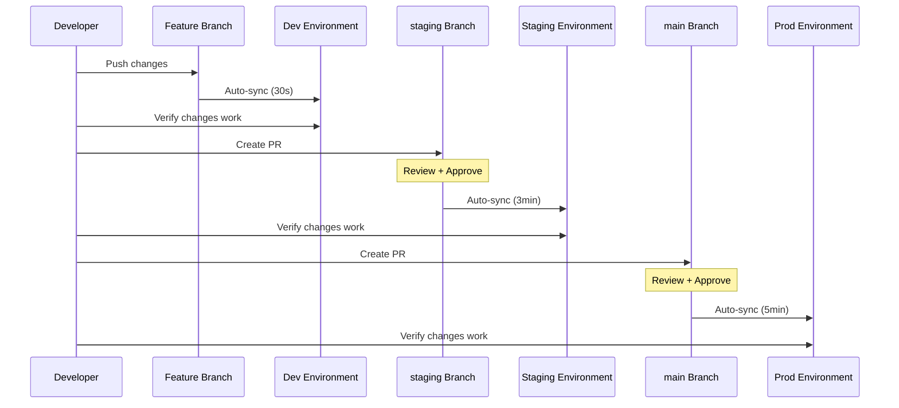
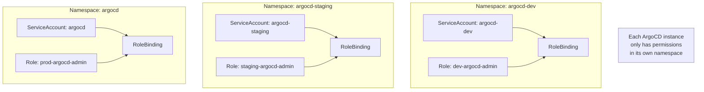
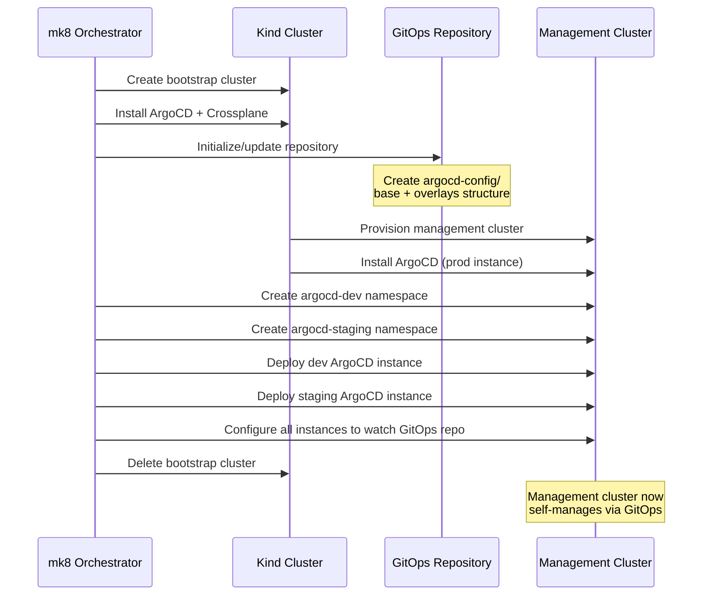

# Design Document: ArgoCD GitOps Promotion

## Document Status

**Status**: ✅ COMPLETE - Ready for detailed design and implementation

## Related Documents

- **Requirements**: `requirements.md` in this directory
- **Architecture Decisions**: 
  - `.claude/architecture/ADR-001-argocd-testing-approaches-analysis.md`
  - `.claude/architecture/ADR-002-argocd-testing-implementation-strategy.md`

---

## Overview

This document describes the design for implementing safe testing and promotion of ArgoCD CRD changes on the management cluster using dev/staging/prod namespace isolation.

### High-Level Architecture



---

## GitOps Repository Structure

```
gitops-repo/
├── README.md                           # Repository overview and workflow docs
├── argocd-config/                      # ArgoCD CRD configurations
│   ├── README.md                       # ArgoCD config documentation
│   ├── base/                           # Kustomize base (templates)
│   │   ├── kustomization.yaml
│   │   ├── applications/               # Application templates
│   │   │   ├── kustomization.yaml
│   │   │   └── *.yaml
│   │   ├── applicationsets/            # ApplicationSet templates
│   │   │   ├── kustomization.yaml
│   │   │   └── *.yaml
│   │   ├── projects/                   # AppProject templates
│   │   │   ├── kustomization.yaml
│   │   │   └── *.yaml
│   │   └── repositories/               # Repository templates
│   │       ├── kustomization.yaml
│   │       └── *.yaml
│   │
│   └── overlays/                       # Environment-specific overlays
│       ├── dev/
│       │   ├── kustomization.yaml
│       │   ├── namespace-patch.yaml    # namespace: argocd-dev
│       │   └── config-patches/         # Dev-specific patches
│       ├── staging/
│       │   ├── kustomization.yaml
│       │   ├── namespace-patch.yaml    # namespace: argocd-staging
│       │   └── config-patches/
│       └── prod/
│           ├── kustomization.yaml
│           ├── namespace-patch.yaml    # namespace: argocd
│           └── config-patches/
│
├── argocd-instances/                   # ArgoCD instance configurations
│   ├── dev/
│   │   └── argocd-instance.yaml        # ArgoCD CR for dev
│   ├── staging/
│   │   └── argocd-instance.yaml        # ArgoCD CR for staging
│   └── prod/
│       └── argocd-instance.yaml        # ArgoCD CR for prod (reference)
│
└── ... (other gitops content)
```

---

## Kustomize Structure

### Base Template Example

```yaml
# argocd-config/base/applications/example-app.yaml
apiVersion: argoproj.io/v1alpha1
kind: Application
metadata:
  name: example-app  # Will be patched with environment suffix
  # namespace injected by overlay
  labels:
    app.kubernetes.io/managed-by: argocd-crd-testing
    environment: base  # Will be patched by overlay
spec:
  project: default  # Will be patched to environment-specific project
  source:
    repoURL: https://github.com/org/app-repo
    targetRevision: HEAD  # May be patched by overlay
    path: manifests
  destination:
    server: https://kubernetes.default.svc
    namespace: app-namespace
  syncPolicy:
    automated:
      prune: false  # Conservative default, may be patched
      selfHeal: true
```

### Base Kustomization

```yaml
# argocd-config/base/kustomization.yaml
apiVersion: kustomize.config.k8s.io/v1beta1
kind: Kustomization

resources:
  - applications/
  - applicationsets/
  - projects/
  - repositories/

commonLabels:
  app.kubernetes.io/part-of: argocd-crd-testing
```

### Dev Overlay Example

```yaml
# argocd-config/overlays/dev/kustomization.yaml
apiVersion: kustomize.config.k8s.io/v1beta1
kind: Kustomization

resources:
  - ../../base

namespace: argocd-dev

nameSuffix: -dev

commonLabels:
  environment: dev

patches:
  - path: config-patches/sync-policy-patch.yaml
    target:
      kind: Application
  - path: config-patches/project-patch.yaml
    target:
      kind: Application
```

```yaml
# argocd-config/overlays/dev/config-patches/sync-policy-patch.yaml
apiVersion: argoproj.io/v1alpha1
kind: Application
metadata:
  name: not-used  # Kustomize will match by target
spec:
  syncPolicy:
    automated:
      prune: false  # Never auto-prune in dev
      selfHeal: true
    syncOptions:
      - CreateNamespace=true
```

### Prod Overlay Example

```yaml
# argocd-config/overlays/prod/kustomization.yaml
apiVersion: kustomize.config.k8s.io/v1beta1
kind: Kustomization

resources:
  - ../../base

namespace: argocd

# No nameSuffix for prod - these are the "real" names

commonLabels:
  environment: prod

patches:
  - path: config-patches/sync-policy-patch.yaml
    target:
      kind: Application
```

```yaml
# argocd-config/overlays/prod/config-patches/sync-policy-patch.yaml
apiVersion: argoproj.io/v1alpha1
kind: Application
metadata:
  name: not-used
  annotations:
    argocd.argoproj.io/sync-options: "PruneLast=true"
spec:
  syncPolicy:
    automated:
      prune: true  # Prune enabled but with PruneLast
      selfHeal: true
    syncOptions:
      - PrunePropagationPolicy=foreground
      - PruneLast=true
```

---

## ArgoCD Instance Configuration

### Dev Instance

```yaml
# argocd-instances/dev/argocd-instance.yaml
apiVersion: argoproj.io/v1beta1
kind: ArgoCD
metadata:
  name: argocd-dev
  namespace: argocd-dev
spec:
  server:
    route:
      enabled: true
  controller:
    appSync: 30s  # Aggressive sync for fast feedback
  applicationSet:
    enabled: true
```

### Staging Instance

```yaml
# argocd-instances/staging/argocd-instance.yaml
apiVersion: argoproj.io/v1beta1
kind: ArgoCD
metadata:
  name: argocd-staging
  namespace: argocd-staging
spec:
  server:
    route:
      enabled: true
  controller:
    appSync: 180s  # 3 minute sync
  applicationSet:
    enabled: true
```

---

## Promotion Workflow



---

## Namespace and RBAC Design



---

## Integration with mk8 Bootstrap



---

## Component Interactions

| Component | Responsibility |
|-----------|----------------|
| GitOps Repository | Source of truth for all ArgoCD CRD configurations |
| Kustomize Base | Template definitions shared across environments |
| Kustomize Overlays | Environment-specific patches and namespace targeting |
| ArgoCD Dev Instance | Watches feature branches, syncs to argocd-dev namespace |
| ArgoCD Staging Instance | Watches staging branch, syncs to argocd-staging namespace |
| ArgoCD Prod Instance | Watches main branch, syncs to argocd namespace |
| mk8 Orchestrator | Bootstraps initial structure, manages ArgoCD installation |

---

## Security Considerations

- Namespace isolation prevents cross-environment interference
- RBAC limits each ArgoCD instance to its own namespace
- Git branch protection enforces PR requirements
- No credentials stored in GitOps repository

---

## Testing Strategy

- Unit tests for Kustomize overlays (kustomize build succeeds)
- Integration tests for ArgoCD instance deployment
- End-to-end tests for promotion workflow
