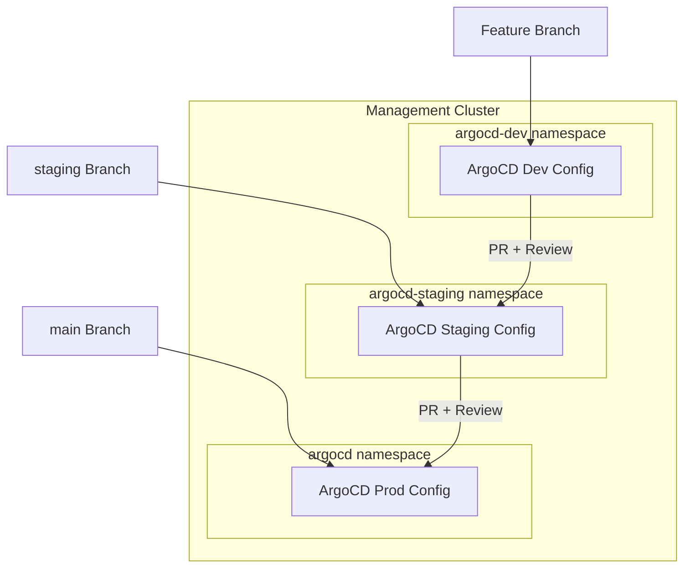

# Requirements Document: ArgoCD GitOps Promotion

## Document Status

**Status**: ✅ COMPLETE - Ready for implementation

## Related Documents

- **Design**: `design.md` in this directory
- **Architecture Decisions**: 
  - `.claude/architecture/ADR-001-argocd-testing-approaches-analysis.md`
  - `.claude/architecture/ADR-002-argocd-testing-implementation-strategy.md`

---

## Introduction

This document specifies requirements for implementing safe testing and promotion of ArgoCD CRD changes on the management cluster using dev/staging/prod namespace isolation. Changes are tested in lower environments before reaching production.

### Problem Statement

ArgoCD CRDs (ApplicationSets, Applications, Projects, Repositories) control the deployment of applications across Kubernetes clusters. Small changes to these resources can trigger catastrophic cascading failures:

- An ApplicationSet selector change can orphan dozens of applications
- A sync policy change can cause mass deletion of resources
- A project permission change can break deployments across clusters

### Solution Overview

This phase (Phase 1 of 4) implements namespaced environment promotion on the management cluster:

### Target Environment

- **Use Case**: Platform service cluster for development, testing, and demos
- **Users**: Developers, product owners, customers/management (demos)
- **Availability**: Minutes of downtime acceptable during business hours, hours acceptable nights/weekends
- **Data Durability**: Cloud-managed resources with automatic backups

### Glossary

- **ArgoCD CRD**: Custom Resource Definition for ArgoCD (Application, ApplicationSet, AppProject, Repository)
- **Management Cluster**: The single Kubernetes cluster running ArgoCD and Crossplane
- **Workload Cluster**: Kubernetes clusters provisioned by the management cluster for running applications
- **Namespaced Environment**: Isolated ArgoCD configuration in a dedicated namespace (dev, staging, prod)
- **Promotion**: Moving configuration changes from one environment to the next
- **mk8**: The orchestration tool that manages cluster lifecycle

---

## Requirements

### Requirement 1.1: Templated ArgoCD CRD Structure

**User Story**: As a platform engineer, I want ArgoCD CRDs to be templated so that the same logical configuration can be deployed to different environments with appropriate variations.

#### Acceptance Criteria

1. WHEN setting up the GitOps repository THEN the system SHALL create a Kustomize base directory containing template ArgoCD CRDs
2. WHEN creating templates THEN the system SHALL include templates for Applications, ApplicationSets, AppProjects, and Repositories
3. WHEN creating templates THEN the system SHALL use Kustomize-compatible placeholder patterns for environment-specific values
4. WHEN templates are created THEN the system SHALL include comments explaining which values are environment-specific
5. IF a template references other ArgoCD resources THEN the references SHALL use environment-aware naming conventions

### Requirement 1.2: Environment Overlays

**User Story**: As a platform engineer, I want environment-specific overlays so that I can customize ArgoCD configuration for dev, staging, and production.

#### Acceptance Criteria

1. WHEN setting up the GitOps repository THEN the system SHALL create overlay directories for dev, staging, and prod environments
2. WHEN creating overlays THEN each overlay SHALL patch the namespace to the appropriate ArgoCD namespace (argocd-dev, argocd-staging, argocd)
3. WHEN creating overlays THEN each overlay SHALL include environment-specific configuration patches
4. WHEN creating the dev overlay THEN the system SHALL configure more permissive settings (e.g., faster sync, no prune)
5. WHEN creating the prod overlay THEN the system SHALL configure conservative settings (e.g., slower sync, require annotations for prune)
6. WHEN overlays are created THEN each overlay SHALL be independently deployable via `kustomize build`

### Requirement 1.3: Namespace Isolation

**User Story**: As a platform engineer, I want ArgoCD configurations isolated by namespace so that dev/staging changes cannot affect production.

#### Acceptance Criteria

1. WHEN deploying ArgoCD configuration THEN dev configuration SHALL only exist in the `argocd-dev` namespace
2. WHEN deploying ArgoCD configuration THEN staging configuration SHALL only exist in the `argocd-staging` namespace
3. WHEN deploying ArgoCD configuration THEN prod configuration SHALL only exist in the `argocd` namespace
4. WHEN ArgoCD resources reference other resources THEN references SHALL be namespace-scoped appropriately
5. IF a resource in one namespace attempts to affect another namespace THEN the system SHALL prevent cross-namespace interference through RBAC or resource naming

### Requirement 1.4: Branch-to-Environment Mapping

**User Story**: As a platform engineer, I want Git branches to map to environments so that the promotion workflow is clear and auditable.

#### Acceptance Criteria

1. WHEN a commit is pushed to a feature branch THEN the dev environment SHALL be updated (if configured for auto-sync)
2. WHEN a commit is merged to the `staging` branch THEN the staging environment SHALL be updated
3. WHEN a commit is merged to the `main` branch THEN the prod environment SHALL be updated
4. WHEN promoting from dev to staging THEN a pull request to the `staging` branch SHALL be required
5. WHEN promoting from staging to prod THEN a pull request to the `main` branch SHALL be required
6. WHEN a PR is created THEN the system SHALL support additional validations (CI/CD hooks, not defined in this phase)

### Requirement 1.5: ArgoCD Instance Configuration

**User Story**: As a platform engineer, I want ArgoCD instances configured for each environment so that each environment has appropriate sync behavior.

#### Acceptance Criteria

1. WHEN configuring the dev ArgoCD instance THEN the sync interval SHALL be aggressive (e.g., 30 seconds)
2. WHEN configuring the dev ArgoCD instance THEN auto-prune SHALL be disabled by default
3. WHEN configuring the staging ArgoCD instance THEN the sync interval SHALL be moderate (e.g., 3 minutes)
4. WHEN configuring the staging ArgoCD instance THEN auto-prune MAY be enabled
5. WHEN configuring the prod ArgoCD instance THEN the sync interval SHALL be conservative (e.g., 5 minutes)
6. WHEN configuring the prod ArgoCD instance THEN changes requiring prune SHALL require explicit annotation approval

### Requirement 1.6: GitOps Repository Structure

**User Story**: As a platform engineer, I want a well-defined repository structure so that the organization of ArgoCD configurations is clear and maintainable.

#### Acceptance Criteria

1. WHEN setting up the GitOps repository THEN the system SHALL create a dedicated directory for ArgoCD CRD configurations
2. WHEN organizing the repository THEN the structure SHALL separate base templates from environment overlays
3. WHEN organizing the repository THEN the structure SHALL group related resources logically (e.g., by function or by target cluster)
4. WHEN the repository structure is created THEN each directory SHALL contain a README explaining its purpose
5. WHEN the repository structure is created THEN the system SHALL include a top-level README documenting the overall structure and workflow

### Requirement 1.7: Integration with mk8 Bootstrap

**User Story**: As a platform engineer, I want the namespaced environment structure integrated with the mk8 bootstrap process so that new management clusters are set up correctly from the start.

#### Acceptance Criteria

1. WHEN mk8 bootstraps a new management cluster THEN the GitOps repository SHALL be initialized with the templated CRD structure
2. WHEN mk8 completes the bootstrap handoff THEN the management cluster's ArgoCD SHALL be configured to watch the appropriate branch/path
3. WHEN mk8 sets up the initial ArgoCD THEN the dev and staging namespaces SHALL be created
4. WHEN mk8 sets up the initial ArgoCD THEN the ArgoCD instances for dev and staging environments SHALL be deployed
5. IF the GitOps repository already exists THEN mk8 SHALL integrate with the existing structure without overwriting

### Requirement 1.8: Documentation

**User Story**: As a platform engineer, I want comprehensive documentation so that team members understand how to use the promotion workflow.

#### Acceptance Criteria

1. WHEN the system is set up THEN documentation SHALL explain the dev/staging/prod environment model
2. WHEN documentation is created THEN it SHALL include step-by-step instructions for promoting changes
3. WHEN documentation is created THEN it SHALL include examples of common operations (add application, modify sync policy, etc.)
4. WHEN documentation is created THEN it SHALL explain how to troubleshoot common issues
5. WHEN documentation is created THEN it SHALL include diagrams showing the promotion workflow

---

## Edge Cases and Constraints

### Edge Cases

- GitOps repository already exists with different structure
- Concurrent PRs modifying the same resources
- ArgoCD instance fails to start in dev/staging namespace
- Branch protection rules not configured on Git repository

### Constraints

- Single management cluster (cannot be replicated for testing)
- ArgoCD installation managed by mk8, not self-managed
- Must integrate with existing mk8 bootstrap workflow
- Must support both new and existing GitOps repositories
