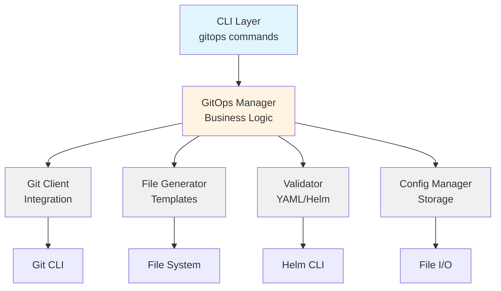
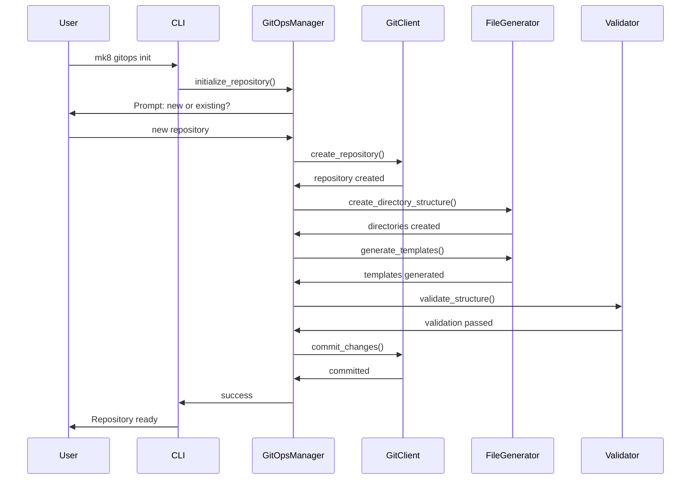

# Design Document: GitOps Repository Setup

## Overview

The GitOps repository setup feature provides automated creation and configuration of Git repositories structured for managing Kubernetes infrastructure using GitOps principles. The system creates a standardized directory structure containing Crossplane manifests, Helm charts, and ArgoCD Application definitions that enable declarative infrastructure management.

This feature integrates with mk8's existing architecture by adding new business logic for Git operations, file generation, and validation, along with CLI commands for user interaction. The design emphasizes user choice (new vs. existing repository), validation at every step, and clear error messaging to ensure successful GitOps adoption.

## Architecture

### High-Level Architecture



### Component Interaction Flow



## Components and Interfaces

### 1. CLI Layer

#### GitOps Command Group
```python
@cli.group()
def gitops():
    """Manage GitOps repository for infrastructure."""
    pass

@gitops.command()
@click.option('--path', help='Repository path')
@click.option('--remote', help='Git remote URL')
@click.pass_context
def init(ctx, path, remote):
    """Initialize GitOps repository structure."""
    pass

@gitops.command()
@click.pass_context
def status(ctx):
    """Display GitOps repository status."""
    pass

@gitops.command()
@click.pass_context
def validate(ctx):
    """Validate GitOps repository structure."""
    pass
```

### 2. Business Logic Layer

#### GitOpsManager
Primary orchestrator for GitOps operations.

```python
class GitOpsManager:
    """Manages GitOps repository setup and configuration."""
    
    def __init__(
        self,
        git_client: GitClient,
        file_generator: FileGenerator,
        validator: GitOpsValidator,
        config_manager: ConfigManager,
        output: OutputFormatter
    ):
        """Initialize GitOps manager with dependencies."""
        
    def initialize_repository(
        self,
        path: Optional[str] = None,
        remote_url: Optional[str] = None,
        use_existing: bool = False
    ) -> GitOpsRepository:
        """
        Initialize GitOps repository with full structure.
        
        Returns:
            GitOpsRepository object with metadata
        """
        
    def get_status(self) -> GitOpsStatus:
        """Get current GitOps repository status."""
        
    def validate_repository(self, path: str) -> ValidationResult:
        """Validate GitOps repository structure and contents."""
```

#### FileGenerator
Generates all template files and directory structures.

```python
class FileGenerator:
    """Generates GitOps repository files and templates."""
    
    def create_directory_structure(self, base_path: Path) -> None:
        """Create standard GitOps directory structure."""
        
    def generate_crossplane_templates(self, path: Path) -> None:
        """Generate Crossplane manifest templates."""
        
    def generate_helm_chart(self, path: Path, chart_name: str) -> None:
        """Generate Helm chart structure with Chart.yaml and templates."""
        
    def generate_argocd_application(self, path: Path, config: Dict) -> None:
        """Generate ArgoCD Application manifest."""
        
    def generate_readme(self, path: Path, config: Dict) -> None:
        """Generate comprehensive README documentation."""
```

### 3. Integration Layer

#### GitClient
Wraps Git CLI operations.

```python
class GitClient:
    """Client for Git operations."""
    
    def init_repository(self, path: str) -> None:
        """Initialize new Git repository."""
        
    def is_git_repository(self, path: str) -> bool:
        """Check if path is a Git repository."""
        
    def add_remote(self, name: str, url: str, path: str) -> None:
        """Add Git remote."""
        
    def commit(self, message: str, path: str) -> None:
        """Create Git commit."""
        
    def push(self, remote: str, branch: str, path: str) -> None:
        """Push to remote repository."""
        
    def create_branch(self, name: str, path: str) -> None:
        """Create new Git branch."""
        
    def get_current_branch(self, path: str) -> str:
        """Get current branch name."""
        
    def get_last_commit(self, path: str) -> Dict[str, str]:
        """Get last commit information."""
```

#### GitOpsValidator
Validates repository structure and file contents.

```python
class GitOpsValidator:
    """Validates GitOps repository structure and contents."""
    
    def validate_directory_structure(self, path: Path) -> List[ValidationError]:
        """Validate required directories exist."""
        
    def validate_helm_charts(self, path: Path) -> List[ValidationError]:
        """Validate Helm Chart.yaml and values files."""
        
    def validate_yaml_files(self, path: Path) -> List[ValidationError]:
        """Validate all YAML files are syntactically correct."""
        
    def validate_crossplane_manifests(self, path: Path) -> List[ValidationError]:
        """Validate Crossplane manifests."""
        
    def validate_argocd_applications(self, path: Path) -> List[ValidationError]:
        """Validate ArgoCD Application manifests."""
```

## Data Models

### GitOpsRepository
```python
@dataclass
class GitOpsRepository:
    """Represents a GitOps repository configuration."""
    
    path: Path
    repository_type: str  # 'local' or 'remote'
    remote_url: Optional[str] = None
    remote_name: str = 'origin'
    branch: str = 'main'
    created_at: datetime = field(default_factory=datetime.now)
    last_validated: Optional[datetime] = None
```

### GitOpsStatus
```python
@dataclass
class GitOpsStatus:
    """Status of GitOps repository."""
    
    configured: bool = False
    repository_path: Optional[Path] = None
    repository_type: Optional[str] = None
    remote_url: Optional[str] = None
    last_commit: Optional[Dict[str, str]] = None
    structure_valid: bool = False
    validation_errors: List[str] = field(default_factory=list)
    helm_charts: List[str] = field(default_factory=list)
    argocd_apps: List[str] = field(default_factory=list)
```

### ValidationResult
```python
@dataclass
class ValidationError:
    """Represents a validation error."""
    
    file_path: str
    line_number: Optional[int]
    error_type: str  # 'syntax', 'structure', 'missing'
    message: str
    suggestion: str

@dataclass
class ValidationResult:
    """Result of repository validation."""
    
    valid: bool
    errors: List[ValidationError] = field(default_factory=list)
    warnings: List[str] = field(default_factory=list)
```

### DirectoryStructure
```python
@dataclass
class DirectoryStructure:
    """Defines GitOps repository directory structure."""
    
    base: str = "gitops"
    charts: str = "charts"
    management_cluster: str = "management-cluster"
    bootstrap: str = "bootstrap"
    argocd: str = "argocd"
    
    def get_full_paths(self, base_path: Path) -> Dict[str, Path]:
        """Get full paths for all directories."""
        return {
            'base': base_path / self.base,
            'charts': base_path / self.base / self.charts,
            'management': base_path / self.base / self.management_cluster,
            'bootstrap': base_path / self.base / self.bootstrap,
            'argocd': base_path / self.base / self.argocd,
        }
```

## Directory Structure

The generated GitOps repository will have the following structure:

```
gitops-repo/
├── README.md                          # Main documentation
├── gitops/                            # Root GitOps directory
│   ├── README.md                      # GitOps structure overview
│   ├── charts/                        # Helm charts
│   │   ├── management-cluster/        # Management cluster chart
│   │   │   ├── Chart.yaml             # Helm chart definition
│   │   │   ├── values.yaml            # Default values
│   │   │   ├── values-dev.yaml        # Development values
│   │   │   ├── values-prod.yaml       # Production values
│   │   │   └── templates/             # Kubernetes manifests
│   │   │       ├── namespace.yaml
│   │   │       ├── crossplane/        # Crossplane resources
│   │   │       │   ├── eks-cluster.yaml
│   │   │       │   ├── vpc.yaml
│   │   │       │   └── iam.yaml
│   │   │       └── README.md
│   │   └── README.md
│   ├── bootstrap/                     # Bootstrap configurations
│   │   ├── README.md
│   │   └── crossplane-config.yaml     # Initial Crossplane setup
│   ├── argocd/                        # ArgoCD applications
│   │   ├── README.md
│   │   └── management-cluster-app.yaml
│   └── management-cluster/            # Additional management resources
│       └── README.md
```

## Template Generation

### Crossplane EKS Cluster Template
```yaml
apiVersion: eks.aws.upbound.io/v1beta1
kind: Cluster
metadata:
  name: {{ .Values.clusterName }}
  annotations:
    crossplane.io/external-name: {{ .Values.clusterName }}
spec:
  forProvider:
    region: {{ .Values.region }}
    version: {{ .Values.kubernetesVersion }}
    roleArnSelector:
      matchLabels:
        role: cluster
    vpcConfig:
      - endpointPrivateAccess: true
        endpointPublicAccess: true
        subnetIdSelector:
          matchLabels:
            access: public
```

### Helm Chart.yaml Template
```yaml
apiVersion: v2
name: management-cluster
description: Management cluster infrastructure for mk8
type: application
version: 0.1.0
appVersion: "1.0"
keywords:
  - kubernetes
  - crossplane
  - eks
  - infrastructure
maintainers:
  - name: Platform Team
```

### ArgoCD Application Template
```yaml
apiVersion: argoproj.io/v1alpha1
kind: Application
metadata:
  name: management-cluster
  namespace: argocd
spec:
  project: default
  source:
    repoURL: {{ .RepoURL }}
    targetRevision: {{ .Branch }}
    path: gitops/charts/management-cluster
    helm:
      valueFiles:
        - values-{{ .Environment }}.yaml
  destination:
    server: https://kubernetes.default.svc
    namespace: crossplane-system
  syncPolicy:
    automated:
      prune: true
      selfHeal: true
    syncOptions:
      - CreateNamespace=true
```

## Error Handling

### Error Types

1. **Repository Errors**
   - Path does not exist
   - Path is not a Git repository
   - Git not installed or not in PATH
   - Insufficient permissions

2. **Validation Errors**
   - Invalid YAML syntax
   - Missing required files
   - Invalid Helm chart structure
   - Invalid Crossplane manifests

3. **Git Operation Errors**
   - Remote not accessible
   - Authentication failure
   - Push rejected
   - Merge conflicts

### Error Handling Strategy

```python
# Example error handling pattern
try:
    git_client.init_repository(path)
except GitNotFoundError:
    raise PrerequisiteError(
        "Git is not installed or not in PATH",
        suggestions=[
            "Install Git: https://git-scm.com/downloads",
            "Verify Git is in PATH: git --version",
        ]
    )
except PermissionError as e:
    raise CommandError(
        f"Insufficient permissions to create repository at {path}",
        suggestions=[
            f"Check directory permissions: ls -la {path.parent}",
            "Try a different location with write access",
            "Run with appropriate permissions",
        ]
    )
```

## Configuration Storage

GitOps repository configuration is stored in `~/.config/mk8/gitops.yaml`:

```yaml
repository:
  path: /path/to/gitops-repo
  type: local  # or 'remote'
  remote_url: https://github.com/org/gitops-repo.git
  remote_name: origin
  branch: main
  created_at: "2024-01-15T10:30:00Z"
  last_validated: "2024-01-15T11:00:00Z"
```

## Correctness Properties

*A property is a characteristic or behavior that should hold true across all valid executions of a system-essentially, a formal statement about what the system should do. Properties serve as the bridge between human-readable specifications and machine-verifiable correctness guarantees.*

### Property 1: Path Validation
*For any* provided path, if the path is claimed to be an existing Git repository, then Git operations on that path should succeed without errors.
**Validates: Requirements 1.4**

### Property 2: Repository Initialization Creates Git Repository
*For any* valid file system path with write permissions, initializing a repository at that path should result in a valid Git repository with an initial commit.
**Validates: Requirements 2.1, 2.2**

### Property 3: Git Configuration Preservation
*For any* repository initialization, if Git user name and email are already configured, they should remain unchanged; if not configured, they should be set.
**Validates: Requirements 2.3**

### Property 4: Complete Directory Structure
*For any* GitOps repository setup, all required directories (base, charts, management-cluster, bootstrap, argocd) should exist after setup completes.
**Validates: Requirements 3.1, 3.2, 3.3, 3.4**

### Property 5: Directory Documentation
*For any* created directory in the GitOps structure, that directory should contain a README.md file explaining its purpose.
**Validates: Requirements 3.5**

### Property 6: Crossplane Template Completeness
*For any* GitOps repository setup, all required Crossplane manifest templates (EKS cluster, VPC, IAM) should exist in the templates directory.
**Validates: Requirements 4.1, 4.2, 4.3**

### Property 7: Template Placeholder Presence
*For any* generated Crossplane template, the template should contain placeholder values (indicated by {{ }} or similar markers) that require customization.
**Validates: Requirements 4.4**

### Property 8: Template Documentation
*For any* generated template file, the file should contain comments explaining the resource and required customizations.
**Validates: Requirements 4.5, 6.5**

### Property 9: Helm Chart Structure Validity
*For any* generated Helm chart, the chart should have a valid Chart.yaml file, a templates directory, and a values.yaml file.
**Validates: Requirements 5.1, 5.2, 5.3**

### Property 10: Environment Values Files
*For any* GitOps repository setup with multiple environments, each environment should have a corresponding values-{env}.yaml file.
**Validates: Requirements 5.4**

### Property 11: YAML Syntax Validity
*For any* generated YAML file (Helm charts, Crossplane manifests, ArgoCD applications), the file should be syntactically valid YAML that can be parsed without errors.
**Validates: Requirements 5.5, 11.2, 11.3, 11.4**

### Property 12: ArgoCD Application Completeness
*For any* generated ArgoCD Application manifest, the manifest should contain all required fields: source repository path, destination cluster, destination namespace, and sync policies.
**Validates: Requirements 6.1, 6.2, 6.3, 6.4**

### Property 13: Configuration File Completeness
*For any* completed GitOps setup, the configuration file should contain all required fields: repository path, repository type, and if remote, the remote URL.
**Validates: Requirements 7.1, 7.2, 7.3, 7.4**

### Property 14: Configuration File Permissions
*For any* saved configuration file, the file permissions should be set to 0600 (owner read/write only) on Unix-like systems.
**Validates: Requirements 7.5**

### Property 15: Git Remote Addition
*For any* valid remote URL provided, adding the remote to the repository should result in the remote being present in the Git configuration.
**Validates: Requirements 8.3**

### Property 16: Remote Accessibility Verification
*For any* remote URL being added, the system should attempt to verify accessibility before completing the operation.
**Validates: Requirements 8.4**

### Property 17: Complete File Staging
*For any* GitOps structure creation, all generated files should be staged in Git (appear in git status as staged).
**Validates: Requirements 9.1**

### Property 18: Commit Creation
*For any* staged GitOps structure, creating a commit should result in a commit with a descriptive message appearing in the Git history.
**Validates: Requirements 9.2**

### Property 19: Successful Push
*For any* configured remote and confirmed push operation, the commit should appear in the remote repository after push completes.
**Validates: Requirements 9.4**

### Property 20: Conflict Detection
*For any* existing repository with existing directories, the system should detect conflicts with the GitOps structure before making changes.
**Validates: Requirements 10.1**

### Property 21: File Preservation
*For any* existing repository, after adding GitOps structure, all pre-existing files and directories should remain unchanged.
**Validates: Requirements 10.3**

### Property 22: Branch Creation for Existing Repos
*For any* existing repository, adding GitOps structure should create a new Git branch, and the changes should only exist on that branch.
**Validates: Requirements 10.4**

### Property 23: Structure Validation Completeness
*For any* GitOps repository, validation should check all required directories, all YAML files, all Helm charts, and all ArgoCD applications.
**Validates: Requirements 11.1, 11.2, 11.3, 11.4**

### Property 24: Main README Completeness
*For any* generated main README.md, the file should contain: directory structure overview, template customization instructions, resource addition instructions, and links to external documentation.
**Validates: Requirements 12.1, 12.2, 12.3, 12.4, 12.5**

### Property 25: Status Information Completeness
*For any* status check, the output should include: repository path, repository type (local/remote), remote URL (if configured), last commit information, and structure validation status.
**Validates: Requirements 13.1, 13.2, 13.3, 13.4, 13.5**

### Property 26: Error Message Quality
*For any* operation failure, the error message should be human-readable and include specific suggestions for resolving the issue.
**Validates: Requirements 14.1, 14.2**

## Testing Strategy

### Unit Tests

Unit tests will cover individual components in isolation:

1. **GitClient Tests**
   - Test Git command execution
   - Test error handling for Git failures
   - Mock subprocess calls

2. **FileGenerator Tests**
   - Test directory creation
   - Test template generation
   - Test file content correctness
   - Mock file system operations

3. **GitOpsValidator Tests**
   - Test YAML validation
   - Test Helm chart validation
   - Test structure validation
   - Mock file reads

4. **GitOpsManager Tests**
   - Test orchestration logic
   - Test user interaction flows
   - Mock all dependencies

### Integration Tests

Integration tests will verify end-to-end workflows:

1. **Repository Initialization**
   - Create new repository
   - Verify directory structure
   - Verify file contents
   - Verify Git initialization

2. **Existing Repository Integration**
   - Add structure to existing repo
   - Verify no conflicts
   - Verify branch creation

3. **Validation**
   - Validate complete repository
   - Detect and report errors
   - Verify error messages

### Property-Based Tests

Property-based tests will verify universal behaviors:

1. **Path Handling**
   - Any valid path should work
   - Special characters handled correctly
   - Relative and absolute paths work

2. **YAML Generation**
   - Generated YAML is always valid
   - Templates render correctly with various inputs

3. **Validation Consistency**
   - Valid repositories always pass validation
   - Invalid repositories always fail with specific errors

## Security Considerations

1. **File Permissions**
   - Set restrictive permissions on generated files
   - Validate user has appropriate access

2. **Input Validation**
   - Sanitize all user inputs
   - Validate paths before operations
   - Prevent path traversal attacks

3. **Git Operations**
   - Never pass unsanitized input to Git commands
   - Use subprocess with shell=False
   - Validate remote URLs

4. **Credential Handling**
   - Never store Git credentials
   - Rely on user's Git configuration
   - Warn about authentication requirements

## Performance Considerations

1. **File Operations**
   - Batch file writes when possible
   - Use efficient path operations
   - Minimize disk I/O

2. **Validation**
   - Cache validation results
   - Validate only changed files when possible
   - Parallel validation of independent files

3. **Git Operations**
   - Use Git plumbing commands for efficiency
   - Minimize Git subprocess calls
   - Cache Git status information

## Future Enhancements

1. **Multi-Environment Support**
   - Generate multiple environment overlays
   - Environment-specific Helm values
   - Environment promotion workflows

2. **Template Customization**
   - User-defined templates
   - Template library
   - Template versioning

3. **Advanced Validation**
   - Crossplane composition validation
   - ArgoCD sync preview
   - Cost estimation for infrastructure

4. **Repository Sync**
   - Auto-sync with remote
   - Conflict resolution
   - Change detection and notification

5. **GitOps Workflows**
   - Pull request automation
   - CI/CD integration
   - Automated testing of manifests
