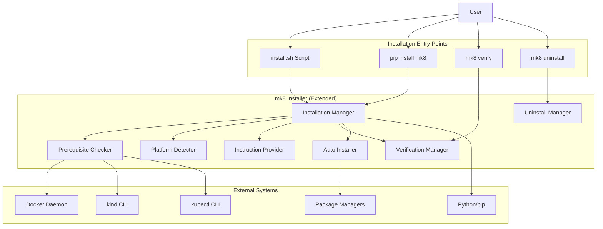

# Installer Future Enhancements Design Document

## Overview

This document contains the design for future enhancements to the mk8 installer. These features build upon the MVP installer to provide a polished, production-ready installation experience for external users. Features include multi-platform support, interactive installation, automatic prerequisite installation, version management, and comprehensive error handling.

## Architecture

### Extended System Context



## Components and Interfaces

### 1. PlatformDetector

**Purpose**: Detect operating system, distribution, and version.

**Location**: `mk8/integrations/platform.py`

**Interface**:
```python
class PlatformDetector:
    """Detects platform information (OS, distribution, version)."""

    def detect(self) -> PlatformInfo:
        """Detect current platform."""

    def get_os(self) -> str:
        """Get operating system name (linux, darwin, windows, wsl)."""

    def get_linux_distribution(self) -> Optional[str]:
        """Get Linux distribution name (ubuntu, debian, fedora, etc.)."""

    def is_wsl(self) -> bool:
        """Check if running under WSL2."""

    def is_platform_supported(self) -> bool:
        """Check if current platform is supported."""
```

### 2. InstallationManager

**Purpose**: Orchestrates installation with interactive prompts and automatic installation.

**Location**: `mk8/business/installer.py`

**Interface**:
```python
class InstallationManager:
    """Manages the installation process for mk8."""

    def __init__(
        self,
        interactive: bool = True,
        force_reinstall: bool = False,
        logger: Optional[logging.Logger] = None,
        output: Optional[OutputFormatter] = None,
    ):
        """Initialize installation manager."""

    def install(self) -> InstallationResult:
        """Execute the installation process."""

    def detect_existing_installation(self) -> Optional[str]:
        """Check if mk8 is already installed and return version."""

    def check_prerequisites(self) -> PrerequisiteResults:
        """Check all prerequisites."""

    def handle_missing_prerequisites(
        self,
        results: PrerequisiteResults
    ) -> bool:
        """Handle missing prerequisites interactively or provide instructions."""

    def install_package(self) -> bool:
        """Install the mk8 Python package."""

    def verify_installation(self) -> VerificationResult:
        """Verify the installation is complete and functional."""
```

### 3. InstructionProvider

**Purpose**: Generate platform-specific installation instructions.

**Location**: `mk8/business/installation_instructions.py`

**Interface**:
```python
class InstructionProvider:
    """Provides platform-specific installation instructions."""

    def __init__(self, platform: PlatformInfo):
        """Initialize with platform information."""

    def get_instructions_for_missing(
        self,
        missing: List[str]
    ) -> Dict[str, str]:
        """Get installation instructions for missing tools."""

    def get_docker_instructions(self) -> str:
        """Get Docker installation instructions for platform."""

    def get_kind_instructions(self) -> str:
        """Get kind installation instructions for platform."""

    def get_kubectl_instructions(self) -> str:
        """Get kubectl installation instructions for platform."""

    def format_instructions(
        self,
        instructions: Dict[str, str]
    ) -> str:
        """Format instructions for display to user."""
```

### 4. AutoInstaller

**Purpose**: Attempt automatic installation of prerequisites.

**Location**: `mk8/business/auto_installer.py`

**Interface**:
```python
class AutoInstaller:
    """Attempts automatic installation of prerequisites."""

    def __init__(self, platform: PlatformInfo):
        """Initialize with platform information."""

    def can_auto_install(self, tool: str) -> bool:
        """Check if tool can be automatically installed on this platform."""

    def install_docker(self) -> bool:
        """Attempt to install Docker."""

    def install_kind(self) -> bool:
        """Attempt to install kind."""

    def install_kubectl(self) -> bool:
        """Attempt to install kubectl."""
```

### 5. UninstallManager

**Purpose**: Interactive uninstallation with configuration cleanup.

**Location**: `mk8/business/uninstaller.py`

**Interface**:
```python
class UninstallManager:
    """Manages mk8 uninstallation."""

    def __init__(
        self,
        remove_config: bool = False,
        interactive: bool = True,
        logger: Optional[logging.Logger] = None,
    ):
        """Initialize uninstall manager."""

    def uninstall(self) -> UninstallResult:
        """Uninstall mk8."""

    def remove_package(self) -> bool:
        """Remove mk8 Python package."""

    def remove_configuration(self) -> bool:
        """Remove ~/.config/mk8 directory."""

    def verify_removal(self) -> bool:
        """Verify mk8 is no longer in PATH."""
```

## Data Models

### PlatformInfo
```python
@dataclass
class PlatformInfo:
    """Information about the platform."""

    os: str  # "linux", "darwin", "windows", "wsl"
    distribution: Optional[str]  # "ubuntu", "debian", "fedora", etc.
    version: Optional[str]  # OS/distribution version
    architecture: str  # "x86_64", "arm64", etc.
    supported: bool  # Whether platform is supported

    def is_linux(self) -> bool:
        """Check if Linux-based."""
        return self.os in ("linux", "wsl")

    def is_wsl(self) -> bool:
        """Check if WSL."""
        return self.os == "wsl"
```

### InstallationResult
```python
@dataclass
class InstallationResult:
    """Result of installation process."""

    success: bool
    previous_version: Optional[str]  # If upgrading
    new_version: str
    prerequisites_satisfied: bool
    verification_passed: bool
    messages: List[str]  # Informational messages
    errors: List[str]  # Error messages

    def is_upgrade(self) -> bool:
        """Check if this was an upgrade."""
        return self.previous_version is not None
```

### UninstallResult
```python
@dataclass
class UninstallResult:
    """Result of uninstallation process."""

    success: bool
    package_removed: bool
    config_removed: bool
    verified_removed: bool
    errors: List[str]
```

## Error Handling

### Exception Hierarchy

```python
class InstallationError(MK8Error):
    """Raised when installation fails."""
    pass

class UninstallError(MK8Error):
    """Raised when uninstallation fails."""
    pass
```

### Error Scenarios

| Scenario | Exception | Exit Code | Suggestions |
|----------|-----------|-----------|-------------|
| Unsupported platform | PrerequisiteError | 4 | List supported platforms, manual installation docs |
| Pip install fails | InstallationError | 1 | Check permissions, check disk space, check network |
| Network/proxy issues | InstallationError | 1 | Check proxy settings, check network connection |
| Permission denied | InstallationError | 1 | Use virtual environment, use sudo (with warning) |
| Uninstall fails | UninstallError | 1 | Manual removal instructions |

## Implementation Notes

### Virtual Environment Detection

```python
def is_virtual_env() -> bool:
    """Check if running in a virtual environment."""
    return (
        hasattr(sys, 'real_prefix') or  # virtualenv
        (hasattr(sys, 'base_prefix') and sys.base_prefix != sys.prefix)  # venv
    )
```

### Platform Detection Implementation

```python
def is_wsl() -> bool:
    """Detect WSL by checking for WSL-specific files."""
    if platform.system() != "Linux":
        return False

    try:
        with open("/proc/version", "r") as f:
            version = f.read().lower()
            return "microsoft" in version or "wsl" in version
    except:
        return False
```

### Version Parsing

```python
def parse_version(version_string: str) -> Tuple[int, int, int]:
    """
    Parse semantic version from string.

    Args:
        version_string: Version string like "v1.28.0" or "24.0.5"

    Returns:
        Tuple of (major, minor, patch)
    """
    version = version_string.lstrip('v')
    parts = version.split('.')
    major = int(parts[0]) if len(parts) > 0 else 0
    minor = int(parts[1]) if len(parts) > 1 else 0
    patch = int(parts[2]) if len(parts) > 2 else 0
    return (major, minor, patch)
```

### Configuration File Permissions

```python
import os
import stat

config_file = Path.home() / ".config" / "mk8" / "config.yaml"
config_file.parent.mkdir(parents=True, exist_ok=True)
config_file.write_text(content)

# Set restrictive permissions (0600)
os.chmod(config_file, stat.S_IRUSR | stat.S_IWUSR)
```

## CLI Integration

### New Commands

```python
@cli.command()
@click.option('--remove-config', is_flag=True, help='Remove configuration files')
@click.option('--yes', '-y', is_flag=True, help='Skip confirmation prompts')
@click.pass_context
def uninstall(ctx: click.Context, remove_config: bool, yes: bool) -> None:
    """Uninstall mk8."""
    # Implementation calls UninstallManager
```

### Standalone Script

Create `scripts/install.sh`:
```bash
#!/bin/bash
# mk8 installation script
# Usage: curl -fsSL https://example.com/install.sh | bash

set -e

echo "Installing mk8..."

# Check Python version
python3 --version || {
    echo "Error: Python 3.8+ required"
    exit 1
}

# Install mk8
pip3 install mk8

# Run verification
mk8 verify
```

## Future Enhancements

1. **Auto-installation**: Attempt to install missing prerequisites automatically (with user permission)
2. **Offline installation**: Support installation from local package cache
3. **Custom installation paths**: Allow user to specify installation directory
4. **Plugin system**: Allow third-party prerequisites to register checks
5. **Health monitoring**: Periodic verification that prerequisites are still available
6. **Upgrade notifications**: Check for newer versions and notify user
7. **Rollback support**: Automatically roll back failed installations

## Security Considerations

1. **Never use shell=True**: Always pass command as list to subprocess.run()
2. **Validate all paths**: Use pathlib and resolve() to prevent path traversal
3. **Restrictive permissions**: Set 0600 on config files containing credentials
4. **Input validation**: Validate all version strings and paths before using
5. **Timeout all subprocess calls**: Prevent hanging on unresponsive tools
6. **Mask sensitive data in logs**: Never log full credentials
7. **Verify checksums**: If downloading tools, verify checksums
