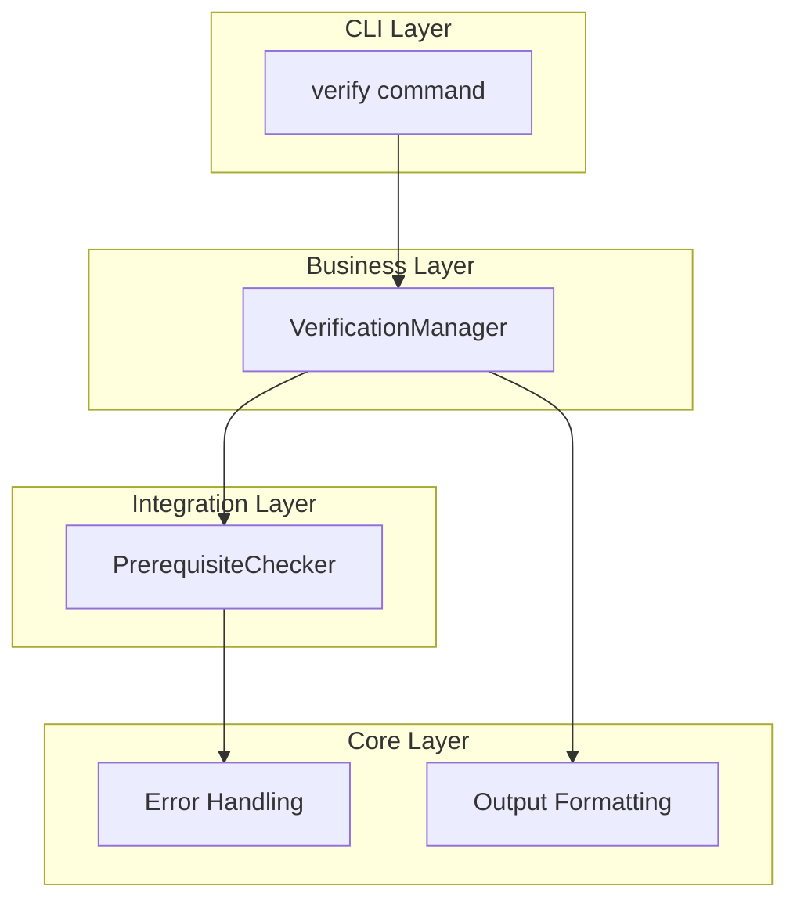
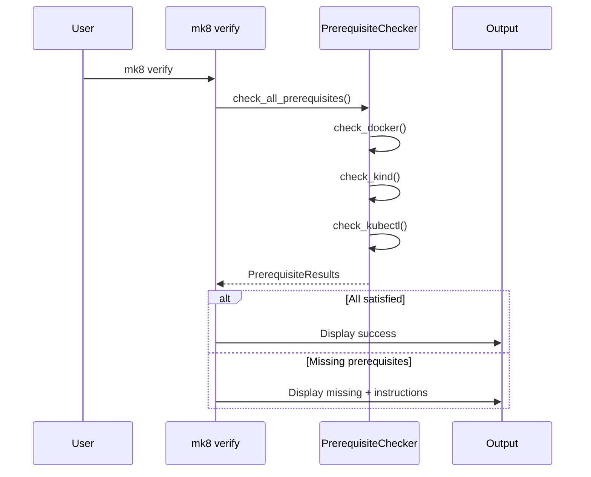

# Installer Design Document

## Overview

The installer feature provides minimal installation verification for mk8 on Linux systems. The design focuses on prerequisite checking via the `mk8 verify` command and basic installation guidance. This MVP assumes pip handles package installation and provides simple prerequisite detection without automatic installation.

### Design Goals

1. **Minimal complexity**: Simple prerequisite checking only
2. **Linux-focused**: Target Linux environments (Ubuntu/Debian primary)
3. **Developer-friendly**: Clear error messages with basic guidance
4. **No automation**: Manual prerequisite installation by developer
5. **Fast verification**: Quick checks without extensive platform detection

## Architecture

### Component Architecture



### Verification Flow



## Components and Interfaces

### 1. PrerequisiteChecker

**Purpose**: Check for required external tools.

**Location**: `mk8/integrations/prerequisites.py`

**Interface**:
```python
class PrerequisiteChecker:
    """Checks for required external tools."""

    def check_all(self) -> PrerequisiteResults:
        """Check all prerequisites."""

    def check_docker(self) -> PrerequisiteStatus:
        """Check Docker installation and daemon status."""

    def check_kind(self) -> PrerequisiteStatus:
        """Check kind installation."""

    def check_kubectl(self) -> PrerequisiteStatus:
        """Check kubectl installation."""

    def is_docker_daemon_running(self) -> bool:
        """Check if Docker daemon is running."""
```

### 2. VerificationManager

**Purpose**: Verify mk8 installation and prerequisites.

**Location**: `mk8/business/verification.py`

**Interface**:
```python
class VerificationManager:
    """Verifies mk8 installation and prerequisites."""

    def verify(self) -> VerificationResult:
        """Perform installation verification."""

    def verify_mk8_installed(self) -> bool:
        """Verify mk8 command is available."""

    def verify_prerequisites(self) -> PrerequisiteResults:
        """Check all prerequisites."""

    def get_installation_instructions(
        self,
        missing: List[str]
    ) -> str:
        """Get basic installation instructions for missing tools."""
```

## Data Models

### PrerequisiteStatus
```python
@dataclass
class PrerequisiteStatus:
    """Status of a single prerequisite check."""

    name: str  # Tool name
    installed: bool  # Whether tool is installed
    daemon_running: Optional[bool]  # For Docker only
    error: Optional[str]  # Error message if check failed

    def is_satisfied(self) -> bool:
        """Check if prerequisite is satisfied."""
        if not self.installed:
            return False
        if self.daemon_running is not None and not self.daemon_running:
            return False
        return True
```

### PrerequisiteResults
```python
@dataclass
class PrerequisiteResults:
    """Results from checking all prerequisites."""

    docker: PrerequisiteStatus
    kind: PrerequisiteStatus
    kubectl: PrerequisiteStatus

    def all_satisfied(self) -> bool:
        """Check if all prerequisites are satisfied."""
        return all([
            self.docker.is_satisfied(),
            self.kind.is_satisfied(),
            self.kubectl.is_satisfied(),
        ])

    def get_missing(self) -> List[str]:
        """Get list of missing prerequisite names."""
        missing = []
        if not self.docker.is_satisfied():
            missing.append("docker")
        if not self.kind.is_satisfied():
            missing.append("kind")
        if not self.kubectl.is_satisfied():
            missing.append("kubectl")
        return missing
```

### VerificationResult
```python
@dataclass
class VerificationResult:
    """Result of installation verification."""

    mk8_installed: bool
    prerequisites_ok: bool
    prerequisite_results: PrerequisiteResults
    messages: List[str]

    def is_verified(self) -> bool:
        """Check if fully verified."""
        return self.mk8_installed and self.prerequisites_ok
```

## Error Handling

### Exception Hierarchy

Use existing mk8 error hierarchy:

```python
class VerificationError(MK8Error):
    """Raised when verification fails."""
    pass
```

### Error Scenarios

| Scenario | Exception | Exit Code | Suggestions |
|----------|-----------|-----------|-------------|
| Docker not installed | VerificationError | 4 | Install Docker, provide link |
| Docker daemon not running | VerificationError | 4 | Start Docker daemon |
| kind not installed | VerificationError | 4 | Install kind, provide command |
| kubectl not installed | VerificationError | 4 | Install kubectl, provide command |
| mk8 not in PATH | VerificationError | 1 | Check pip install, check PATH |

## Testing Strategy

### Unit Tests

**Coverage Target**: 80%+

**Test Organization**:
```
tests/unit/business/
└── test_verification.py           # VerificationManager tests

tests/unit/integrations/
└── test_prerequisites.py          # PrerequisiteChecker tests

tests/unit/cli/
└── test_verify_command.py         # verify command tests
```

**Key Test Scenarios**:

1. **PrerequisiteChecker**:
   - Tool installed and working
   - Tool not installed
   - Docker daemon running vs not running
   - Command not in PATH

2. **VerificationManager**:
   - All checks pass
   - Missing prerequisites
   - mk8 not installed

### Integration Tests

**Test Organization**:
```
tests/integration/
└── test_verification_flow.py      # End-to-end verification
```

### Mocking Strategy

**Mock External Dependencies**:
- `subprocess.run()` calls for tool checks
- `shutil.which()` for PATH checks

**Use Real Components**:
- Data models
- Error formatting
- Output formatting

## Implementation Notes

### Subprocess Best Practices

```python
subprocess.run(
    ["command", "arg"],
    capture_output=True,
    text=True,
    timeout=5,
    check=False,
)
```

### Docker Daemon Check

```python
def is_docker_daemon_running() -> bool:
    """Check if Docker daemon is running."""
    try:
        result = subprocess.run(
            ["docker", "info"],
            capture_output=True,
            timeout=5,
            check=False,
        )
        return result.returncode == 0
    except:
        return False
```

### Basic Installation Instructions

```python
INSTRUCTIONS = {
    "docker": "Install Docker: https://docs.docker.com/engine/install/",
    "kind": "Install kind: curl -Lo ./kind https://kind.sigs.k8s.io/dl/latest/kind-linux-amd64 && chmod +x ./kind && sudo mv ./kind /usr/local/bin/kind",
    "kubectl": "Install kubectl: https://kubernetes.io/docs/tasks/tools/install-kubectl-linux/",
}
```

## CLI Integration

### verify Command

Add to `mk8/cli/main.py`:

```python
@cli.command()
@click.option('--verbose', '-v', is_flag=True, help='Verbose output')
@click.pass_context
def verify(ctx: click.Context, verbose: bool) -> None:
    """Verify mk8 installation and prerequisites."""
    # Implementation calls VerificationManager
```

## Dependencies

### Python Dependencies

Use only standard library:
- `subprocess` - Running external commands
- `shutil` - which() for PATH checks
- `sys` - Python environment info

### External Tools (Runtime)

Required for mk8 operation:
- Docker (any recent version)
- kind (any recent version)
- kubectl (any recent version)

## Security Considerations

1. **Never use shell=True**: Always pass command as list
2. **Timeout all subprocess calls**: Prevent hanging
3. **Validate paths**: Use shutil.which() for tool detection

## Performance Considerations

- **Fast checks**: Simple existence checks only
- **No version parsing**: Skip version comparison for MVP
- **Minimal output**: Only show necessary info
- **Short timeouts**: 5 second max for subprocess calls
