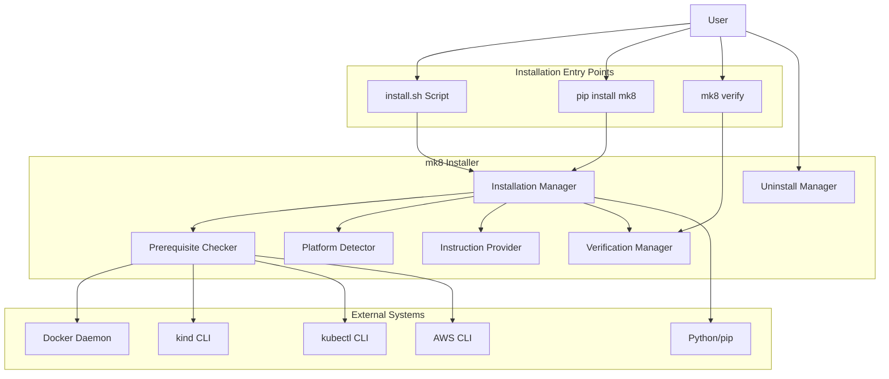
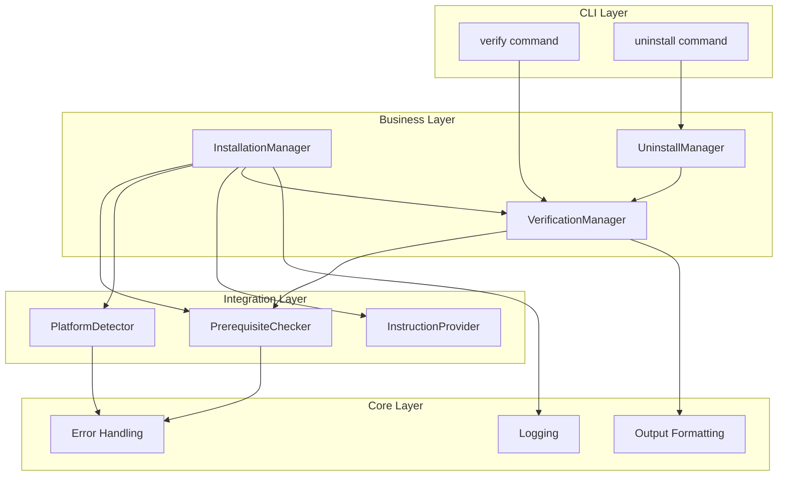
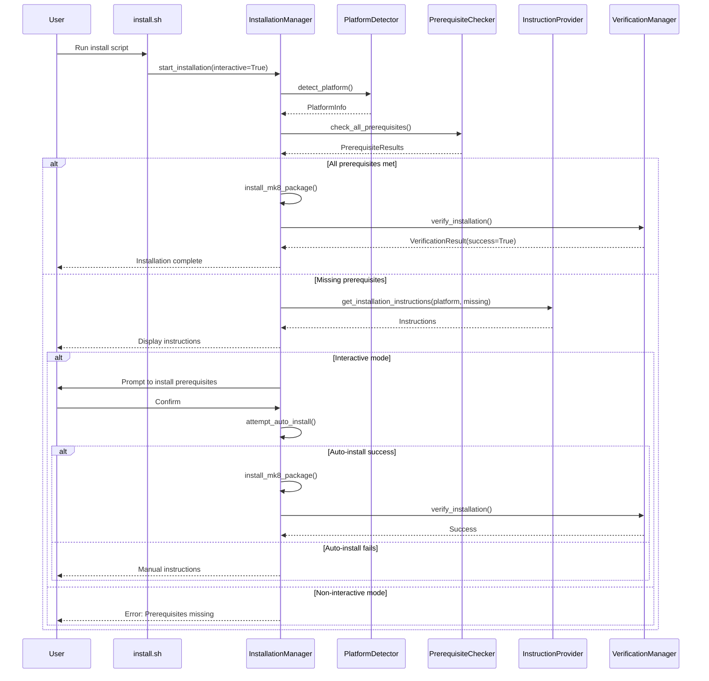
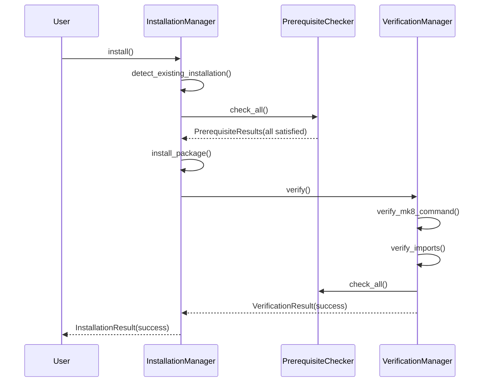
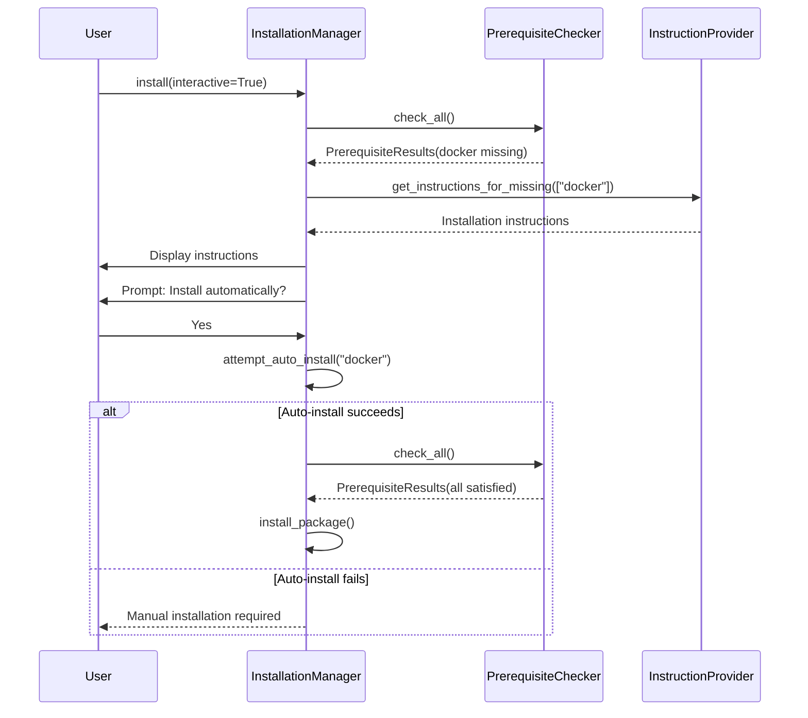

# Installer Design Document

## Overview

The installer feature provides an automated installation and verification system for mk8 and its prerequisites. The design supports multiple installation entry points: standalone script execution, pip post-install hooks, and the `mk8 verify` command. The installer validates prerequisites (Docker, kind, kubectl), detects platform capabilities, provides installation guidance, and verifies successful installation.

### Design Goals

1. **Minimal friction**: Users should get from zero to working mk8 in minimal steps
2. **Clear guidance**: When prerequisites are missing, provide exact platform-specific commands
3. **Robust verification**: Ensure all components work before marking installation complete
4. **Safe operation**: Never break existing configurations or installations
5. **Multi-platform**: Support Linux (multiple distros), macOS, and Windows/WSL2
6. **Flexible entry points**: Support manual scripts, pip hooks, and CLI commands

## Architecture

### System Context



### Component Architecture



### Installation Flow



## Components and Interfaces

### 1. InstallationManager

**Purpose**: Orchestrates the entire installation process, managing prerequisite checks, user interaction, and package installation.

**Location**: `mk8/business/installer.py`

**Interface**:
```python
class InstallationManager:
    """Manages the installation process for mk8."""

    def __init__(
        self,
        interactive: bool = True,
        force_reinstall: bool = False,
        logger: Optional[logging.Logger] = None,
        output: Optional[OutputFormatter] = None,
    ):
        """Initialize installation manager."""

    def install(self) -> InstallationResult:
        """
        Execute the installation process.

        Returns:
            InstallationResult indicating success/failure

        Raises:
            PrerequisiteError: If prerequisites are missing (non-interactive)
            InstallationError: If installation fails
        """

    def detect_existing_installation(self) -> Optional[str]:
        """
        Check if mk8 is already installed.

        Returns:
            Version string if installed, None otherwise
        """

    def check_prerequisites(self) -> PrerequisiteResults:
        """
        Check all prerequisites.

        Returns:
            PrerequisiteResults with status of all checks
        """

    def handle_missing_prerequisites(
        self,
        results: PrerequisiteResults
    ) -> bool:
        """
        Handle missing prerequisites interactively or provide instructions.

        Args:
            results: Results from prerequisite checks

        Returns:
            True if prerequisites are now satisfied, False otherwise
        """

    def install_package(self) -> bool:
        """
        Install the mk8 Python package.

        Returns:
            True if installation succeeded, False otherwise
        """

    def verify_installation(self) -> VerificationResult:
        """
        Verify the installation is complete and functional.

        Returns:
            VerificationResult with details
        """
```

### 2. PrerequisiteChecker

**Purpose**: Check for required external tools and their versions.

**Location**: `mk8/integrations/prerequisites.py`

**Interface**:
```python
class PrerequisiteChecker:
    """Checks for required external tools and versions."""

    REQUIRED_TOOLS = {
        "docker": {"min_version": "20.10.0", "check_daemon": True},
        "kind": {"min_version": "0.17.0", "check_daemon": False},
        "kubectl": {"min_version": "1.24.0", "check_daemon": False},
    }

    def check_all(self) -> PrerequisiteResults:
        """
        Check all prerequisites.

        Returns:
            PrerequisiteResults with all checks
        """

    def check_docker(self) -> PrerequisiteStatus:
        """
        Check Docker installation and daemon status.

        Returns:
            PrerequisiteStatus for Docker
        """

    def check_kind(self) -> PrerequisiteStatus:
        """
        Check kind installation.

        Returns:
            PrerequisiteStatus for kind
        """

    def check_kubectl(self) -> PrerequisiteStatus:
        """
        Check kubectl installation.

        Returns:
            PrerequisiteStatus for kubectl
        """

    def check_tool_version(
        self,
        tool: str,
        min_version: str
    ) -> Tuple[bool, Optional[str]]:
        """
        Check if a tool meets minimum version requirement.

        Args:
            tool: Tool name (e.g., "docker")
            min_version: Minimum required version

        Returns:
            Tuple of (meets_requirement, current_version)
        """

    def is_docker_daemon_running(self) -> bool:
        """
        Check if Docker daemon is running.

        Returns:
            True if daemon is running, False otherwise
        """
```

### 3. PlatformDetector

**Purpose**: Detect operating system, distribution, and version.

**Location**: `mk8/integrations/platform.py`

**Interface**:
```python
class PlatformDetector:
    """Detects platform information (OS, distribution, version)."""

    def detect(self) -> PlatformInfo:
        """
        Detect current platform.

        Returns:
            PlatformInfo with platform details
        """

    def get_os(self) -> str:
        """
        Get operating system name.

        Returns:
            One of: "linux", "darwin", "windows", "wsl"
        """

    def get_linux_distribution(self) -> Optional[str]:
        """
        Get Linux distribution name.

        Returns:
            Distribution name (e.g., "ubuntu", "debian", "fedora") or None
        """

    def is_wsl(self) -> bool:
        """
        Check if running under WSL2.

        Returns:
            True if WSL2, False otherwise
        """

    def is_platform_supported(self) -> bool:
        """
        Check if current platform is supported.

        Returns:
            True if supported, False otherwise
        """
```

### 4. InstructionProvider

**Purpose**: Generate platform-specific installation instructions.

**Location**: `mk8/business/installation_instructions.py`

**Interface**:
```python
class InstructionProvider:
    """Provides platform-specific installation instructions."""

    def __init__(self, platform: PlatformInfo):
        """Initialize with platform information."""

    def get_instructions_for_missing(
        self,
        missing: List[str]
    ) -> Dict[str, str]:
        """
        Get installation instructions for missing tools.

        Args:
            missing: List of missing tool names

        Returns:
            Dict mapping tool name to installation instructions
        """

    def get_docker_instructions(self) -> str:
        """Get Docker installation instructions for platform."""

    def get_kind_instructions(self) -> str:
        """Get kind installation instructions for platform."""

    def get_kubectl_instructions(self) -> str:
        """Get kubectl installation instructions for platform."""

    def format_instructions(
        self,
        instructions: Dict[str, str]
    ) -> str:
        """
        Format instructions for display to user.

        Args:
            instructions: Dict of tool->instructions

        Returns:
            Formatted string ready for display
        """
```

### 5. VerificationManager

**Purpose**: Verify that installation completed successfully.

**Location**: `mk8/business/verification.py`

**Interface**:
```python
class VerificationManager:
    """Verifies mk8 installation is complete and functional."""

    def verify(self) -> VerificationResult:
        """
        Perform full installation verification.

        Returns:
            VerificationResult with details
        """

    def verify_mk8_command(self) -> bool:
        """
        Verify mk8 command is in PATH and executable.

        Returns:
            True if mk8 command works, False otherwise
        """

    def verify_imports(self) -> List[str]:
        """
        Verify all Python dependencies can be imported.

        Returns:
            List of import errors (empty if all successful)
        """

    def verify_prerequisites(self) -> PrerequisiteResults:
        """
        Re-check all prerequisites.

        Returns:
            PrerequisiteResults
        """
```

### 6. UninstallManager

**Purpose**: Clean removal of mk8 and optionally its configuration.

**Location**: `mk8/business/uninstaller.py`

**Interface**:
```python
class UninstallManager:
    """Manages mk8 uninstallation."""

    def __init__(
        self,
        remove_config: bool = False,
        interactive: bool = True,
        logger: Optional[logging.Logger] = None,
    ):
        """Initialize uninstall manager."""

    def uninstall(self) -> UninstallResult:
        """
        Uninstall mk8.

        Returns:
            UninstallResult with status
        """

    def remove_package(self) -> bool:
        """
        Remove mk8 Python package.

        Returns:
            True if successful, False otherwise
        """

    def remove_configuration(self) -> bool:
        """
        Remove ~/.config/mk8 directory.

        Returns:
            True if successful, False otherwise
        """

    def verify_removal(self) -> bool:
        """
        Verify mk8 is no longer in PATH.

        Returns:
            True if fully removed, False otherwise
        """
```

## Data Models

### PlatformInfo
```python
@dataclass
class PlatformInfo:
    """Information about the platform."""

    os: str  # "linux", "darwin", "windows", "wsl"
    distribution: Optional[str]  # "ubuntu", "debian", "fedora", etc.
    version: Optional[str]  # OS/distribution version
    architecture: str  # "x86_64", "arm64", etc.
    supported: bool  # Whether platform is supported

    def is_linux(self) -> bool:
        """Check if Linux-based."""
        return self.os in ("linux", "wsl")

    def is_wsl(self) -> bool:
        """Check if WSL."""
        return self.os == "wsl"
```

### PrerequisiteStatus
```python
@dataclass
class PrerequisiteStatus:
    """Status of a single prerequisite check."""

    name: str  # Tool name (e.g., "docker")
    installed: bool  # Whether tool is installed
    version: Optional[str]  # Installed version if available
    version_ok: bool  # Whether version meets minimum requirement
    daemon_running: Optional[bool]  # For tools with daemons (Docker)
    path: Optional[str]  # Path to tool executable
    error: Optional[str]  # Error message if check failed

    def is_satisfied(self) -> bool:
        """Check if prerequisite is fully satisfied."""
        if not self.installed or not self.version_ok:
            return False
        if self.daemon_running is not None and not self.daemon_running:
            return False
        return True
```

### PrerequisiteResults
```python
@dataclass
class PrerequisiteResults:
    """Results from checking all prerequisites."""

    docker: PrerequisiteStatus
    kind: PrerequisiteStatus
    kubectl: PrerequisiteStatus

    def all_satisfied(self) -> bool:
        """Check if all prerequisites are satisfied."""
        return all([
            self.docker.is_satisfied(),
            self.kind.is_satisfied(),
            self.kubectl.is_satisfied(),
        ])

    def get_missing(self) -> List[str]:
        """Get list of missing prerequisite names."""
        missing = []
        if not self.docker.is_satisfied():
            missing.append("docker")
        if not self.kind.is_satisfied():
            missing.append("kind")
        if not self.kubectl.is_satisfied():
            missing.append("kubectl")
        return missing

    def get_status_summary(self) -> str:
        """Get human-readable summary of all statuses."""
        # Format summary string
```

### InstallationResult
```python
@dataclass
class InstallationResult:
    """Result of installation process."""

    success: bool
    previous_version: Optional[str]  # If upgrading
    new_version: str
    prerequisites_satisfied: bool
    verification_passed: bool
    messages: List[str]  # Informational messages
    errors: List[str]  # Error messages

    def is_upgrade(self) -> bool:
        """Check if this was an upgrade."""
        return self.previous_version is not None
```

### VerificationResult
```python
@dataclass
class VerificationResult:
    """Result of installation verification."""

    command_available: bool
    command_path: Optional[str]
    imports_ok: bool
    import_errors: List[str]
    prerequisites_ok: bool
    prerequisite_results: Optional[PrerequisiteResults]

    def is_fully_verified(self) -> bool:
        """Check if installation is fully verified."""
        return all([
            self.command_available,
            self.imports_ok,
            self.prerequisites_ok,
        ])
```

### UninstallResult
```python
@dataclass
class UninstallResult:
    """Result of uninstallation process."""

    success: bool
    package_removed: bool
    config_removed: bool
    verified_removed: bool
    errors: List[str]
```

## Error Handling

### Exception Hierarchy

Extend existing mk8 error hierarchy:

```python
class InstallationError(MK8Error):
    """Raised when installation fails."""
    pass

class VerificationError(MK8Error):
    """Raised when installation verification fails."""
    pass

class UninstallError(MK8Error):
    """Raised when uninstallation fails."""
    pass
```

### Error Scenarios

| Scenario | Exception | Exit Code | Suggestions |
|----------|-----------|-----------|-------------|
| Prerequisites missing (non-interactive) | PrerequisiteError | 4 | Install missing tools, run with --interactive |
| Docker daemon not running | PrerequisiteError | 4 | Start Docker Desktop, run `systemctl start docker` |
| Unsupported platform | PrerequisiteError | 4 | List supported platforms, manual installation docs |
| Pip install fails | InstallationError | 1 | Check permissions, check disk space, check network |
| Verification fails | VerificationError | 1 | Check PATH, reinstall, check prerequisites |
| Uninstall fails | UninstallError | 1 | Manual removal instructions |
| Network/proxy issues | InstallationError | 1 | Check proxy settings, check network connection |
| Permission denied | InstallationError | 1 | Use virtual environment, use sudo (with warning) |

### Error Message Format

All error messages should follow the established pattern:
```
Error: <Clear description>

[Optional context about what was being attempted]

Suggestions:
  • <Specific step 1>
  • <Alternative step 2>
  • <Fallback option>
```

## Testing Strategy

### Unit Tests

**Coverage Target**: 90%+ (higher than general 80% due to installation criticality)

**Test Organization**:
```
tests/unit/business/
├── test_installer.py              # InstallationManager tests
├── test_verification.py           # VerificationManager tests
├── test_uninstaller.py           # UninstallManager tests
└── test_installation_instructions.py  # InstructionProvider tests

tests/unit/integrations/
├── test_prerequisites.py          # PrerequisiteChecker tests
└── test_platform.py               # PlatformDetector tests

tests/unit/cli/
└── test_verify_command.py         # verify command tests
```

**Key Test Scenarios**:

1. **PrerequisiteChecker**:
   - Tool installed and version ok
   - Tool installed but version too old
   - Tool not installed
   - Docker daemon running vs not running
   - Command not in PATH
   - Version parsing edge cases

2. **PlatformDetector**:
   - Each supported OS (Linux, macOS, WSL)
   - Each supported Linux distribution
   - Unsupported platforms
   - WSL detection accuracy

3. **InstallationManager**:
   - Fresh install (no previous version)
   - Upgrade (newer version)
   - Downgrade (older version)
   - Reinstall (same version)
   - All prerequisites met
   - Missing prerequisites (interactive)
   - Missing prerequisites (non-interactive)
   - Installation interrupted
   - Virtual environment active vs not active

4. **VerificationManager**:
   - All checks pass
   - Command not in PATH
   - Import errors
   - Prerequisites fail after installation

5. **UninstallManager**:
   - Standard uninstall (keep config)
   - Full uninstall (remove config)
   - Package not installed
   - Config directory doesn't exist

### Integration Tests

**Test Organization**:
```
tests/integration/
├── test_installation_flow.py      # End-to-end installation
├── test_verification_flow.py      # End-to-end verification
└── test_uninstall_flow.py         # End-to-end uninstallation
```

**Key Integration Tests**:
1. Complete installation flow in fresh environment
2. Installation with missing Docker
3. Installation with missing kind/kubectl
4. Upgrade from previous version
5. Verify command functionality
6. Uninstall and verify cleanup

### Mocking Strategy

**Mock External Dependencies**:
- `subprocess.run()` calls for tool checks
- `shutil.which()` for PATH checks
- File system operations
- pip install operations
- Platform detection calls

**Use Real Components**:
- Data models
- Error formatting
- Logging
- Output formatting

### Test Data

**Sample Version Outputs**:
```python
DOCKER_VERSION_OUTPUT = "Docker version 24.0.5, build ced0996"
KIND_VERSION_OUTPUT = "kind v0.20.0 go1.20.4 linux/amd64"
KUBECTL_VERSION_OUTPUT = "Client Version: v1.28.0"
```

**Sample Platform Info**:
```python
UBUNTU_PLATFORM = PlatformInfo(
    os="linux",
    distribution="ubuntu",
    version="22.04",
    architecture="x86_64",
    supported=True
)
```

## Implementation Notes

### Subprocess Best Practices

All subprocess calls should use:
```python
subprocess.run(
    ["command", "arg1", "arg2"],  # Never use shell=True
    capture_output=True,
    text=True,
    timeout=10,  # Prevent hangs
    check=False,  # Handle errors manually
)
```

### Virtual Environment Detection

```python
def is_virtual_env() -> bool:
    """Check if running in a virtual environment."""
    return (
        hasattr(sys, 'real_prefix') or  # virtualenv
        (hasattr(sys, 'base_prefix') and sys.base_prefix != sys.prefix)  # venv
    )
```

### Platform Detection Implementation

```python
def is_wsl() -> bool:
    """Detect WSL by checking for WSL-specific files."""
    if platform.system() != "Linux":
        return False

    # Check /proc/version for "Microsoft" or "WSL"
    try:
        with open("/proc/version", "r") as f:
            version = f.read().lower()
            return "microsoft" in version or "wsl" in version
    except:
        return False
```

### Version Parsing

Use semantic versioning library or implement parser:
```python
def parse_version(version_string: str) -> Tuple[int, int, int]:
    """
    Parse semantic version from string.

    Args:
        version_string: Version string like "v1.28.0" or "24.0.5"

    Returns:
        Tuple of (major, minor, patch)
    """
    # Strip leading 'v' if present
    version = version_string.lstrip('v')

    # Split and convert to ints
    parts = version.split('.')
    major = int(parts[0]) if len(parts) > 0 else 0
    minor = int(parts[1]) if len(parts) > 1 else 0
    patch = int(parts[2]) if len(parts) > 2 else 0

    return (major, minor, patch)
```

### Configuration File Permissions

When creating config files:
```python
import os
import stat

config_file = Path.home() / ".config" / "mk8" / "config.yaml"
config_file.parent.mkdir(parents=True, exist_ok=True)
config_file.write_text(content)

# Set restrictive permissions (0600)
os.chmod(config_file, stat.S_IRUSR | stat.S_IWUSR)
```

### Logging Best Practices

```python
# Log all subprocess calls
logger.debug(f"Running command: {' '.join(cmd)}")
result = subprocess.run(cmd, ...)
logger.debug(f"Command output: {result.stdout}")
logger.debug(f"Command stderr: {result.stderr}")
logger.debug(f"Command exit code: {result.returncode}")

# Log all file operations
logger.debug(f"Creating directory: {path}")
logger.debug(f"Writing file: {file_path}")

# Mask sensitive data
logger.debug(f"AWS Access Key: {key[:4]}...{key[-4:]}")
```

## CLI Integration

### New Commands

Add to `mk8/cli/main.py`:

```python
@cli.command()
@click.option('--verbose', '-v', is_flag=True, help='Verbose output')
@click.pass_context
def verify(ctx: click.Context, verbose: bool) -> None:
    """Verify mk8 installation and prerequisites."""
    # Implementation calls VerificationManager

@cli.command()
@click.option('--remove-config', is_flag=True, help='Remove configuration files')
@click.option('--yes', '-y', is_flag=True, help='Skip confirmation prompts')
@click.pass_context
def uninstall(ctx: click.Context, remove_config: bool, yes: bool) -> None:
    """Uninstall mk8."""
    # Implementation calls UninstallManager
```

### Standalone Script

Create `scripts/install.sh`:
```bash
#!/bin/bash
# mk8 installation script
# Usage: curl -fsSL https://example.com/install.sh | bash

set -e

echo "Installing mk8..."

# Check Python version
python3 --version || {
    echo "Error: Python 3.8+ required"
    exit 1
}

# Install mk8
pip3 install mk8

# Run verification
mk8 verify
```

## Sequence Diagrams

### Successful Installation Flow



### Missing Prerequisites Flow (Interactive)



## Future Enhancements

1. **Auto-installation**: Attempt to install missing prerequisites automatically (with user permission)
2. **Offline installation**: Support installation from local package cache
3. **Custom installation paths**: Allow user to specify installation directory
4. **Plugin system**: Allow third-party prerequisites to register checks
5. **Health monitoring**: Periodic verification that prerequisites are still available
6. **Upgrade notifications**: Check for newer versions and notify user
7. **Rollback support**: Automatically roll back failed installations

## Dependencies

### New Python Dependencies

None required - use only standard library:
- `subprocess` - Running external commands
- `platform` - Platform detection
- `sys` - Python environment info
- `shutil` - File operations and which()
- `pathlib` - Path manipulation
- `os` - File permissions

### External Tools (Runtime)

Required for mk8 operation (checked by installer):
- Docker 20.10.0+
- kind 0.17.0+
- kubectl 1.24.0+

## Security Considerations

1. **Never use shell=True**: Always pass command as list to subprocess.run()
2. **Validate all paths**: Use pathlib and resolve() to prevent path traversal
3. **Restrictive permissions**: Set 0600 on config files containing credentials
4. **Input validation**: Validate all version strings and paths before using
5. **Timeout all subprocess calls**: Prevent hanging on unresponsive tools
6. **Mask sensitive data in logs**: Never log full credentials
7. **Verify checksums**: If downloading tools, verify checksums (future)

## Performance Considerations

- **Parallel checks**: Check prerequisites concurrently where possible
- **Cache results**: Cache platform detection and version checks for session
- **Fast failure**: Fail fast on missing prerequisites in non-interactive mode
- **Minimal output**: Only show necessary info unless in verbose mode
- **Timeout defaults**: Use reasonable timeouts (5-10s) for subprocess calls
