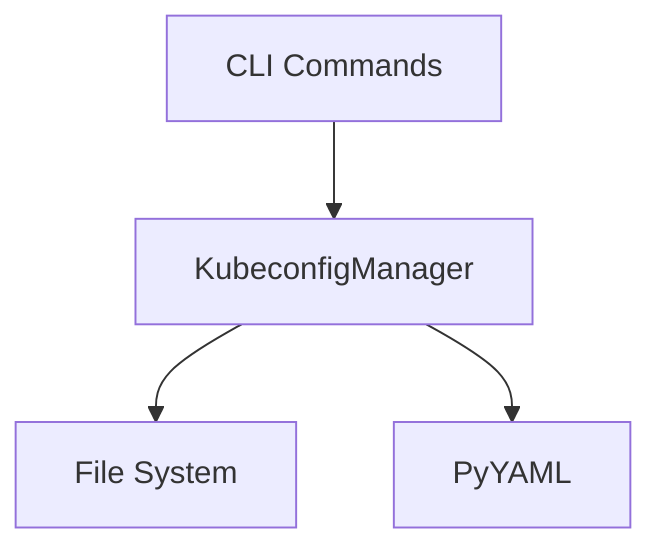

# Design Document: Kubeconfig File Handling

## Overview

The kubeconfig file handling system provides safe, atomic operations for managing kubectl configuration files. It ensures that mk8 can integrate new clusters into existing kubectl configurations without disrupting access to other clusters or corrupting the configuration file.

The design follows a layered approach with clear separation between file I/O, YAML parsing, configuration merging logic, and atomic update operations. The system treats the kubeconfig file as a critical resource that requires careful handling with backups, validation, and atomic updates.

## Architecture

### High-Level Architecture



### Component Responsibilities

The design uses a single `KubeconfigManager` class that handles all operations directly. This keeps the implementation simple and straightforward:

1. **KubeconfigManager**: Handles all kubeconfig operations including file I/O, parsing, merging, backups, and atomic updates
2. **PyYAML**: External library for YAML parsing and serialization
3. **File System**: Standard library (`pathlib`, `tempfile`, `shutil`) for file operations

## Components and Interfaces

### KubeconfigManager

A single class that handles all kubeconfig operations.

```python
class KubeconfigManager:
    """
    Manages kubectl configuration file operations.
    
    Handles all kubeconfig operations including reading, writing, parsing,
    merging, backups, and atomic updates in a single cohesive class.
    """
    
    def __init__(
        self,
        config_path: Optional[Path] = None,
        max_backups: int = 5
    ):
        """
        Initialize the kubeconfig manager.
        
        Args:
            config_path: Path to kubeconfig file (defaults to ~/.kube/config or KUBECONFIG)
            max_backups: Maximum number of backup files to retain
        """
        pass
    
    def add_cluster(
        self,
        cluster_name: str,
        cluster_config: Dict[str, Any],
        set_current: bool = True
    ) -> None:
        """
        Add a new cluster configuration to kubeconfig.
        
        Args:
            cluster_name: Name of the cluster
            cluster_config: Cluster configuration dict with server, ca, etc.
            set_current: Whether to set this cluster as current context
            
        Raises:
            KubeconfigError: If operation fails
        """
        pass
    
    def remove_cluster(
        self,
        cluster_name: str,
        restore_previous_context: bool = True
    ) -> None:
        """
        Remove a cluster configuration from kubeconfig.
        
        Args:
            cluster_name: Name of the cluster to remove
            restore_previous_context: Whether to restore previous context
            
        Raises:
            KubeconfigError: If operation fails
        """
        pass
    
    def get_current_context(self) -> Optional[str]:
        """Get the current kubectl context."""
        pass
    
    def set_current_context(self, context_name: str) -> None:
        """Set the current kubectl context."""
        pass
    
    def list_clusters(self) -> List[str]:
        """List all cluster names in kubeconfig."""
        pass
    
    def cluster_exists(self, cluster_name: str) -> bool:
        """Check if a cluster exists in kubeconfig."""
        pass
    
    # Private helper methods (implementation details)
    def _read_config(self) -> Dict[str, Any]:
        """Read and parse kubeconfig file."""
        pass
    
    def _write_config(self, config: Dict[str, Any]) -> None:
        """Write kubeconfig atomically with backup."""
        pass
    
    def _create_backup(self) -> None:
        """Create timestamped backup of current config."""
        pass
    
    def _cleanup_old_backups(self) -> None:
        """Remove old backups beyond retention limit."""
        pass
```

## Data Models

### Data Representation

The design uses native Python dictionaries to represent kubeconfig data, matching the YAML structure directly. This eliminates the need for custom data classes and simplifies serialization.

```python
# Kubeconfig structure (as dict):
{
    'apiVersion': 'v1',
    'kind': 'Config',
    'clusters': [
        {'name': 'my-cluster', 'cluster': {'server': 'https://...', ...}}
    ],
    'contexts': [
        {'name': 'my-context', 'context': {'cluster': 'my-cluster', 'user': 'my-user'}}
    ],
    'users': [
        {'name': 'my-user', 'user': {'client-certificate-data': '...', ...}}
    ],
    'current-context': 'my-context',
    'preferences': {}
}
```

### Error Hierarchy

```python
class KubeconfigError(MK8Error):
    """Base exception for kubeconfig operations."""
    pass
```

All kubeconfig errors inherit from this single base class. Specific error types can be distinguished by error messages and suggestions rather than separate exception classes.

## Correctness Properties

*A property is a characteristic or behavior that should hold true across all valid executions of a system-essentially, a formal statement about what the system should do. Properties serve as the bridge between human-readable specifications and machine-verifiable correctness guarantees.*


### Property Reflection

After analyzing all acceptance criteria, several properties can be consolidated:
- Properties 2.2, 2.3, 2.4 (preserve clusters/contexts/users) → Combined into single "preserve all entries" property
- Properties 5.1, 5.2, 5.3 (remove cluster/context/user) → Combined into single "cascading removal" property  
- Properties 7.1, 7.2, 7.3 (temp file, validate, replace) → Combined into single "atomic write" property
- Requirement 8 (Concurrent Access) removed - atomic writes provide sufficient protection

This reduces redundancy and complexity while maintaining comprehensive coverage of the requirements.

### Property 1: Read before modify
*For any* kubeconfig modification operation, the system should read and parse the existing file (if it exists) before making any changes
**Validates: Requirements 1.2**

### Property 2: Invalid configs rejected
*For any* invalid or corrupted kubeconfig content, the system should reject it with an error and refuse to modify it
**Validates: Requirements 1.4**

### Property 3: Preservation of unrelated entries
*For any* kubeconfig modification operation, all entries not related to the operation (clusters, contexts, users) should remain unchanged in the resulting configuration
**Validates: Requirements 1.5, 2.2, 2.3, 2.4, 5.4**

### Property 4: Merge produces valid YAML
*For any* merge operation, the resulting kubeconfig file should contain valid YAML that can be parsed successfully
**Validates: Requirements 2.5**

### Property 5: Conflict handling
*For any* merge operation where a naming conflict exists, the system should automatically rename the new cluster with a numeric suffix without corrupting the configuration
**Validates: Requirements 2.6**

### Property 6: Directory and permissions on creation
*For any* kubeconfig file creation, the system should ensure the ~/.kube directory exists with mode 0o700 and the file has mode 0o600
**Validates: Requirements 3.2, 3.3**

### Property 7: Standard structure on creation
*For any* newly created kubeconfig file, it should contain the standard structure with apiVersion, kind, clusters, contexts, and users sections
**Validates: Requirements 3.4**

### Property 8: Context setting on cluster add
*For any* cluster addition operation with set_current=True, the current-context field should be set to the new cluster's context
**Validates: Requirements 4.1**

### Property 9: Previous context storage
*For any* context change operation, the system should store the previous context value for potential restoration
**Validates: Requirements 4.2**

### Property 10: Cascading removal
*For any* cluster removal operation, the system should remove the cluster entry, its associated context entry, and its associated user entry from the configuration
**Validates: Requirements 5.1, 5.2, 5.3**

### Property 11: Context switching on removal
*For any* cluster removal where the removed cluster was the current context, the system should either restore the previous context (if it exists) or select another valid context (if available) or clear the current-context field (if no contexts remain)
**Validates: Requirements 5.5, 6.1, 6.2**

### Property 12: Atomic file updates
*For any* kubeconfig modification, the system should write to a temporary file, validate it, then atomically replace the original, ensuring the original remains unchanged if any step fails
**Validates: Requirements 7.1, 7.2, 7.3, 7.4**

### Property 13: Temporary file cleanup
*For any* kubeconfig operation (successful or failed), no temporary files should remain after the operation completes
**Validates: Requirements 7.5**

### Property 14: Backup creation
*For any* modification to an existing kubeconfig file, the system should create a timestamped backup before making changes
**Validates: Requirements 8.1, 8.2**

### Property 15: Backup cleanup
*For any* backup directory with more than 5 backup files, the system should remove the oldest backups to maintain the limit
**Validates: Requirements 8.3**

### Property 16: Error messages include suggestions
*For any* error raised by kubeconfig operations, the error message should include at least one specific suggestion for resolving the issue
**Validates: Requirements 9.2**

### Property 17: Parse-serialize round trip
*For any* valid kubeconfig data structure, serializing it to YAML and then parsing it back should produce an equivalent structure
**Validates: Requirements 1.3, 2.5** (validates parser correctness)

## Error Handling

### Error Categories

1. **File System Errors**
   - File not found (when expected to exist)
   - Permission denied (read or write)
   - Disk full
   - Directory creation failure

2. **Parse Errors**
   - Invalid YAML syntax
   - Missing required fields
   - Invalid structure

3. **Merge Errors**
   - Unresolvable naming conflicts
   - Invalid cluster configuration

4. **Lock Errors**
   - Unable to acquire lock
   - Lock timeout exceeded

5. **Backup Errors**
   - Backup creation failure
   - Backup directory not writable

### Error Handling Strategy

All errors should:
1. Inherit from `KubeconfigError` (which inherits from `MK8Error`)
2. Include a clear description of what went wrong
3. Include specific suggestions for resolution
4. Preserve the original kubeconfig file (never leave it corrupted)
5. Clean up any temporary files

Example error messages:

```python
# Permission error
raise KubeconfigError(
    "Cannot write to kubeconfig file: ~/.kube/config",
    suggestions=[
        "Check file permissions: chmod 600 ~/.kube/config",
        "Ensure you own the file: ls -la ~/.kube/config"
    ]
)

# Parse error
raise KubeconfigError(
    "Kubeconfig file contains invalid YAML",
    suggestions=[
        "Validate YAML syntax: yamllint ~/.kube/config",
        "Restore from backup in ~/.kube/backups/",
        "Check for manual edits that may have introduced errors"
    ]
)
```

### Rollback Strategy

When an operation fails:
1. Keep the original file unchanged (atomic writes ensure this)
2. Remove any temporary files
3. Release any locks held
4. Inform user that backup is available if needed
5. Do not leave the system in an inconsistent state

## Testing Strategy

### Unit Testing

Unit tests will cover the `KubeconfigManager` class:

1. **Basic Operations**
   - Adding clusters
   - Removing clusters
   - Setting/getting current context
   - Listing clusters
   - Checking cluster existence

2. **File Operations**
   - Reading existing configs
   - Creating new configs
   - Atomic writes
   - Permission setting
   - Directory creation

3. **Merge Logic**
   - Merging without conflicts
   - Handling naming conflicts
   - Preserving unrelated entries
   - Cascading removal

4. **Backup Management**
   - Creating timestamped backups
   - Cleaning up old backups
   - Backup retention limits

5. **Error Handling**
   - Invalid YAML
   - Permission errors
   - Missing files
   - Corrupted configs

### Property-Based Testing

Property-based tests will use **Hypothesis** (Python's property-based testing library) to verify universal properties across many randomly generated inputs. Each test will run a minimum of 100 iterations.

**Property test implementations:**

1. **Property 1: Read before modify**
   - **Feature: kubeconfig-file-handling, Property 1: Read before modify**
   - Generate: Random valid kubeconfig files
   - Test: Mock file operations and verify read is called before write

2. **Property 2: Invalid configs rejected**
   - **Feature: kubeconfig-file-handling, Property 2: Invalid configs rejected**
   - Generate: Random invalid YAML and corrupted kubeconfig structures
   - Test: All invalid inputs should raise ConfigParseError

3. **Property 3: Preservation of unrelated entries**
   - **Feature: kubeconfig-file-handling, Property 3: Preservation of unrelated entries**
   - Generate: Random kubeconfig with multiple clusters, random operation (add/remove)
   - Test: Unrelated entries should be identical before and after operation

4. **Property 4: Merge produces valid YAML**
   - **Feature: kubeconfig-file-handling, Property 4: Merge produces valid YAML**
   - Generate: Random valid kubeconfig, random cluster to add
   - Test: Result should parse successfully as valid YAML

5. **Property 5: Conflict handling**
   - **Feature: kubeconfig-file-handling, Property 5: Conflict handling**
   - Generate: Random kubeconfig, cluster with conflicting name
   - Test: Operation should complete without exception and result should be valid

6. **Property 6: Directory and permissions on creation**
   - **Feature: kubeconfig-file-handling, Property 6: Directory and permissions on creation**
   - Generate: Random cluster config, non-existent kubeconfig path
   - Test: Directory should exist with 0o700, file should have 0o600

7. **Property 7: Standard structure on creation**
   - **Feature: kubeconfig-file-handling, Property 7: Standard structure on creation**
   - Generate: Random cluster config, non-existent kubeconfig
   - Test: Created file should have apiVersion, kind, clusters, contexts, users

8. **Property 8: Context setting on cluster add**
   - **Feature: kubeconfig-file-handling, Property 8: Context setting on cluster add**
   - Generate: Random kubeconfig, random cluster with set_current=True
   - Test: current-context should equal new cluster's context name

9. **Property 9: Previous context storage**
   - **Feature: kubeconfig-file-handling, Property 9: Previous context storage**
   - Generate: Random kubeconfig with current context, new context to set
   - Test: Previous context should be stored internally

10. **Property 10: Cascading removal**
    - **Feature: kubeconfig-file-handling, Property 10: Cascading removal**
    - Generate: Random kubeconfig with cluster, remove that cluster
    - Test: Cluster, context, and user entries should all be removed

11. **Property 11: Context switching on removal**
    - **Feature: kubeconfig-file-handling, Property 11: Context switching on removal**
    - Generate: Random kubeconfig, remove current context cluster
    - Test: current-context should be updated appropriately

12. **Property 12: Atomic file updates**
    - **Feature: kubeconfig-file-handling, Property 12: Atomic file updates**
    - Generate: Random kubeconfig, random modification, inject failure at various points
    - Test: Original file should remain unchanged when failures occur

13. **Property 13: Temporary file cleanup**
    - **Feature: kubeconfig-file-handling, Property 13: Temporary file cleanup**
    - Generate: Random kubeconfig operations (successful and failed)
    - Test: No .tmp files should exist after operation

14. **Property 14: Backup creation**
    - **Feature: kubeconfig-file-handling, Property 14: Backup creation**
    - Generate: Random existing kubeconfig, random modification
    - Test: Backup file with timestamp should exist

15. **Property 15: Backup cleanup**
    - **Feature: kubeconfig-file-handling, Property 15: Backup cleanup**
    - Generate: More than 5 backup files
    - Test: Only 5 newest files should remain

16. **Property 16: Error messages include suggestions**
    - **Feature: kubeconfig-file-handling, Property 16: Error messages include suggestions**
    - Generate: Various error conditions
    - Test: All raised KubeconfigError exceptions should have non-empty suggestions list

17. **Property 17: Parse-serialize round trip**
    - **Feature: kubeconfig-file-handling, Property 17: Parse-serialize round trip**
    - Generate: Random valid kubeconfig dicts
    - Test: yaml.safe_load(yaml.safe_dump(config)) should equal config

### Integration Testing

Integration tests will verify:
1. End-to-end cluster addition and removal
2. Interaction with real file system
3. Concurrent access scenarios
4. Recovery from various failure modes
5. Backup and restore workflows

### Test Data Generators

For property-based testing, we'll need simple generators:

```python
# Hypothesis strategies for generating test data

@st.composite
def valid_kubeconfig(draw):
    """Generate valid kubeconfig dict."""
    num_clusters = draw(st.integers(min_value=0, max_value=5))
    cluster_names = [f"cluster-{i}" for i in range(num_clusters)]
    
    return {
        'apiVersion': 'v1',
        'kind': 'Config',
        'clusters': [
            {'name': name, 'cluster': {'server': f'https://server-{i}'}}
            for i, name in enumerate(cluster_names)
        ],
        'contexts': [
            {'name': name, 'context': {'cluster': name, 'user': name}}
            for name in cluster_names
        ],
        'users': [
            {'name': name, 'user': {'token': f'token-{i}'}}
            for i, name in enumerate(cluster_names)
        ],
        'current-context': cluster_names[0] if cluster_names else None
    }

@st.composite
def invalid_yaml(draw):
    """Generate invalid YAML strings."""
    return draw(st.one_of(
        st.just("{ invalid: yaml: ["),
        st.just("not: valid:\n\t\tyaml"),
    ))
```

## Implementation Notes

### Atomic Write Pattern

```python
def _write_config(self, config: Dict[str, Any]) -> None:
    """Write kubeconfig atomically with backup."""
    # Create backup if file exists
    if self.config_path.exists():
        self._create_backup()
    
    # Write to temp file
    temp_path = self.config_path.with_suffix('.tmp')
    try:
        temp_path.write_text(yaml.safe_dump(config))
        # Atomic rename
        temp_path.replace(self.config_path)
        # Set permissions
        self.config_path.chmod(0o600)
    finally:
        # Clean up temp file if it still exists
        if temp_path.exists():
            temp_path.unlink()
```

### KUBECONFIG Environment Variable

```python
def _get_config_path() -> Path:
    """Get kubeconfig path from environment or default."""
    kubeconfig_env = os.environ.get('KUBECONFIG')
    if kubeconfig_env:
        # Use first path if multiple are specified
        return Path(kubeconfig_env.split(':')[0])
    return Path.home() / '.kube' / 'config'
```

### Conflict Resolution

When a naming conflict occurs, automatically append a numeric suffix:
- `my-cluster` → `my-cluster-2`
- `my-cluster-2` → `my-cluster-3`

### Context Tracking

Store previous context as an instance variable for restoration:

```python
self._previous_context: Optional[str] = None
```

## Dependencies

- **PyYAML**: For YAML parsing and serialization (already in requirements.txt)
- **Hypothesis**: For property-based testing (add to requirements-dev.txt)
- **pytest**: For unit and integration testing (already in requirements-dev.txt)
- **Standard library**: `pathlib`, `os`, `tempfile`, `shutil`, `datetime`

## Security Considerations

1. **File Permissions**: Always set kubeconfig to 0o600 (owner read/write only)
2. **Directory Permissions**: Set ~/.kube to 0o700 (owner access only)
3. **Backup Permissions**: Backups should have same restrictive permissions
4. **Temporary Files**: Should be created with restrictive permissions
5. **YAML Parsing**: Use safe YAML loading to prevent code execution
6. **Path Traversal**: Validate paths to prevent directory traversal attacks

## Performance Considerations

1. **File Locking**: Use non-blocking locks with timeout to avoid hanging
2. **Backup Cleanup**: Run asynchronously or lazily to avoid blocking operations
3. **YAML Parsing**: Cache parsed configs when performing multiple operations
4. **Atomic Writes**: Minimize time between temp file creation and rename
5. **Large Files**: Handle kubeconfig files with many clusters efficiently

## Future Enhancements

1. **Multi-file Support**: Handle KUBECONFIG with multiple colon-separated paths
2. **Dry Run Mode**: Preview changes before applying them
3. **Rollback Command**: Easy rollback to previous backup
