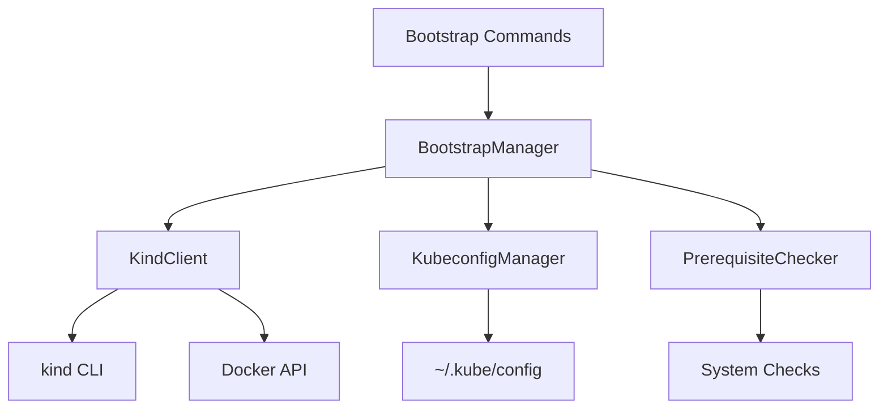

# Design Document: Local kind Cluster Management

## Overview

The local-kind-cluster feature provides lifecycle management for a local Kubernetes cluster using kind (Kubernetes in Docker). This cluster serves as the bootstrap environment for infrastructure management tools like Crossplane and ArgoCD.

The design follows a layered architecture with clear separation between CLI commands, business logic for cluster operations, and integration with external tools (kind, kubectl, Docker). The system emphasizes safety, idempotency, and clear error reporting.

## Architecture

### High-Level Architecture



### Component Responsibilities

1. **BootstrapManager**: Orchestrates bootstrap cluster lifecycle operations
2. **KindClient**: Wraps kind CLI operations for cluster management
3. **KubeconfigManager**: Handles kubeconfig file operations (from kubeconfig-file-handling spec)
4. **PrerequisiteChecker**: Validates system prerequisites (from installer spec)

## Components and Interfaces

### BootstrapManager

The main orchestrator for bootstrap cluster operations.

```python
class BootstrapManager:
    """
    Manages bootstrap cluster lifecycle.
    
    Coordinates between kind cluster operations, kubeconfig management,
    and prerequisite validation to provide a cohesive bootstrap experience.
    """
    
    def __init__(
        self,
        kind_client: Optional[KindClient] = None,
        kubeconfig_manager: Optional[KubeconfigManager] = None,
        prerequisite_checker: Optional[PrerequisiteChecker] = None
    ):
        """
        Initialize the bootstrap manager.
        
        Args:
            kind_client: Client for kind operations (created if not provided)
            kubeconfig_manager: Manager for kubeconfig operations (created if not provided)
            prerequisite_checker: Checker for prerequisites (created if not provided)
        """
        pass
    
    def create_cluster(
        self,
        kubernetes_version: Optional[str] = None,
        force_recreate: bool = False
    ) -> None:
        """
        Create the bootstrap cluster.
        
        Args:
            kubernetes_version: Kubernetes version to use (defaults to kind's default)
            force_recreate: If True, delete existing cluster before creating
            
        Raises:
            BootstrapError: If creation fails
        """
        pass
    
    def delete_cluster(self, skip_confirmation: bool = False) -> None:
        """
        Delete the bootstrap cluster.
        
        Args:
            skip_confirmation: If True, skip confirmation prompt
            
        Raises:
            BootstrapError: If deletion fails
        """
        pass
    
    def get_status(self) -> ClusterStatus:
        """
        Get the current status of the bootstrap cluster.
        
        Returns:
            ClusterStatus object with cluster information
        """
        pass
    
    def cluster_exists(self) -> bool:
        """Check if the bootstrap cluster exists."""
        pass
```

### KindClient

Wraps kind CLI operations.

```python
class KindClient:
    """
    Client for kind cluster operations.
    
    Provides a Python interface to kind CLI commands with
    error handling and output parsing.
    """
    
    CLUSTER_NAME = "mk8-bootstrap"
    
    def __init__(self):
        """Initialize the kind client."""
        pass
    
    def create_cluster(
        self,
        kubernetes_version: Optional[str] = None,
        config: Optional[Dict[str, Any]] = None
    ) -> None:
        """
        Create a kind cluster.
        
        Args:
            kubernetes_version: Kubernetes version to use
            config: Optional kind configuration dict
            
        Raises:
            KindError: If cluster creation fails
        """
        pass
    
    def delete_cluster(self) -> None:
        """
        Delete the kind cluster.
        
        Raises:
            KindError: If deletion fails
        """
        pass
    
    def cluster_exists(self) -> bool:
        """Check if the cluster exists."""
        pass
    
    def get_cluster_info(self) -> Dict[str, Any]:
        """
        Get cluster information.
        
        Returns:
            Dict with cluster details (nodes, version, etc.)
            
        Raises:
            KindError: If cluster doesn't exist or info retrieval fails
        """
        pass
    
    def wait_for_ready(self, timeout: int = 300) -> None:
        """
        Wait for cluster to be ready.
        
        Args:
            timeout: Maximum seconds to wait
            
        Raises:
            KindError: If cluster doesn't become ready in time
        """
        pass
    
    def get_kubeconfig(self) -> str:
        """
        Get kubeconfig for the cluster.
        
        Returns:
            Kubeconfig YAML as string
            
        Raises:
            KindError: If kubeconfig retrieval fails
        """
        pass
```

### ClusterStatus

Data model for cluster status.

```python
@dataclass
class ClusterStatus:
    """Represents the status of the bootstrap cluster."""
    exists: bool
    name: str = "mk8-bootstrap"
    ready: bool = False
    kubernetes_version: Optional[str] = None
    context_name: Optional[str] = None
    node_count: int = 0
    nodes: List[Dict[str, str]] = field(default_factory=list)
    issues: List[str] = field(default_factory=list)
```

### Error Hierarchy

```python
class BootstrapError(MK8Error):
    """Base exception for bootstrap operations."""
    pass


class KindError(BootstrapError):
    """kind CLI operation failed."""
    pass


class ClusterExistsError(BootstrapError):
    """Cluster already exists."""
    pass


class ClusterNotFoundError(BootstrapError):
    """Cluster does not exist."""
    pass
```

## Data Models

### Kind Configuration

The system uses a default kind configuration optimized for infrastructure management:

```yaml
kind: Cluster
apiVersion: kind.x-k8s.io/v1alpha4
nodes:
- role: control-plane
  extraPortMappings:
  - containerPort: 80
    hostPort: 80
    protocol: TCP
  - containerPort: 443
    hostPort: 443
    protocol: TCP
```

This configuration:
- Single control-plane node (sufficient for bootstrap)
- Port mappings for ingress (80, 443)
- Uses kind's default networking

## Correctness Properties

*A property is a characteristic or behavior that should hold true across all valid executions of a system-essentially, a formal statement about what the system should do. Properties serve as the bridge between human-readable specifications and machine-verifiable correctness guarantees.*


### Property Reflection

After analyzing all acceptance criteria, several properties can be consolidated or removed:
- Properties 3.1, 3.2, 3.3 (check Docker/kind/kubectl) → Combined into single "prerequisite validation" property
- Kubeconfig preservation/creation → Delegated to kubeconfig-file-handling spec
- Properties 7.3, 7.4, 7.5 (status display content) → Combined into single "status completeness" property
- UI/display properties (prompts, progress messages) → Removed as implementation details
- Edge case diagnostics (network, timeouts) → Removed as edge cases

**Critical Safety Properties Added:**
- Property 1: Cluster name isolation - ensures mk8 only operates on mk8-bootstrap cluster
- Property 2: Context isolation - prevents accidental operations on user's other clusters

**Simplified Requirements:**
- Reduced from 11 requirements to 10
- Reduced acceptance criteria from 54 to 32
- Removed UI concerns and edge case details
- Delegated kubeconfig details to kubeconfig-file-handling spec

This significantly reduces complexity while maintaining comprehensive coverage of functional requirements and adding critical safety guarantees.

### Property 1: Cluster name isolation
*For any* mk8 operation, the system should only operate on clusters with the name "mk8-bootstrap"
**Validates: Requirements 2.1**

### Property 2: Context isolation
*For any* kubectl operation, the system should explicitly specify the context to use rather than relying on the current context
**Validates: Requirements 2.3**

### Property 3: Cluster creation with correct name
*For any* cluster creation operation, the system should create a kind cluster with the name "mk8-bootstrap"
**Validates: Requirements 4.1**

### Property 4: Prerequisite validation before operations
*For any* bootstrap operation, the system should validate that Docker, kind, and kubectl are installed and accessible before proceeding
**Validates: Requirements 3.1, 3.2, 3.3**

### Property 5: Prerequisite errors include suggestions
*For any* missing prerequisite, the error message should include specific installation instructions
**Validates: Requirements 3.4**

### Property 6: Cluster configuration correctness
*For any* cluster creation, the system should use a kind configuration with control-plane node and port mappings for ingress
**Validates: Requirements 4.2**

### Property 7: Readiness verification
*For any* successful cluster creation, the system should verify node readiness before completing
**Validates: Requirements 4.3**

### Property 8: Creation errors include suggestions
*For any* failed cluster creation, the error message should include suggestions for common issues
**Validates: Requirements 4.4, 9.2**

### Property 9: Context setting on creation
*For any* successful cluster creation, the kubectl context should be set to the bootstrap cluster
**Validates: Requirements 4.5, 6.2**

### Property 10: Existing cluster detection
*For any* create operation when a cluster already exists, the system should detect this condition
**Validates: Requirements 5.1**

### Property 11: Force recreate workflow
*For any* create operation with force_recreate=True and an existing cluster, the system should delete the old cluster and create a new one
**Validates: Requirements 5.2**

### Property 12: Kubeconfig merging
*For any* successful cluster creation, the cluster context should be merged into the kubeconfig file
**Validates: Requirements 6.1** (delegates to kubeconfig-file-handling for preservation and creation)

### Property 13: Status checking
*For any* status operation, the system should accurately report whether the cluster exists
**Validates: Requirements 7.1**

### Property 14: Status completeness
*For any* status operation on an existing cluster, the returned status should include node readiness, context name, and Kubernetes version
**Validates: Requirements 7.3, 7.4, 7.5**

### Property 15: Cluster deletion
*For any* delete operation on an existing cluster, the kind cluster should be removed
**Validates: Requirements 8.2**

### Property 16: Container cleanup verification
*For any* successful cluster deletion, all Docker containers associated with the cluster should be removed
**Validates: Requirements 8.3**

### Property 17: Kubeconfig cleanup
*For any* successful cluster deletion, the bootstrap cluster context should be removed from kubeconfig
**Validates: Requirements 8.4**

### Property 18: Cleanup resilience
*For any* cleanup operation, if individual steps fail, the system should continue with remaining cleanup steps
**Validates: Requirements 8.6**

### Property 19: Kubernetes version customization
*For any* create operation with a specified Kubernetes version, the cluster should be created with that version
**Validates: Requirements 10.1**

### Property 20: Version validation
*For any* create operation with an invalid Kubernetes version, the system should raise an error before attempting creation
**Validates: Requirements 10.3**

## Error Handling

### Error Categories

1. **Prerequisite Errors**
   - Docker not installed
   - Docker daemon not running
   - kind not installed
   - kubectl not installed

2. **Cluster Operation Errors**
   - Cluster creation failure
   - Cluster already exists
   - Cluster not found
   - Cluster not ready timeout

3. **Kubeconfig Errors**
   - Kubeconfig merge failure
   - Kubeconfig cleanup failure
   - Permission errors

4. **Resource Errors**
   - Port conflicts
   - Insufficient system resources
   - Docker container issues

### Error Handling Strategy

All errors should:
1. Inherit from `BootstrapError` (which inherits from `MK8Error`)
2. Include a clear description of what went wrong
3. Include specific suggestions for resolution
4. Preserve system state (don't leave partial clusters)
5. Clean up temporary resources

Example error messages:

```python
# Prerequisite error
raise BootstrapError(
    "Docker daemon is not running",
    suggestions=[
        "Start Docker Desktop",
        "On Linux: sudo systemctl start docker",
        "Verify Docker is running: docker ps"
    ]
)

# Cluster exists error
raise ClusterExistsError(
    "Bootstrap cluster 'mk8-bootstrap' already exists",
    suggestions=[
        "Use 'mk8 bootstrap delete' to remove the existing cluster",
        "Use --force-recreate flag to automatically recreate",
        "Use 'mk8 bootstrap status' to check cluster state"
    ]
)

# Creation failure
raise KindError(
    "Failed to create kind cluster: port 80 already in use",
    suggestions=[
        "Check for other services using port 80: lsof -i :80",
        "Stop conflicting services",
        "Modify kind configuration to use different ports"
    ]
)
```

## Testing Strategy

### Unit Testing

Unit tests will cover:

1. **BootstrapManager**
   - Cluster creation workflow
   - Cluster deletion workflow
   - Status retrieval
   - Existing cluster detection
   - Force recreate logic
   - Error handling

2. **KindClient**
   - Cluster creation
   - Cluster deletion
   - Cluster existence checking
   - Cluster info retrieval
   - Readiness waiting
   - Kubeconfig retrieval
   - Error parsing

3. **ClusterStatus**
   - Status data model
   - Status formatting

### Property-Based Testing

Property-based tests will use **Hypothesis** (Python's property-based testing library) to verify universal properties across many randomly generated inputs. Each test will run a minimum of 100 iterations.

**Property test implementations:**

1. **Property 1: Cluster name isolation**
   - **Feature: local-kind-cluster, Property 1: Cluster name isolation**
   - Generate: Various operation scenarios
   - Test: All operations should only target "mk8-bootstrap" cluster

2. **Property 2: Context isolation**
   - **Feature: local-kind-cluster, Property 2: Context isolation**
   - Generate: Various kubectl operations
   - Test: All kubectl commands should explicitly specify context

3. **Property 3: Cluster creation with correct name**
   - **Feature: local-kind-cluster, Property 3: Cluster creation with correct name**
   - Generate: Various creation scenarios
   - Test: Cluster name should always be "mk8-bootstrap"

4. **Property 4: Prerequisite validation before operations**
   - **Feature: local-kind-cluster, Property 4: Prerequisite validation before operations**
   - Generate: Various system states (missing Docker, kind, kubectl)
   - Test: Operations should fail with clear errors when prerequisites missing

5. **Property 5: Prerequisite errors include suggestions**
   - **Feature: local-kind-cluster, Property 5: Prerequisite errors include suggestions**
   - Generate: Various missing prerequisites
   - Test: All prerequisite errors should have non-empty suggestions

6. **Property 6: Cluster configuration correctness**
   - **Feature: local-kind-cluster, Property 6: Cluster configuration correctness**
   - Generate: Various creation scenarios
   - Test: Configuration should always include control-plane and port mappings

7. **Property 7: Readiness verification**
   - **Feature: local-kind-cluster, Property 7: Readiness verification**
   - Generate: Various cluster states
   - Test: Creation should not complete until nodes are ready

8. **Property 8: Creation errors include suggestions**
   - **Feature: local-kind-cluster, Property 8: Creation errors include suggestions**
   - Generate: Various failure scenarios
   - Test: All creation errors should have non-empty suggestions

9. **Property 9: Context setting on creation**
   - **Feature: local-kind-cluster, Property 9: Context setting on creation**
   - Generate: Various creation scenarios
   - Test: Current context should be set to bootstrap cluster after creation

10. **Property 10: Existing cluster detection**
    - **Feature: local-kind-cluster, Property 10: Existing cluster detection**
    - Generate: Scenarios with existing clusters
    - Test: System should detect existing cluster before attempting creation

11. **Property 11: Force recreate workflow**
    - **Feature: local-kind-cluster, Property 11: Force recreate workflow**
    - Generate: Scenarios with existing clusters and force_recreate=True
    - Test: Old cluster should be deleted and new one created

12. **Property 12: Kubeconfig merging**
    - **Feature: local-kind-cluster, Property 12: Kubeconfig merging**
    - Generate: Various kubeconfig states
    - Test: Bootstrap context should be present in kubeconfig after creation

13. **Property 13: Status checking**
    - **Feature: local-kind-cluster, Property 13: Status checking**
    - Generate: Various cluster states (exists, doesn't exist)
    - Test: Status should accurately report existence

14. **Property 14: Status completeness**
    - **Feature: local-kind-cluster, Property 14: Status completeness**
    - Generate: Various running clusters
    - Test: Status should include node readiness, context, and version

15. **Property 15: Cluster deletion**
    - **Feature: local-kind-cluster, Property 15: Cluster deletion**
    - Generate: Various existing clusters
    - Test: Cluster should not exist after deletion

16. **Property 16: Container cleanup verification**
    - **Feature: local-kind-cluster, Property 16: Container cleanup verification**
    - Generate: Various cluster deletion scenarios
    - Test: No Docker containers should remain after deletion

17. **Property 17: Kubeconfig cleanup**
    - **Feature: local-kind-cluster, Property 17: Kubeconfig cleanup**
    - Generate: Various deletion scenarios
    - Test: Bootstrap context should be removed from kubeconfig after deletion

18. **Property 18: Cleanup resilience**
    - **Feature: local-kind-cluster, Property 18: Cleanup resilience**
    - Generate: Deletion scenarios with injected failures
    - Test: Cleanup should continue despite individual step failures

19. **Property 19: Kubernetes version customization**
    - **Feature: local-kind-cluster, Property 19: Kubernetes version customization**
    - Generate: Various valid Kubernetes versions
    - Test: Cluster should use specified version

20. **Property 20: Version validation**
    - **Feature: local-kind-cluster, Property 20: Version validation**
    - Generate: Invalid Kubernetes versions
    - Test: Should raise error before attempting creation

### Integration Testing

Integration tests will verify end-to-end workflows with **real kind clusters** (no mocking):

1. **Full Cluster Lifecycle**
   - Create real kind cluster
   - Verify cluster is running
   - Check kubeconfig was updated
   - Delete cluster
   - Verify complete cleanup

2. **Real Tool Interaction**
   - Execute actual kind CLI commands
   - Execute actual kubectl commands
   - Interact with real Docker daemon
   - Modify real kubeconfig files

3. **Safety Verification**
   - Verify cluster name is always "mk8-bootstrap"
   - Verify context is explicitly specified in kubectl commands
   - Verify no operations on other clusters

4. **Error Scenarios**
   - Attempt to create when cluster exists
   - Force recreate workflow
   - Delete non-existent cluster
   - Handle Docker daemon failures

5. **Prerequisite Validation**
   - Check real system for Docker, kind, kubectl
   - Verify error messages when tools missing

**Note**: Integration tests require Docker, kind, and kubectl to be installed and will create/delete real clusters. They should be run in a safe environment and may take several minutes to complete.

## Implementation Notes

### Kind CLI Interaction

```python
def _run_kind_command(self, args: List[str]) -> str:
    """Run a kind command and return output."""
    cmd = ["kind"] + args
    result = subprocess.run(
        cmd,
        capture_output=True,
        text=True,
        timeout=300
    )
    if result.returncode != 0:
        raise KindError(
            f"kind command failed: {result.stderr}",
            suggestions=self._parse_kind_error(result.stderr)
        )
    return result.stdout
```

### Cluster Readiness Checking

```python
def wait_for_ready(self, timeout: int = 300) -> None:
    """Wait for cluster nodes to be ready."""
    start_time = time.time()
    while time.time() - start_time < timeout:
        try:
            # Check node status using kubectl
            result = subprocess.run(
                ["kubectl", "get", "nodes", "--context", f"kind-{self.CLUSTER_NAME}"],
                capture_output=True,
                text=True
            )
            if "Ready" in result.stdout:
                return
        except Exception:
            pass
        time.sleep(5)
    
    raise KindError(
        f"Cluster did not become ready within {timeout} seconds",
        suggestions=[
            "Check Docker daemon status",
            "Check system resources (memory, disk)",
            "View cluster logs: kind export logs"
        ]
    )
```

### Default Kind Configuration

```python
DEFAULT_KIND_CONFIG = {
    "kind": "Cluster",
    "apiVersion": "kind.x-k8s.io/v1alpha4",
    "nodes": [
        {
            "role": "control-plane",
            "extraPortMappings": [
                {"containerPort": 80, "hostPort": 80, "protocol": "TCP"},
                {"containerPort": 443, "hostPort": 443, "protocol": "TCP"}
            ]
        }
    ]
}
```

## Dependencies

- **kind**: External CLI tool for cluster management
- **kubectl**: External CLI tool for Kubernetes operations
- **Docker**: Container runtime (via Docker daemon)
- **PyYAML**: For YAML configuration handling
- **Hypothesis**: For property-based testing
- **pytest**: For unit and integration testing
- **KubeconfigManager**: From kubeconfig-file-handling spec
- **PrerequisiteChecker**: From installer spec

## Safety Considerations

**CRITICAL: Cluster Isolation**

mk8 must NEVER operate on clusters it did not create. This is enforced through multiple layers:

1. **Hardcoded Cluster Name**: All operations use the hardcoded name "mk8-bootstrap"
2. **Explicit Context Specification**: All kubectl commands explicitly specify `--context kind-mk8-bootstrap`
3. **Pre-operation Validation**: Before any destructive operation, verify the cluster name
4. **No Current Context Reliance**: Never rely on the current kubectl context

```python
# CORRECT: Explicit context specification
subprocess.run([
    "kubectl", "get", "nodes",
    "--context", "kind-mk8-bootstrap"  # Always explicit
])

# WRONG: Relying on current context
subprocess.run(["kubectl", "get", "nodes"])  # NEVER DO THIS
```

**Validation Before Destructive Operations:**

```python
def delete_cluster(self) -> None:
    """Delete cluster with safety checks."""
    # Verify we're deleting the right cluster
    if not self.cluster_exists():
        raise ClusterNotFoundError("Bootstrap cluster does not exist")
    
    # Double-check cluster name
    cluster_info = self.get_cluster_info()
    if cluster_info["name"] != self.CLUSTER_NAME:
        raise BootstrapError(
            f"Safety check failed: cluster name mismatch",
            suggestions=["This should never happen - please report as a bug"]
        )
    
    # Proceed with deletion
    self._run_kind_command(["delete", "cluster", "--name", self.CLUSTER_NAME])
```

## Security Considerations

1. **Kubeconfig Permissions**: Ensure kubeconfig files have restrictive permissions (0o600)
2. **Docker Socket Access**: Requires access to Docker socket (security consideration for multi-user systems)
3. **Port Exposure**: Default configuration exposes ports 80 and 443 on localhost
4. **Cluster Isolation**: kind clusters are isolated but share the Docker daemon
5. **Context Isolation**: Never operate on contexts not created by mk8

## Performance Considerations

1. **Cluster Creation Time**: Typically 30-60 seconds depending on image pull
2. **Image Caching**: kind caches images to speed up subsequent creations
3. **Resource Usage**: Single control-plane node uses ~2GB RAM
4. **Cleanup Time**: Deletion typically completes in 5-10 seconds

## Future Enhancements

1. **Multi-node Clusters**: Support for multi-node configurations
2. **Custom Networking**: Advanced networking configurations
3. **Persistent Volumes**: Support for persistent storage
4. **Cluster Snapshots**: Save and restore cluster state
5. **Resource Limits**: Configure CPU and memory limits
6. **Custom Images**: Support for custom node images
