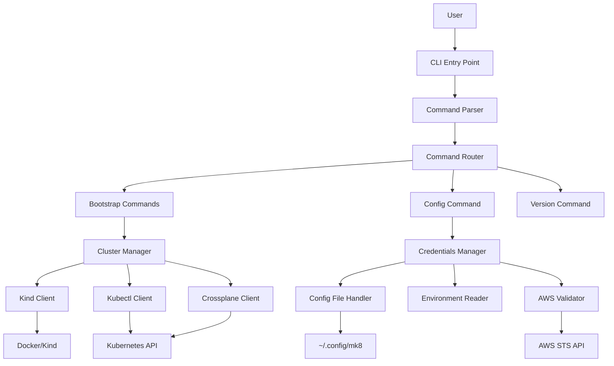
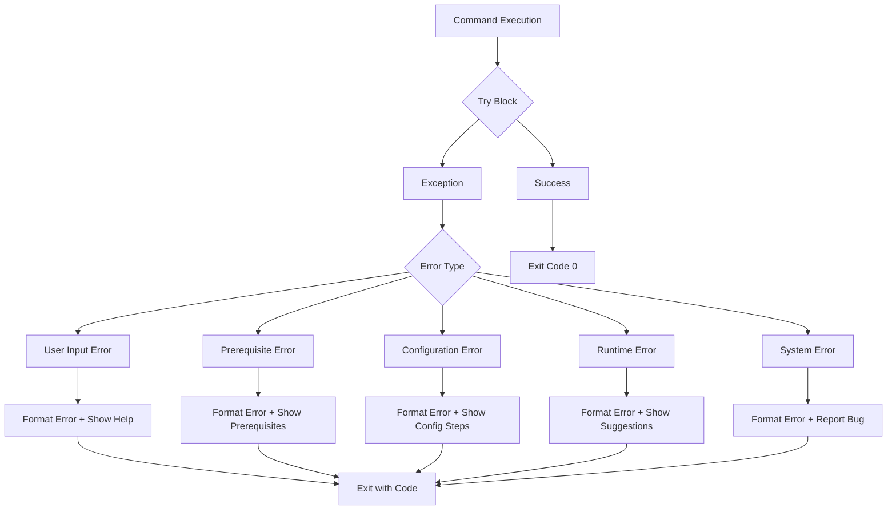

# Design Document

## Overview

The mk8 CLI is a Python-based command-line interface tool that provides a modern, user-friendly interface for managing Kubernetes infrastructure on AWS. The design follows industry best practices for CLI tools, drawing inspiration from kubectl, git, and docker CLI patterns.

### Goals

1. Provide an intuitive, hierarchical command structure that scales as new features are added
2. Deliver clear, actionable error messages that guide users to solutions
3. Support flexible command-line option placement for natural CLI usage
4. Maintain high code quality with comprehensive testing and modular architecture
5. Enable easy extension for future subcommands and features

### Design Principles

- **Convention over Configuration**: Follow established CLI patterns that users already know
- **Progressive Disclosure**: Show basic information by default, detailed information with flags
- **Fail Fast with Clear Feedback**: Validate early and provide specific error messages
- **Consistent Behavior**: All commands follow the same patterns for options, help, and output
- **Testability**: Design for comprehensive unit and integration testing

## Architecture

The mk8 CLI follows a layered architecture separating concerns between CLI parsing, command routing, business logic, and external integrations.



### Layers

1. **CLI Layer**: Entry point, argument parsing, command routing
2. **Command Layer**: Command implementations (bootstrap, config, version)
3. **Business Logic Layer**: Core functionality (cluster management, credential management)
4. **Integration Layer**: External tool clients (kind, kubectl, AWS)
5. **Infrastructure Layer**: File I/O, environment variables, logging

## Components and Interfaces

### 1. CLI Entry Point

**Module**: `mk8/cli/main.py`

**Responsibilities**:
- Application entry point
- Global exception handling
- Exit code management
- Logging initialization

**Interface**:
```python
def main() -> int:
    """
    Main entry point for the mk8 CLI.

    Returns:
        Exit code (0 for success, non-zero for errors)
    """
```

### 2. Command Parser

**Module**: `mk8/cli/parser.py`

**Framework Choice**: Click

**Rationale**: Click is chosen over Typer and argparse because:
- Mature, widely-adopted framework with excellent documentation
- Decorator-based API is intuitive and reduces boilerplate
- Built-in support for nested command groups (perfect for hierarchical structure)
- Excellent help formatting and automatic help generation
- Strong support for flexible option placement
- Good testing utilities

**Interface**:
```python
@click.group()
@click.option('--verbose', '-v', is_flag=True, help='Enable verbose output')
@click.option('--version', is_flag=True, help='Show version information')
@click.pass_context
def cli(ctx: click.Context, verbose: bool, version: bool):
    """mk8 - Manage Kubernetes infrastructure on AWS"""

@cli.group()
def bootstrap():
    """Manage local bootstrap cluster"""

@bootstrap.command()
@click.option('--k8s-version', help='Kubernetes version for the cluster')
@click.option('--crossplane-version', help='Crossplane version to install')
def create(k8s_version: Optional[str], crossplane_version: Optional[str]):
    """Create bootstrap cluster"""

@bootstrap.command()
@click.option('--force', is_flag=True, help='Skip confirmation prompt')
def delete(force: bool):
    """Delete bootstrap cluster"""

@bootstrap.command()
def status():
    """Show bootstrap cluster status"""

@cli.command()
def config():
    """Configure AWS credentials"""

@cli.command()
def version():
    """Show version information"""
```

### 3. Command Router

**Module**: `mk8/cli/commands/`

**Responsibilities**:
- Route parsed commands to appropriate handlers
- Set up command context (logging level, output format)
- Handle common pre/post command tasks

**Structure**:
```
mk8/cli/commands/
├── __init__.py
├── bootstrap.py      # Bootstrap command handlers
├── config.py         # Config command handler
└── version.py        # Version command handler
```

**Interface**:
```python
class CommandContext:
    """Shared context for all commands"""
    verbose: bool
    logger: logging.Logger

class BootstrapCommands:
    """Bootstrap command handlers"""

    @staticmethod
    def create(ctx: CommandContext, k8s_version: Optional[str],
               crossplane_version: Optional[str]) -> int:
        """Execute bootstrap create command"""

    @staticmethod
    def delete(ctx: CommandContext, force: bool) -> int:
        """Execute bootstrap delete command"""

    @staticmethod
    def status(ctx: CommandContext) -> int:
        """Execute bootstrap status command"""

class ConfigCommand:
    """Config command handler"""

    @staticmethod
    def execute(ctx: CommandContext) -> int:
        """Execute config command"""

class VersionCommand:
    """Version command handler"""

    @staticmethod
    def execute(ctx: CommandContext) -> int:
        """Execute version command"""
```

### 4. Error Handler

**Module**: `mk8/core/errors.py`

**Responsibilities**:
- Define custom exception hierarchy
- Format error messages consistently
- Provide error suggestions

**Interface**:
```python
class MK8Error(Exception):
    """Base exception for all mk8 errors"""

    def __init__(self, message: str, suggestions: Optional[List[str]] = None):
        self.message = message
        self.suggestions = suggestions or []
        super().__init__(self.message)

    def format_error(self) -> str:
        """Format error with suggestions"""

class PrerequisiteError(MK8Error):
    """Raised when prerequisites are not met"""

class ValidationError(MK8Error):
    """Raised when input validation fails"""

class CommandError(MK8Error):
    """Raised when a command execution fails"""

class ConfigurationError(MK8Error):
    """Raised when configuration is invalid"""
```

### 5. Output Formatter

**Module**: `mk8/cli/output.py`

**Responsibilities**:
- Format output consistently
- Handle verbose vs. normal output
- Colorize terminal output (optional)

**Interface**:
```python
class OutputFormatter:
    """Handles formatted output to the console"""

    def __init__(self, verbose: bool = False):
        self.verbose = verbose

    def info(self, message: str):
        """Print informational message"""

    def success(self, message: str):
        """Print success message"""

    def warning(self, message: str):
        """Print warning message"""

    def error(self, message: str, suggestions: Optional[List[str]] = None):
        """Print error message with suggestions"""

    def progress(self, message: str):
        """Print progress message (only in verbose mode)"""

    def debug(self, message: str):
        """Print debug message (only in verbose mode)"""
```

### 6. Logger

**Module**: `mk8/core/logging.py`

**Responsibilities**:
- Configure Python logging
- Support verbosity levels
- Add timestamps in verbose mode

**Interface**:
```python
def setup_logging(verbose: bool = False) -> logging.Logger:
    """
    Configure logging for the application.

    Args:
        verbose: Enable verbose logging with timestamps

    Returns:
        Configured logger instance
    """

class VerboseFormatter(logging.Formatter):
    """Custom formatter that includes timestamps"""

    def format(self, record: logging.LogRecord) -> str:
        """Format log record with timestamp"""
```

### 7. Version Manager

**Module**: `mk8/core/version.py`

**Responsibilities**:
- Provide version information
- Support semantic versioning
- Include build metadata for dev builds

**Interface**:
```python
class Version:
    """Version information"""

    MAJOR: int = 0
    MINOR: int = 1
    PATCH: int = 0
    PRERELEASE: Optional[str] = None
    BUILD: Optional[str] = None

    @classmethod
    def get_version(cls) -> str:
        """Get semantic version string"""

    @classmethod
    def get_version_info(cls) -> Dict[str, Any]:
        """Get detailed version information"""
```

## Data Models

### Command Context

```python
@dataclass
class CommandContext:
    """Context shared across command execution"""

    verbose: bool
    logger: logging.Logger
    output: OutputFormatter

    def __post_init__(self):
        """Initialize output formatter"""
        self.output = OutputFormatter(self.verbose)
```

### Exit Codes

```python
class ExitCode(Enum):
    """Standard exit codes for the CLI"""

    SUCCESS = 0
    GENERAL_ERROR = 1
    COMMAND_ERROR = 2
    VALIDATION_ERROR = 3
    PREREQUISITE_ERROR = 4
    CONFIGURATION_ERROR = 5
    KEYBOARD_INTERRUPT = 130
```

## Error Handling

### Error Categories

1. **User Input Errors**: Invalid commands, options, or arguments
2. **Prerequisite Errors**: Missing dependencies or invalid environment
3. **Configuration Errors**: Invalid or missing configuration
4. **Runtime Errors**: Failures during command execution
5. **System Errors**: Unexpected system or library errors

### Error Flow



### Error Message Format

All error messages follow this structure:

```
Error: <Clear description of what went wrong>

<Additional context if helpful>

Suggestions:
  • <Specific action user can take>
  • <Alternative solution>
  • <Link to documentation if relevant>
```

Example:
```
Error: Docker daemon is not running

The bootstrap cluster requires Docker to create the kind cluster.

Suggestions:
  • Start Docker Desktop on macOS/Windows
  • Run 'sudo systemctl start docker' on Linux
  • Check Docker installation: https://docs.docker.com/get-docker/
```

### Exception Handling Strategy

```python
def safe_command_execution(func):
    """Decorator for safe command execution with error handling"""

    @functools.wraps(func)
    def wrapper(*args, **kwargs):
        try:
            return func(*args, **kwargs)
        except KeyboardInterrupt:
            click.echo("\n\nOperation cancelled by user.", err=True)
            sys.exit(ExitCode.KEYBOARD_INTERRUPT.value)
        except MK8Error as e:
            # Our custom errors - format nicely
            output = OutputFormatter()
            output.error(e.message, e.suggestions)
            sys.exit(ExitCode.COMMAND_ERROR.value)
        except click.ClickException as e:
            # Click's exceptions - let Click handle them
            raise
        except Exception as e:
            # Unexpected errors - show and suggest bug report
            click.echo(f"Error: Unexpected error occurred: {str(e)}", err=True)
            click.echo("\nThis may be a bug. Please report it at:", err=True)
            click.echo("https://github.com/your-org/mk8/issues", err=True)
            sys.exit(ExitCode.GENERAL_ERROR.value)

    return wrapper
```

## Testing Strategy

### Unit Tests

**Framework**: pytest

**Coverage Goals**: >80% overall, 100% for critical paths

**Test Organization**:
```
tests/
├── unit/
│   ├── cli/
│   │   ├── test_parser.py         # Command parsing tests
│   │   ├── test_output.py         # Output formatting tests
│   │   └── test_commands.py       # Command handler tests
│   ├── core/
│   │   ├── test_errors.py         # Error handling tests
│   │   ├── test_logging.py        # Logging tests
│   │   └── test_version.py        # Version tests
│   └── conftest.py                # Shared fixtures
├── integration/
│   ├── test_help_system.py        # Help output tests
│   ├── test_error_flow.py         # End-to-end error handling
│   └── test_command_flow.py       # Command execution flow
└── conftest.py
```

### Test Categories

1. **Parser Tests**: Verify command parsing, option handling, help generation
2. **Command Tests**: Test command handlers with mocked dependencies
3. **Error Tests**: Verify error handling and message formatting
4. **Output Tests**: Test formatting and verbosity levels
5. **Integration Tests**: Test complete command flows

### Testing Approach

```python
# Example unit test for command parsing
def test_bootstrap_create_command_parsing():
    """Test that bootstrap create command parses options correctly"""
    runner = CliRunner()
    result = runner.invoke(cli, ['bootstrap', 'create', '--k8s-version', '1.28.0'])

    assert result.exit_code == 0
    # Verify k8s-version was parsed correctly

# Example test for error handling
def test_prerequisite_error_formatting():
    """Test that prerequisite errors are formatted correctly"""
    error = PrerequisiteError(
        "Docker is not installed",
        suggestions=["Install Docker from https://docker.com"]
    )

    formatted = error.format_error()
    assert "Docker is not installed" in formatted
    assert "Suggestions:" in formatted
    assert "Install Docker" in formatted

# Example test for output formatting
def test_verbose_output():
    """Test that verbose flag enables detailed output"""
    formatter = OutputFormatter(verbose=True)

    # In verbose mode, progress messages should be shown
    with patch('sys.stdout', new=StringIO()) as fake_out:
        formatter.progress("Test progress")
        assert "Test progress" in fake_out.getvalue()

# Example integration test
def test_help_system_hierarchical():
    """Test that help is available at all command levels"""
    runner = CliRunner()

    # Top-level help
    result = runner.invoke(cli, ['--help'])
    assert result.exit_code == 0
    assert 'bootstrap' in result.output
    assert 'config' in result.output

    # Bootstrap command help
    result = runner.invoke(cli, ['bootstrap', '--help'])
    assert result.exit_code == 0
    assert 'create' in result.output
    assert 'delete' in result.output
    assert 'status' in result.output

    # Bootstrap create help
    result = runner.invoke(cli, ['bootstrap', 'create', '--help'])
    assert result.exit_code == 0
    assert '--k8s-version' in result.output
```

### Mock Strategy

All external dependencies should be mocked in unit tests:
- File system operations
- External command execution (kind, kubectl)
- AWS API calls
- Environment variable reading

```python
# Example mock setup
@pytest.fixture
def mock_kind_client(mocker):
    """Mock the Kind client"""
    return mocker.patch('mk8.integrations.kind.KindClient')

@pytest.fixture
def mock_config_file(tmp_path):
    """Provide a temporary config file"""
    config_file = tmp_path / "mk8"
    return config_file
```

### Continuous Testing

- Run tests on every commit via CI/CD
- Enforce coverage thresholds (fail builds below 80%)
- Run linting (flake8, black, mypy) in CI
- Test on multiple Python versions (3.8, 3.9, 3.10, 3.11)
- Test on multiple platforms (Linux, macOS, Windows/WSL)

## Implementation Details

### Project Structure

```
mk8/
├── mk8/
│   ├── __init__.py
│   ├── __main__.py              # Entry point for python -m mk8
│   ├── cli/
│   │   ├── __init__.py
│   │   ├── main.py              # CLI entry point
│   │   ├── parser.py            # Click-based parser
│   │   ├── output.py            # Output formatting
│   │   └── commands/
│   │       ├── __init__.py
│   │       ├── bootstrap.py     # Bootstrap commands
│   │       ├── config.py        # Config command
│   │       └── version.py       # Version command
│   ├── core/
│   │   ├── __init__.py
│   │   ├── errors.py            # Exception definitions
│   │   ├── logging.py           # Logging configuration
│   │   └── version.py           # Version information
│   ├── business/
│   │   ├── __init__.py
│   │   ├── cluster_manager.py   # Cluster management logic
│   │   └── credential_manager.py # Credential management logic
│   └── integrations/
│       ├── __init__.py
│       ├── kind.py              # Kind client
│       ├── kubectl.py           # Kubectl client
│       ├── crossplane.py        # Crossplane client
│       └── aws.py               # AWS client
├── tests/
│   └── (test structure as above)
├── setup.py
├── pyproject.toml
├── requirements.txt
├── requirements-dev.txt
└── README.md
```

### Packaging and Distribution

**Package Manager**: pip/setuptools

**Setup Configuration** (`setup.py`):
```python
from setuptools import setup, find_packages

setup(
    name="mk8",
    version="0.1.0",
    packages=find_packages(),
    install_requires=[
        "click>=8.0.0",
        "pyyaml>=6.0",
        "boto3>=1.26.0",
        "requests>=2.28.0",
    ],
    extras_require={
        "dev": [
            "pytest>=7.0.0",
            "pytest-cov>=4.0.0",
            "pytest-mock>=3.10.0",
            "black>=23.0.0",
            "flake8>=6.0.0",
            "mypy>=1.0.0",
        ]
    },
    entry_points={
        "console_scripts": [
            "mk8=mk8.cli.main:main",
        ],
    },
    python_requires=">=3.8",
)
```

### Development Workflow

1. **Code Style**: Black for formatting, flake8 for linting
2. **Type Checking**: mypy for static type checking
3. **Pre-commit Hooks**: Run formatters and linters before commit
4. **Version Management**: Semantic versioning in `mk8/core/version.py`

### Help Text Guidelines

All help text should:
- Start with a verb (Create, Delete, Show, Configure)
- Be concise (one sentence if possible)
- Include examples for complex commands
- Use consistent terminology

Example:
```python
@bootstrap.command()
@click.option('--k8s-version',
              help='Kubernetes version (default: latest stable)')
@click.option('--crossplane-version',
              help='Crossplane version (default: 1.14.0)')
def create(k8s_version, crossplane_version):
    """
    Create a local bootstrap cluster with Crossplane.

    Examples:
      mk8 bootstrap create
      mk8 bootstrap create --k8s-version 1.28.0
      mk8 bootstrap create --crossplane-version 1.13.0
    """
```

## Alternatives Considered

### CLI Framework Alternatives

**Typer**:
- Pros: Modern, type-hint based, auto-completion support
- Cons: Less mature than Click, smaller community
- Decision: Click chosen for maturity and community support

**argparse**:
- Pros: Standard library, no dependencies
- Cons: More verbose, less intuitive API for nested commands
- Decision: Click chosen for better developer experience

### Error Handling Alternatives

**Rich Library for Formatting**:
- Pros: Beautiful terminal output, tables, progress bars
- Cons: Additional dependency, may be overkill for simple CLI
- Decision: Keep it simple for v1, consider for v2

## Security Considerations

1. **Input Validation**: Validate all user inputs before use
2. **Command Injection**: Never pass unsanitized input to shell commands
3. **File Permissions**: Set restrictive permissions on config files
4. **Credential Handling**: Never log credentials, clear from memory when possible
5. **Dependency Security**: Regularly update dependencies, use dependabot

## Performance Considerations

1. **Startup Time**: CLI should start in <500ms
2. **Lazy Loading**: Only import modules when needed
3. **Caching**: Cache version information and other static data
4. **Progress Feedback**: Show progress for operations >2 seconds

## Future Enhancements

1. **Shell Completion**: Add bash/zsh completion support
2. **Configuration File**: Support .mk8.yaml for project-specific defaults
3. **Plugin System**: Allow third-party extensions
4. **Interactive Mode**: Support interactive prompts for complex workflows
5. **Output Formats**: Support JSON/YAML output for scripting
