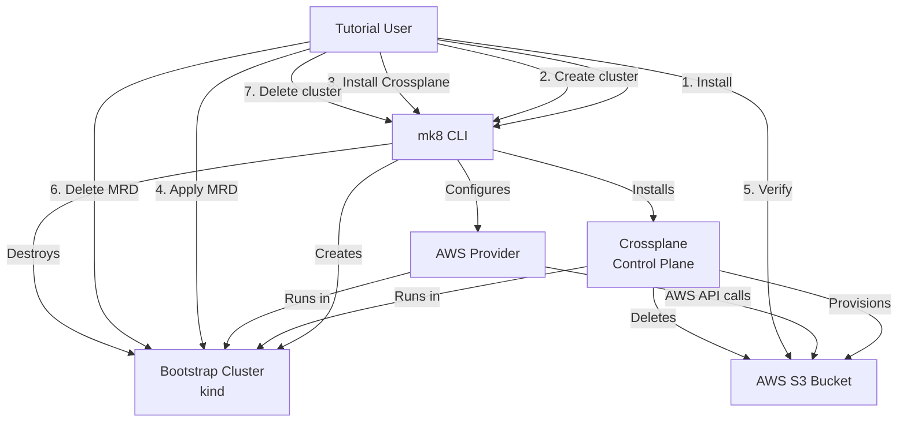
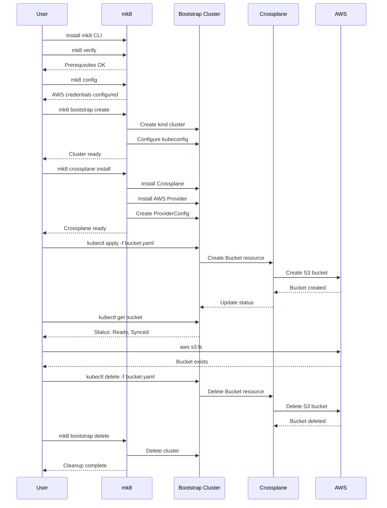

# Design Document

## Overview

This tutorial provides a hands-on introduction to using mk8 and Crossplane to provision AWS infrastructure. The tutorial demonstrates the complete workflow from installing mk8, creating a local bootstrap cluster, installing Crossplane, provisioning an S3 bucket, and cleaning up resources. The design focuses on simplicity and clarity, using only the bootstrap cluster and direct Crossplane Managed Resources to teach fundamental concepts without the complexity of GitOps or multi-cluster architectures.

## Architecture

### System Components



### Tutorial Workflow



## Components and Interfaces

### Tutorial Document Structure

The tutorial will be organized into the following sections:

1. **Introduction**
   - What you'll learn
   - Prerequisites overview
   - Time estimate

2. **Prerequisites**
   - Required tools (Docker, kind, kubectl, AWS CLI, mk8)
   - Links to installation instructions for each tool
   - AWS account requirements
   - Verification commands

3. **Step 1: Install mk8**
   - Installation command
   - Version verification
   - Troubleshooting tips

4. **Step 2: Verify Prerequisites**
   - Run `mk8 verify`
   - Interpret results
   - Fix any issues

5. **Step 3: Configure AWS Credentials**
   - Run `mk8 config`
   - Provide AWS credentials
   - Verify configuration

6. **Step 4: Create Bootstrap Cluster**
   - Run `mk8 bootstrap create`
   - Verify cluster status
   - Check kubeconfig context

7. **Step 5: Install Crossplane**
   - Run `mk8 crossplane install`
   - Verify Crossplane pods
   - Check AWS Provider status

8. **Step 6: Define S3 Bucket Resource**
   - Crossplane Bucket MRD YAML with inline comments
   - Field explanations in the YAML
   - Link to Crossplane documentation for advanced configuration
   - Naming considerations

9. **Step 7: Provision S3 Bucket**
   - Apply MRD with kubectl
   - Monitor provisioning status
   - Check resource conditions

10. **Step 8: Verify Bucket in AWS**
    - kubectl commands to inspect resource
    - AWS CLI commands to verify bucket
    - Confirm bucket properties

11. **Step 9: Clean Up Resources**
    - Delete Bucket MRD
    - Verify deletion in AWS
    - Delete bootstrap cluster

12. **Troubleshooting**
    - Common issues and solutions
    - Checking Crossplane logs
    - AWS permissions
    - Resource stuck in deletion

13. **What You Learned**
    - Key concepts summary
    - Next steps
    - Additional resources

### mk8 Commands Used

The tutorial relies on the following mk8 commands (all already implemented):

- `mk8 verify` - Verify prerequisites (installer spec)
- `mk8 config` - Configure AWS credentials (aws-credentials-management spec)
- `mk8 bootstrap create` - Create bootstrap cluster (local-kind-cluster spec)
- `mk8 bootstrap status` - Check cluster status (local-kind-cluster spec)
- `mk8 crossplane install` - Install Crossplane (crossplane-bootstrap spec)
- `mk8 crossplane status` - Check Crossplane status (crossplane-bootstrap spec)
- `mk8 bootstrap delete` - Delete bootstrap cluster (local-kind-cluster spec)

### kubectl Commands Used

The tutorial uses minimal kubectl commands:

- `kubectl config get-contexts` - Verify kubeconfig
- `kubectl apply -f bucket.yaml` - Create Bucket resource
- `kubectl get bucket` - Check bucket status
- `kubectl describe bucket <name>` - Inspect bucket details
- `kubectl get bucket <name> -o yaml` - View full resource
- `kubectl delete -f bucket.yaml` - Delete Bucket resource

### AWS CLI Commands Used

The tutorial uses AWS CLI for verification:

- `aws s3 ls` - List S3 buckets
- `aws s3api head-bucket --bucket <name>` - Verify bucket exists
- `aws s3api get-bucket-location --bucket <name>` - Check bucket region

## Data Models

### S3 Bucket MRD Example

```yaml
apiVersion: s3.aws.upbound.io/v1beta1
kind: Bucket
metadata:
  name: mk8-tutorial-bucket-<unique-suffix>
  annotations:
    # Annotation to explain this is a tutorial resource
    tutorial: "mk8-tutorial-01"
spec:
  forProvider:
    # AWS region where the bucket will be created
    region: us-east-1
    # Bucket configuration
    acl: private
    # Tags for identification
    tags:
      Environment: tutorial
      ManagedBy: crossplane
      Tutorial: mk8-tutorial-01
  # Reference to the ProviderConfig created by mk8
  providerConfigRef:
    name: default
```

### Expected Resource Status

When the bucket is successfully provisioned, the status should show:

```yaml
status:
  conditions:
  - type: Ready
    status: "True"
    reason: Available
  - type: Synced
    status: "True"
    reason: ReconcileSuccess
  atProvider:
    arn: arn:aws:s3:::mk8-tutorial-bucket-<unique-suffix>
    region: us-east-1
```

## Correctness Properties

*A property is a characteristic or behavior that should hold true across all valid executions of a system—essentially, a formal statement about what the system should do. Properties serve as the bridge between human-readable specifications and machine-verifiable correctness guarantees.*

### Acceptance Criteria Testing Prework

1.1 WHEN a user accesses installation instructions THEN the system SHALL provide commands to install mk8 on the user's platform
Thoughts: This is about documentation content. We need to ensure the tutorial includes installation commands. This is testable by verifying the tutorial document contains installation instructions.
Testable: yes - example

1.2 WHEN mk8 is installed THEN the system SHALL be accessible via the command line
Thoughts: This is about the mk8 tool itself, not the tutorial. The tutorial demonstrates this but doesn't implement it.
Testable: no - out of scope

1.3 WHEN the user verifies installation THEN the system SHALL provide a command to check the mk8 version
Thoughts: This is about tutorial content - ensuring it includes the version check command.
Testable: yes - example

2.1 WHEN a user begins the tutorial THEN the system SHALL list all required prerequisites
Thoughts: This is about documentation content. We can verify the tutorial lists all prerequisites.
Testable: yes - example

2.2 WHEN prerequisites are checked THEN the system SHALL provide commands to verify each prerequisite is installed and configured
Thoughts: This is about tutorial content - ensuring verification commands are provided for each prerequisite.
Testable: yes - example

3.1 WHEN the user executes the mk8 bootstrap cluster creation command THEN the system SHALL create a local kind cluster
Thoughts: This is about mk8 functionality, already implemented in local-kind-cluster spec. Tutorial demonstrates this.
Testable: no - out of scope

3.5 WHEN the user verifies the kubeconfig THEN the system SHALL show the bootstrap cluster context is properly configured
Thoughts: This is about tutorial content - ensuring it includes kubeconfig verification steps.
Testable: yes - example

4.1 WHEN the user executes the mk8 Crossplane installation command THEN the system SHALL install Crossplane on the bootstrap cluster
Thoughts: This is about mk8 functionality, already implemented in crossplane-bootstrap spec. Tutorial demonstrates this.
Testable: no - out of scope

5.1 WHEN the tutorial provides resource definitions THEN the system SHALL include a Crossplane Bucket MRD YAML manifest
Thoughts: This is about tutorial content - ensuring the YAML manifest is included.
Testable: yes - example

5.3 WHEN the YAML manifest is presented THEN the system SHALL include inline comments explaining each field and its purpose
Thoughts: This is about documentation quality. We can verify the YAML includes explanatory comments.
Testable: yes - example

5.5 WHEN the manifest is provided THEN the system SHALL ensure the bucket name is globally unique
Thoughts: This is about the tutorial instructing users to use unique names (e.g., with suffix). We can verify the tutorial includes this guidance.
Testable: yes - example

6.3 WHEN provisioning begins THEN the system SHALL provide kubectl commands to monitor the resource status
Thoughts: This is about tutorial content - ensuring monitoring commands are provided.
Testable: yes - example

7.1 WHEN the user checks resource status THEN the system SHALL provide kubectl commands to inspect the Bucket resource
Thoughts: This is about tutorial content - ensuring inspection commands are provided.
Testable: yes - example

7.3 WHEN AWS verification is performed THEN the system SHALL provide AWS CLI commands to list and describe the created bucket
Thoughts: This is about tutorial content - ensuring AWS CLI verification commands are provided.
Testable: yes - example

8.1 WHEN the user initiates bucket deletion THEN the system SHALL provide the kubectl command to delete the Bucket resource
Thoughts: This is about tutorial content - ensuring deletion commands are provided.
Testable: yes - example

9.1 WHEN the user executes the mk8 cluster deletion command THEN the system SHALL delete the bootstrap cluster
Thoughts: This is about mk8 functionality, already implemented. Tutorial demonstrates this.
Testable: no - out of scope

10.1 WHEN troubleshooting guidance is provided THEN the system SHALL include a section on common issues and resolutions
Thoughts: This is about tutorial content - ensuring a troubleshooting section exists.
Testable: yes - example

10.2 WHEN Crossplane provisioning fails THEN the system SHALL explain how to check Crossplane logs and resource events
Thoughts: This is about tutorial content - ensuring troubleshooting steps for provisioning failures are included.
Testable: yes - example

10.3 WHEN AWS permissions are insufficient THEN the system SHALL describe the required IAM permissions for S3 bucket creation
Thoughts: This is about tutorial content - ensuring IAM permissions are documented.
Testable: yes - example

### Property Reflection

After reviewing all testable acceptance criteria, I observe that all testable items are examples of specific tutorial content that must be present. There are no universal properties that apply across multiple inputs - instead, we have specific documentation requirements. This is appropriate for a tutorial/documentation feature where we're verifying content completeness rather than algorithmic correctness.

The testable items fall into these categories:
1. **Installation and setup instructions** (1.1, 1.3, 2.1, 2.2)
2. **Resource definitions and explanations** (5.1, 5.3, 5.5)
3. **Command examples** (3.5, 6.3, 7.1, 7.3, 8.1)
4. **Troubleshooting guidance** (10.1, 10.2, 10.3)

Since this is documentation, we don't have traditional property-based tests. Instead, we have content verification examples.

### Correctness Properties

Since this is a tutorial/documentation feature, the "correctness properties" are actually content completeness checks. These are examples rather than universal properties:

**Example 1: Installation instructions completeness**
The tutorial document SHALL include installation commands for mk8 on the user's platform
**Validates: Requirements 1.1**

**Example 2: Version verification command**
The tutorial document SHALL include the command to check mk8 version (`mk8 version` or `mk8 --version`)
**Validates: Requirements 1.3**

**Example 3: Prerequisites list completeness**
The tutorial document SHALL list all required prerequisites: Docker, kubectl, AWS CLI, AWS credentials, mk8 CLI
**Validates: Requirements 2.1**

**Example 4: Prerequisite verification commands**
The tutorial document SHALL provide verification commands for each prerequisite (docker ps, kubectl version, aws --version, mk8 verify)
**Validates: Requirements 2.2**

**Example 5: Kubeconfig verification steps**
The tutorial document SHALL include commands to verify kubeconfig configuration (kubectl config get-contexts)
**Validates: Requirements 3.5**

**Example 6: S3 Bucket MRD YAML manifest**
The tutorial document SHALL include a complete Crossplane Bucket MRD YAML manifest
**Validates: Requirements 5.1**

**Example 7: YAML field explanations**
The tutorial document SHALL include inline comments in the YAML manifest explaining each field's purpose
**Validates: Requirements 5.3**

**Example 8: Unique bucket name guidance**
The tutorial document SHALL instruct users to use a unique suffix in the bucket name to ensure global uniqueness
**Validates: Requirements 5.5**

**Example 9: Resource monitoring commands**
The tutorial document SHALL provide kubectl commands to monitor provisioning status (kubectl get bucket, kubectl describe bucket)
**Validates: Requirements 6.3**

**Example 10: Resource inspection commands**
The tutorial document SHALL provide kubectl commands to inspect the Bucket resource details
**Validates: Requirements 7.1**

**Example 11: AWS verification commands**
The tutorial document SHALL provide AWS CLI commands to verify the bucket exists (aws s3 ls, aws s3api head-bucket)
**Validates: Requirements 7.3**

**Example 12: Deletion commands**
The tutorial document SHALL provide the kubectl command to delete the Bucket resource (kubectl delete -f bucket.yaml)
**Validates: Requirements 8.1**

**Example 13: Troubleshooting section**
The tutorial document SHALL include a dedicated troubleshooting section with common issues and resolutions
**Validates: Requirements 10.1**

**Example 14: Provisioning failure troubleshooting**
The tutorial document SHALL explain how to check Crossplane logs (kubectl logs) and resource events (kubectl describe)
**Validates: Requirements 10.2**

**Example 15: IAM permissions documentation**
The tutorial document SHALL describe the required IAM permissions for S3 bucket creation (s3:CreateBucket, s3:DeleteBucket, s3:PutBucketTagging)
**Validates: Requirements 10.3**

## Error Handling

### Tutorial-Level Error Handling

The tutorial should address common error scenarios:

1. **Prerequisites Missing**
   - Clear error messages from `mk8 verify`
   - Links to installation instructions
   - Platform-specific guidance

2. **AWS Credentials Issues**
   - Invalid credentials error from `mk8 config`
   - Instructions to check AWS credentials
   - IAM permissions requirements

3. **Cluster Creation Failures**
   - Docker not running
   - Port conflicts
   - Insufficient resources

4. **Crossplane Installation Failures**
   - Network issues
   - Helm repository problems
   - Timeout errors

5. **Bucket Provisioning Failures**
   - AWS permissions insufficient
   - Bucket name conflicts
   - Region restrictions
   - Resource stuck in provisioning

6. **Deletion Issues**
   - Finalizer problems
   - AWS resource not deleted
   - Cluster deletion with resources still present

### Troubleshooting Commands

The tutorial should provide these troubleshooting commands:

```bash
# Check Crossplane logs
kubectl logs -n crossplane-system deployment/crossplane

# Check AWS Provider logs
kubectl logs -n crossplane-system deployment/provider-aws-*

# Inspect bucket resource events
kubectl describe bucket <name>

# View full bucket resource
kubectl get bucket <name> -o yaml

# Check all Crossplane resources
kubectl get crossplane

# Force delete stuck resource
kubectl patch bucket <name> -p '{"metadata":{"finalizers":[]}}' --type=merge
kubectl delete bucket <name>
```

## Testing Strategy

### Manual Testing Approach

Since this is a tutorial document, testing involves manual verification:

1. **Content Completeness Testing**
   - Verify all 15 examples (correctness properties) are present in the tutorial
   - Check that all required commands are included
   - Ensure all explanations are clear and accurate

2. **End-to-End Tutorial Execution**
   - Follow the tutorial step-by-step on a clean system
   - Verify each command works as documented
   - Confirm the S3 bucket is created and deleted successfully
   - Validate all verification steps produce expected output

3. **Error Scenario Testing**
   - Test with missing prerequisites
   - Test with invalid AWS credentials
   - Test with bucket name conflicts
   - Verify troubleshooting guidance is accurate

4. **Documentation Quality Review**
   - Check for typos and grammatical errors
   - Verify code blocks have proper syntax highlighting
   - Ensure consistent formatting throughout
   - Validate all links work correctly

### Acceptance Testing

The tutorial is considered complete when:

- All 15 content examples are present and accurate
- A user can successfully complete the tutorial from start to finish
- All mk8 commands work as documented
- The S3 bucket is created and visible in AWS
- Cleanup successfully removes all resources
- Troubleshooting section addresses common issues

## Tutorial Format and Delivery

### Documentation Framework

The tutorial will be written in Markdown format compatible with common documentation generators:

- **MkDocs**: Popular Python-based documentation generator
- **Docusaurus**: React-based documentation framework
- **Jekyll**: Static site generator
- **Hugo**: Fast static site generator

The specific framework will be determined by the `documentation-site` spec, but the tutorial will use standard Markdown features that work across all platforms:

- Headers (H1-H6)
- Code blocks with language specification
- Inline code
- Lists (ordered and unordered)
- Links
- Blockquotes for notes/warnings
- Tables (if needed)

### Content Organization

```
tutorial-01-create-s3-bucket/
├── index.md                    # Main tutorial content
├── assets/
│   ├── bucket.yaml            # S3 Bucket MRD manifest
│   └── diagrams/              # Architecture diagrams (optional)
└── README.md                  # Tutorial overview
```

### Visual Indicators

The tutorial will use consistent visual indicators:

- 📋 **Prerequisites** - Required items before starting
- ⚙️ **Setup** - Configuration steps
- 🚀 **Action** - Commands to execute
- ✅ **Verification** - How to confirm success
- ⚠️ **Warning** - Important notes or potential issues
- 💡 **Tip** - Helpful suggestions
- 🔧 **Troubleshooting** - Problem resolution

### Diagrams and Visual Content

The tutorial should include diagrams to enhance understanding without overwhelming the reader:

**Diagram Guidelines:**
- Use diagrams strategically to illustrate complex concepts or workflows
- Include an architecture diagram showing the relationship between mk8, bootstrap cluster, Crossplane, and AWS
- Include a sequence diagram showing the tutorial workflow from start to finish
- Consider adding diagrams for:
  - How Crossplane translates MRDs into AWS API calls
  - The relationship between Provider, ProviderConfig, and Managed Resources
  - The cleanup process and resource dependencies
- Avoid excessive diagrams that don't add value
- Balance text and visuals - the tutorial should not be a wall of text, but also not cluttered with unnecessary images

**Diagram Format:**
- Use Mermaid diagrams for easy maintenance and version control
- Diagrams should be clear, simple, and focused on a single concept
- Include captions explaining what each diagram illustrates
- Ensure diagrams are readable in both light and dark themes (if applicable)

### Code Block Format

All commands will be presented in code blocks with clear context:

```bash
# Create the bootstrap cluster
mk8 bootstrap create

# Expected output:
# Creating bootstrap cluster...
# Cluster created successfully
```

### Time Estimate

The tutorial should include an estimated completion time:
- **Total time**: 30-45 minutes
- **Prerequisites setup**: 10-15 minutes (if tools not installed)
- **Tutorial execution**: 20-30 minutes

## Implementation Notes

### No Code Implementation Required

This tutorial is a documentation artifact, not a code feature. The implementation consists of:

1. **Writing the tutorial document** in Markdown
2. **Creating the S3 Bucket MRD YAML** file
3. **Testing the tutorial** end-to-end
4. **Incorporating feedback** and refining content

### Dependencies

The tutorial depends on these completed specs:

- ✅ **installer** - `mk8 verify` command
- ✅ **aws-credentials-management** - `mk8 config` command
- ✅ **local-kind-cluster** - `mk8 bootstrap` commands
- ✅ **crossplane-bootstrap** - `mk8 crossplane` commands

All dependencies are complete, so the tutorial can be written immediately.

### Integration with Documentation Site

Once the `documentation-site` spec is implemented, this tutorial will be:

- Integrated into the site navigation
- Rendered with the chosen documentation framework
- Linked from the main documentation index
- Tagged as "Getting Started" or "Tutorials"

## Future Enhancements

### Follow-up Tutorials

This tutorial serves as the foundation for more advanced tutorials:

- **Tutorial 02**: Creating multiple resources (S3 + IAM)
- **Tutorial 03**: Using Crossplane Compositions
- **Tutorial 04**: Management cluster with EKS
- **Tutorial 05**: GitOps workflow with ArgoCD

### Interactive Elements

Future versions could include:

- Embedded terminal sessions (asciinema)
- Interactive code examples
- Video walkthrough
- Automated validation scripts
