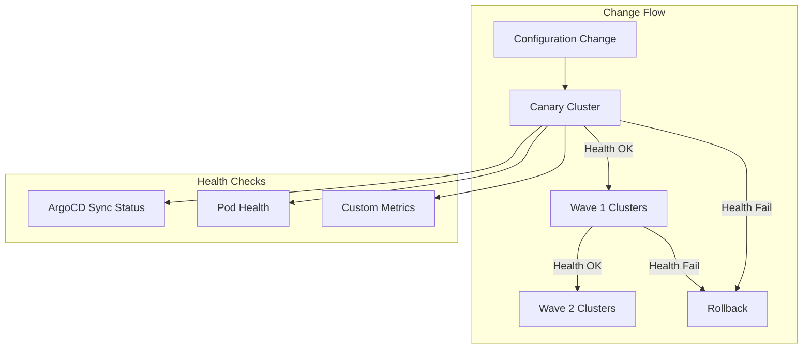

# Design Document: Workload Cluster GitOps

## Document Status

**Status**: 📝 DRAFT - Concepts captured, needs detailed design

## Related Documents

- **Requirements**: `requirements.md` in this directory
- **Architecture Decisions**: 
  - `.claude/architecture/ADR-001-argocd-testing-approaches-analysis.md`
  - `.claude/architecture/ADR-002-argocd-testing-implementation-strategy.md`
- **Prerequisites**: 
  - `.claude/specs/argocd-gitops-promotion/` (Phase 1)
  - `.claude/specs/argocd-crd-basic-static/` (Phase 2)

---

## Overview

This document describes the conceptual design for implementing progressive rollout of changes across multiple workload clusters using a canary deployment strategy.

### Conceptual Design



---

## Canary Strategy Options (To Be Decided)

1. **Dedicated Canary Cluster**: One cluster always receives changes first
2. **Environment-Based**: Dev clusters → Staging clusters → Prod clusters
3. **Rotating Canary**: Different cluster is canary based on change type

---

## Wave Configuration Concept

```yaml
# Conceptual - actual format TBD
waves:
  - name: canary
    clusters: [canary-cluster]
    waitTime: 30m
    healthChecks: [argocd-sync, pod-health]
    
  - name: wave-1
    clusters: [dev-cluster-1, dev-cluster-2]
    waitTime: 1h
    
  - name: wave-2
    clusters: [staging-cluster-1]
    waitTime: 2h
    requireApproval: true
```

---

## Health Check Concepts

| Check Type | What It Validates |
|------------|-------------------|
| ArgoCD Sync Status | All applications are synced and healthy |
| Pod Health | All pods are running and ready |
| Custom Metrics | Application-specific health indicators |

---

## Security Considerations

- Canary health checks don't expose sensitive data
- Rollback credentials must be securely managed
- Alert channels must be properly secured

---

## Testing Strategy

- Canary simulation tests
- Rollback reliability tests
- Health check accuracy tests

---

## Notes for Detailed Design

Before implementation, the following needs detailed design:

1. **Canary Selection**: Criteria for choosing canary clusters
2. **Wave Timing**: Optimal wait times between waves
3. **Health Check Implementation**: Specific checks and thresholds
4. **Rollback Automation**: Reliable rollback mechanism
5. **Monitoring Integration**: Dashboard and alerting setup
