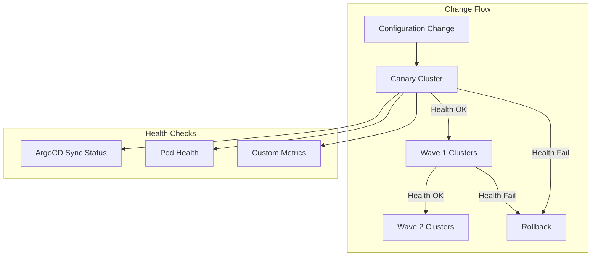

# Requirements Document: Workload Cluster GitOps

## Document Status

**Status**: 📝 DRAFT - Needs refinement before implementation

## Related Documents

- **Design**: `design.md` in this directory
- **Architecture Decisions**: 
  - `.claude/architecture/ADR-001-argocd-testing-approaches-analysis.md`
  - `.claude/architecture/ADR-002-argocd-testing-implementation-strategy.md`
- **Prerequisites**: 
  - `.claude/specs/argocd-gitops-promotion/` (Phase 1)
  - `.claude/specs/argocd-crd-basic-static/` (Phase 2)

---

## Introduction

This document specifies requirements for implementing progressive rollout of changes across multiple workload clusters using a canary deployment strategy.

### Problem Statement

While Phase 1 protects the management cluster and Phase 2 catches static errors, changes that pass both can still cause issues when deployed to workload clusters. A canary deployment strategy allows testing changes on a subset of clusters before full rollout.

### Solution Overview

This phase (Phase 3 of 4) implements workload cluster canary deployment:

### Target Environment

- **Use Case**: Platform service cluster for development, testing, and demos
- **Users**: Developers, product owners, customers/management (demos)
- **Availability**: Minutes of downtime acceptable during business hours, hours acceptable nights/weekends

### Glossary

- **Canary Cluster**: A workload cluster that receives changes first for testing
- **Wave**: A group of clusters that receive changes together
- **Health Check**: Automated verification that a cluster is functioning correctly
- **Rollback**: Reverting to the previous known-good configuration

---

## Requirements

### Requirement 3.1: Canary Cluster Designation

**User Story**: As a platform engineer, I want to designate canary clusters so that changes are tested on a subset before full rollout.

#### Acceptance Criteria (Draft)

1. WHEN workload clusters are configured THEN at least one cluster SHALL be designated as canary
2. WHEN changes are deployed THEN canary clusters SHALL receive changes first
3. WHEN canary deployment succeeds THEN remaining clusters SHALL receive changes in waves

### Requirement 3.2: Health Monitoring

**User Story**: As a platform engineer, I want health monitoring so that problems are detected before changes roll out further.

#### Acceptance Criteria (Draft)

1. WHEN changes are deployed to canary THEN health checks SHALL run automatically
2. WHEN health checks fail THEN rollout SHALL pause
3. WHEN health checks pass THEN rollout MAY proceed to next wave

### Requirement 3.3: Rollback Automation

**User Story**: As a platform engineer, I want automatic rollback so that failed deployments are quickly reverted.

#### Acceptance Criteria (Draft)

1. WHEN health checks fail THEN automatic rollback SHALL be triggered
2. WHEN rollback occurs THEN alerts SHALL be sent to the team
3. WHEN rollback completes THEN the system SHALL be in the previous known-good state

---

## Edge Cases and Constraints

### Edge Cases

- Canary cluster becomes unavailable during rollout
- Rollback during partial deployment
- Health check false positives/negatives
- Network partition between management and workload clusters

### Constraints

- Requires multiple workload clusters to be meaningful
- Health checks must be fast enough to not delay rollout excessively
- Rollback must be reliable even under failure conditions
- Must integrate with Phase 1 promotion workflow

---

## Notes for Refinement

This document captures requirements from initial planning discussions. Before implementation, the following should be refined:

1. **Canary Strategy**: Decide between dedicated canary, environment-based, or rotating canary
2. **Wave Configuration**: Define cluster groupings and timing
3. **Health Check Criteria**: Specify what constitutes "healthy"
4. **Rollback Mechanism**: Design reliable rollback automation
5. **Alerting**: Define alert channels and escalation
