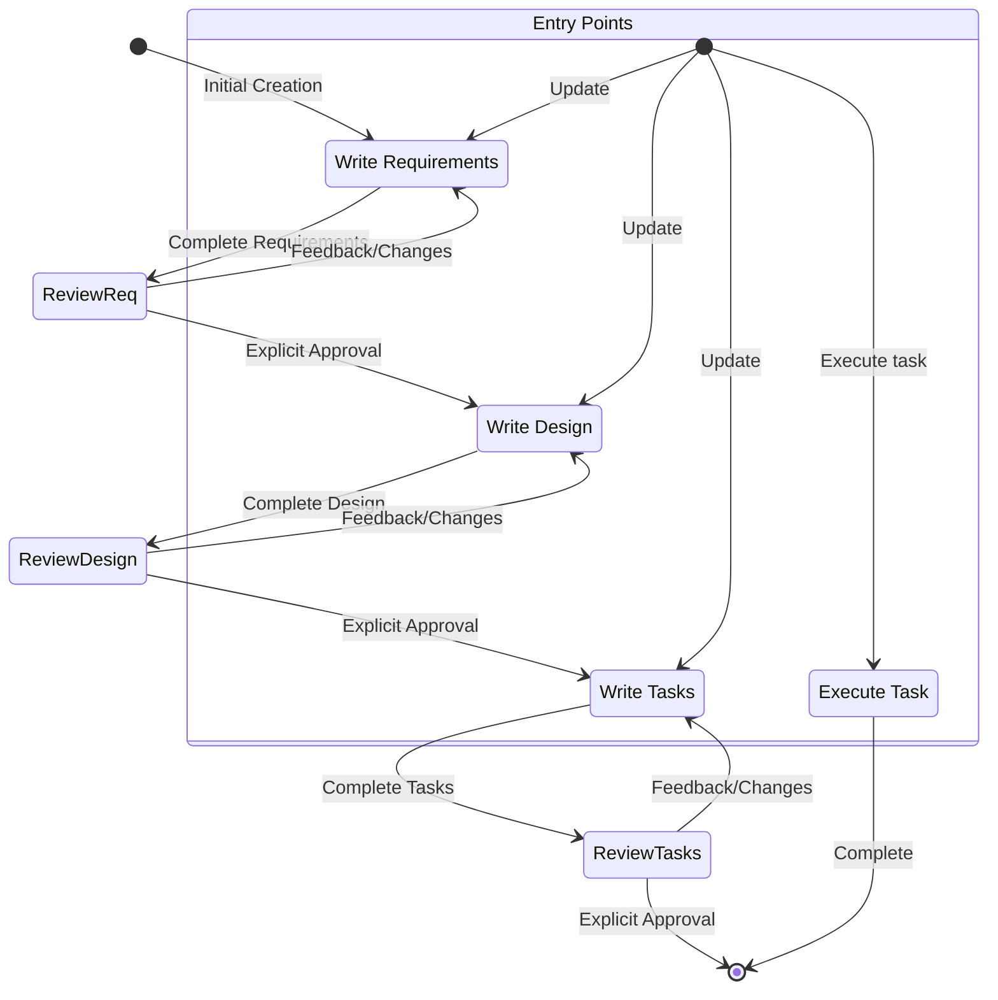

# AI Agent Context Guide

**Read this file first when starting a new session. This is the comprehensive base context for all AI agents working on mk8.**

## Project Overview

**mk8** is a Python CLI tool for managing Kubernetes infrastructure on AWS using Crossplane.

- **Version**: 0.1.0 (Alpha)
- **Language**: Python 3.8+
- **Development**: Spec-driven, test-driven development (TDD)
- **Test Coverage**: 95%+ (273+ tests passing)

## Essential Context Files

Read these for complete project understanding:

1. **This file (AGENTS.md)** - Base context, workflows, requirements
2. **README.md** - Installation, quick start, development setup
3. **.claude/steering/product.md** - What mk8 does, architecture, features
4. **.claude/steering/tech.md** - Tech stack, coding standards, testing
5. **.claude/steering/structure.md** - Project organization, modules
6. **.claude/specs/SPECS-STATUS.md** - Current spec status and priorities

## Current Project Status

- **CLI Framework**: ✅ Complete (100% coverage)
- **Bootstrap Cluster**: ✅ Complete (kind + Crossplane)
- **Tutorial System**: 🚧 In Progress (Tutorial 01 at 96%)
- **Next Priority**: Complete tutorials, begin GitOps features

For detailed status, see `.claude/specs/SPECS-STATUS.md`

---

## Spec-Driven Development Workflow

This project uses a three-phase methodology for feature development.

### Workflow Phases

**Phase 1: Requirements** → **Phase 2: Design** → **Phase 3: Tasks** → **Implementation**

### Key Rules

- **Never skip phases** - must complete Requirements → Design → Tasks in order
- **Always get explicit approval** - clear "yes", "approved", or "looks good" required between phases
- **One task at a time** - no automatic progression to next tasks
- **Code focus only** - tasks involve writing, modifying, or testing code exclusively
- **Spec separation** - this workflow creates planning artifacts, not production code

### Phase 1: Requirements

**File**: `.claude/specs/{feature_name}/requirements.md`

**Process**:
1. Generate requirements based on user idea WITHOUT sequential questions first
2. Use EARS format for acceptance criteria
3. Ask: "Do the requirements look good? If so, we can move on to the design."
4. Iterate until explicit approval received

**Format**:
```markdown
# Requirements Document

## Introduction
[Feature summary]

## Requirements

### Requirement 1
**User Story:** As a [role], I want [feature], so that [benefit]

#### Acceptance Criteria
1. WHEN [event] THEN [system] SHALL [response]
2. IF [precondition] THEN [system] SHALL [response]
```

### Phase 2: Design

**File**: `.claude/specs/{feature_name}/design.md`

**Prerequisites**: Requirements document must be approved

**Process**:
1. Conduct necessary research and build context
2. Create comprehensive design with all required sections
3. Include Mermaid diagrams when appropriate
4. Ask: "Does the design look good? If so, we can move on to the implementation plan."
5. Iterate until explicit approval received

**Required Sections**:
- Overview
- Architecture
- Components and Interfaces
- Data Models
- Error Handling
- Testing Strategy

### Phase 3: Tasks

**File**: `.claude/specs/{feature_name}/tasks.md`

**Prerequisites**: Design document must be approved

**Process**:
1. Convert design into actionable coding tasks
2. Use numbered checkbox list format (max two hierarchy levels)
3. Each task must reference specific requirements
4. Ask: "Do the tasks look good?"
5. Iterate until explicit approval received

**Format**:
```markdown
# Implementation Plan

- [ ] 1. Set up project structure
  - Create directory structure
  - _Requirements: 1.1_

- [ ] 2. Implement data models
- [ ] 2.1 Create core interfaces
  - Write TypeScript interfaces
  - _Requirements: 2.1, 3.3_

- [ ] 2.2 Implement User model
  - Write User class
  - Create unit tests
  - _Requirements: 1.2_
```

### Task Execution

**Pre-Execution Requirements**:
- ALWAYS read requirements.md, design.md, and tasks.md before executing
- Executing without context leads to inaccurate implementations

**Process**:
1. If task has sub-tasks, start with sub-tasks
2. Focus on ONE task only - do not implement other tasks
3. Verify implementation against requirements
4. Ask user for approval of changes
5. Mark task complete by changing `[ ]` to `[x]`
6. Stop and wait for next instruction

**Critical Rule**: Execute one task at a time. Once finished, stop. Don't automatically continue.

### Task Questions

Users may ask about tasks without wanting execution:
- Provide information without starting execution
- Recommend next task if asked
- Don't automatically start execution for informational requests

### Workflow Diagram



---

## Development Requirements

### Mandatory Pre-Commit Checks

**CRITICAL**: Run ALL four checks before EVERY commit. Never commit code that fails any check.

```bash
# 1. Format code (must show no changes)
.venv/bin/black mk8/ tests/

# 2. Lint code (must show zero issues)
.venv/bin/flake8 mk8/ tests/

# 3. Type check (must show zero errors)
.venv/bin/mypy mk8/

# 4. Run tests (must all pass, ≥80% coverage)
.venv/bin/pytest tests/unit/ -v
```

**If ANY check fails:**
- ❌ DO NOT commit
- ❌ DO NOT push
- ✅ Fix the issues first
- ✅ Re-run all checks
- ✅ Only commit when everything passes

### Testing Requirements

- ⚠️ **MANDATORY**: Write tests first (TDD)
- ⚠️ **MANDATORY**: Maintain ≥80% coverage (currently 95%+)
- ⚠️ **MANDATORY**: All tests must pass before commit
- Use Hypothesis for property-based testing (100+ examples per property)

### Code Quality Requirements

- ⚠️ **MANDATORY**: Black formatting (line-length=88)
- ⚠️ **MANDATORY**: Flake8 linting (zero violations)
- ⚠️ **MANDATORY**: Mypy type checking (strict mode, zero errors)
- ⚠️ **MANDATORY**: Type hints on all function signatures
- ⚠️ **MANDATORY**: Docstrings on all public functions/classes

### Git Requirements

- ⚠️ **CRITICAL**: Always use `git --no-pager` to prevent blocking
- Never commit unformatted code
- Never commit code with linting violations
- Never commit code with type errors
- Never commit code that breaks tests

---

## Test-Driven Development (Batched for Efficiency)

To optimize token usage while maintaining TDD rigor:

1. **Batch Test Creation**: Write all tests for a component/layer at once
2. **Red Phase**: Run tests to verify they all fail
3. **Green Phase**: Implement component to make all tests pass
4. **Refactor**: Clean up code while keeping tests green

**Benefits**:
- Reduces context switching
- Allows seeing full test suite structure upfront
- Minimizes redundant file reads
- Maintains TDD benefits (tests first, fail-pass cycle)
- More efficient token usage

**Implementation Order**:
- Group by architectural layer (data models → integrations → business logic → CLI)
- Complete one component fully before moving to next
- Property tests can replace many unit tests (one property = dozens of examples)
- Defer integration tests to checkpoints between major phases

---

## Architecture Quick Reference

### Layered Architecture

```
CLI Layer (Click)
    ↓
Command Layer (handlers)
    ↓
Business Logic (orchestration)
    ↓
Integration Layer (external tools)
    ↓
Infrastructure (logging, errors, I/O)
```

### Error Handling Pattern

```python
# All custom errors inherit from MK8Error
# Always include suggestions for remediation
raise PrerequisiteError(
    "Docker is not running",
    suggestions=["Start Docker Desktop", "Run 'systemctl start docker'"]
)
```

---

## Quick Command Reference

### Testing
```bash
.venv/bin/pytest tests/unit/ -v
.venv/bin/pytest --cov=mk8 --cov-report=html
```

### Code Quality
```bash
.venv/bin/black mk8/ tests/
.venv/bin/flake8 mk8/ tests/
.venv/bin/mypy mk8/
```

### Git (always use --no-pager)
```bash
git --no-pager status
git --no-pager log --oneline -10
git --no-pager diff
```

### Run CLI
```bash
.venv/bin/mk8 --help
.venv/bin/mk8 version
```

---

## When You Get Stuck

1. Check `.claude/specs/<feature>/` for requirements and design
2. Check `.claude/steering/` for detailed guidelines
3. Check tests for usage examples
4. Check existing code for similar patterns
5. Read `pyproject.toml` for tool configurations

---

## Session Start Checklist

- [ ] Read this file (AGENTS.md)
- [ ] Check `.claude/specs/SPECS-STATUS.md` for current priorities
- [ ] If working on a spec, read its requirements.md, design.md, tasks.md
- [ ] Run `.venv/bin/pytest tests/unit/ -v` to verify environment
- [ ] Understand current task from user

---

## Important Notes

- **This file**: Comprehensive base context - do not enhance or duplicate
- **CLAUDE.md**: Points to this file - do not duplicate content there
- **Detailed guidelines**: In steering files - reference, don't duplicate
- **Implementation details**: In structure.md - reference, don't duplicate
