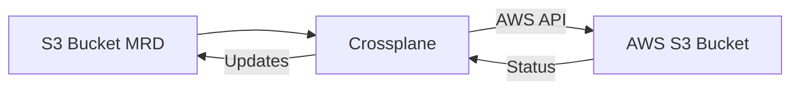

# Tutorial 01: Create an S3 Bucket with Crossplane

## Introduction

Welcome to your first mk8 tutorial! In this hands-on guide, you'll learn how to use mk8 and Crossplane to provision AWS infrastructure. By the end of this tutorial, you'll understand the fundamental workflow of infrastructure-as-code using Kubernetes and Crossplane.

### What You'll Learn

- How to install and configure mk8
- How to use mk8 to create a local Kubernetes cluster for development
- How to use mk8 to install and configure Crossplane
- How to define cloud infrastructure using Kubernetes manifests
- How to provision an AWS S3 bucket using Crossplane
- How to verify and manage cloud resources
- How to clean up resources properly

### Key Concepts

- **Crossplane**: An open-source Kubernetes extension that transforms your cluster into a universal control plane for managing cloud infrastructure
- **Managed Resource Definition (MRD)**: A Kubernetes custom resource that represents actual cloud infrastructure (like an S3 bucket)
- **Provider**: A Crossplane component that enables management of resources in a specific cloud provider (we'll use the AWS Provider)
- **ProviderConfig**: Configuration that tells Crossplane how to authenticate with your cloud provider

### 📋 Prerequisites Overview

Before starting this tutorial, you'll need:

- Docker installed and running
- kubectl command-line tool
- AWS CLI
- An AWS account with appropriate permissions
- mk8 CLI tool (we'll install this in Step 1)

**Estimated Time**: 30-45 minutes

---

## Prerequisites

### Required Tools

You'll need the following tools installed on your system:

#### 1. Docker

Docker is required to run the local Kubernetes cluster.

- **Installation**: [Get Docker](https://docs.docker.com/get-docker/)
- **Verification**: 
  ```bash
  docker --version
  # Expected output: Docker version 20.x.x or higher
  
  docker ps
  # Should run without errors (Docker daemon is running)
  ```

#### 2. kubectl

The Kubernetes command-line tool for interacting with clusters.

- **Installation**: [Install kubectl](https://kubernetes.io/docs/tasks/tools/)
- **Verification**:
  ```bash
  kubectl version --client
  # Expected output: Client Version information
  ```

#### 3. AWS CLI

The AWS command-line interface for verifying resources in AWS.

- **Installation**: [Install AWS CLI](https://docs.aws.amazon.com/cli/latest/userguide/getting-started-install.html)
- **Verification**:
  ```bash
  aws --version
  # Expected output: aws-cli/2.x.x or higher
  ```

#### 4. AWS Account

You'll need an AWS account with permissions to create and delete S3 buckets.

**Required IAM Permissions**:
- `s3:CreateBucket`
- `s3:DeleteBucket`
- `s3:PutBucketTagging`
- `s3:GetBucketLocation`
- `s3:ListBucket`

#### 5. mk8 CLI

We'll install this in the next step!

---

## Step 1: Install mk8

The mk8 CLI tool orchestrates the creation and management of Kubernetes infrastructure.

### 🚀 Installation

```bash
# Installation command will be provided based on your platform
# For now, follow the installation instructions in the main README
```

### ✅ Verify Installation

After installation, verify that mk8 is accessible:

```bash
mk8 --version
# Expected output: mk8 version 0.1.0 (or current version)
```

### 💡 Troubleshooting

If the `mk8` command is not found:
- Ensure the installation directory is in your PATH
- Try restarting your terminal
- Verify the installation completed without errors

---

## Step 2: Verify Prerequisites

mk8 includes a built-in command to verify that all prerequisites are met.

### 🚀 Run Verification

```bash
mk8 verify
```

### ✅ Expected Output

The command will check:
- Docker is installed and running
- kubectl is installed
- AWS credentials are configured
- Required tools are accessible

### Interpreting Results

- **✓ All checks passed**: You're ready to proceed!
- **✗ Some checks failed**: Follow the guidance provided for each failed check

### Common Issues

- **Docker not running**: Start Docker Desktop or run `systemctl start docker` (Linux)
- **kubectl not found**: Install kubectl following the link in Prerequisites
- **AWS credentials not configured**: Proceed to Step 3

---

## Step 3: Configure AWS Credentials

⚙️ mk8 needs AWS credentials to provision cloud resources through Crossplane.

### 🚀 Configure Credentials

```bash
mk8 config
```

This interactive command will prompt you for:
- AWS Access Key ID
- AWS Secret Access Key
- Default AWS Region (e.g., us-east-1)

### ✅ Verify Configuration

```bash
# Check that AWS credentials are working
aws sts get-caller-identity
# Expected output: Your AWS account information
```

### ⚠️ Security Note

- Never commit AWS credentials to version control
- Use IAM users with minimal required permissions
- Consider using AWS IAM roles for production environments
- mk8 stores credentials securely in your local environment

### Required IAM Permissions

For this tutorial, your AWS user/role needs these permissions:
- `s3:CreateBucket` - Create S3 buckets
- `s3:DeleteBucket` - Delete S3 buckets
- `s3:PutBucketTagging` - Add tags to buckets
- `s3:GetBucketLocation` - Check bucket region
- `s3:ListBucket` - List bucket contents

---

## Step 4: Create Bootstrap Cluster

Now we'll create a local Kubernetes cluster that will run Crossplane.

### 🚀 Create the Cluster

```bash
mk8 bootstrap create
```

This command:
1. Creates a kind (Kubernetes in Docker) cluster
2. Configures kubectl to use the new cluster
3. Verifies the cluster is healthy

### Expected Output

```
Creating bootstrap cluster...
✓ Creating kind cluster
✓ Configuring kubeconfig
✓ Verifying cluster health
Bootstrap cluster created successfully
```

### ✅ Verify Cluster Status

```bash
# Check cluster status
mk8 bootstrap status
# Expected output: Cluster is running

# Verify kubeconfig is configured
kubectl config get-contexts
# You should see 'kind-mk8-bootstrap' (or similar) marked with *

# Check cluster nodes
kubectl get nodes
# Expected output: One node in Ready state
```

### 💡 Cluster Details

- **Cluster name**: mk8-bootstrap (default)
- **Type**: kind (Kubernetes in Docker)
- **Purpose**: Local development and testing
- **Lifespan**: Temporary - we'll delete it at the end

---

## Step 5: Install Crossplane

With the cluster running, we'll install Crossplane and configure it for AWS.

### 🚀 Install Crossplane

```bash
mk8 crossplane install
```

This command:
1. Installs Crossplane on the bootstrap cluster
2. Installs the AWS Provider
3. Creates a ProviderConfig with your AWS credentials
4. Verifies everything is healthy

### Expected Output

```
Installing Crossplane...
✓ Installing Crossplane core
✓ Installing AWS Provider
✓ Creating ProviderConfig
✓ Verifying Provider health
Crossplane installation complete
```

### ✅ Verify Installation

```bash
# Check Crossplane status
mk8 crossplane status
# Expected output: Crossplane is healthy, AWS Provider is ready

# Verify Crossplane pods are running
kubectl get pods -n crossplane-system
# Expected output: All pods in Running state

# Check AWS Provider status
kubectl get providers
# Expected output: provider-aws with HEALTHY=True and INSTALLED=True
```

### ⏱️ Wait for Provider

The AWS Provider may take 1-2 minutes to become healthy. Wait until you see:
```
NAME           INSTALLED   HEALTHY   PACKAGE
provider-aws   True        True      ...
```

---

## Step 6: Define S3 Bucket Resource

Now we'll define the S3 bucket we want to create using a Crossplane Managed Resource Definition (MRD).

### Understanding the MRD

A Managed Resource Definition is a Kubernetes custom resource that represents cloud infrastructure. When you apply an MRD to your cluster, Crossplane:

1. Reads the resource definition
2. Translates it into cloud provider API calls
3. Creates the actual infrastructure in AWS
4. Continuously monitors and reconciles the resource



### 📋 The Bucket Manifest

Create a file named `bucket.yaml` or use the provided file in `assets/bucket.yaml`:

```yaml
apiVersion: s3.aws.upbound.io/v1beta1
kind: Bucket
metadata:
  # Replace <unique-suffix> with a random string (e.g., your initials + date)
  # Example: mk8-tutorial-bucket-jm-20231206
  name: mk8-tutorial-bucket-<unique-suffix>
  annotations:
    # Annotation to identify this as a tutorial resource
    tutorial: "mk8-tutorial-01"
spec:
  forProvider:
    # AWS region where the bucket will be created
    # You can change this to your preferred region (e.g., us-west-2, eu-west-1)
    region: us-east-1
    
    # Access Control List - 'private' means only the bucket owner has access
    # Other options: public-read, public-read-write (not recommended for production)
    acl: private
    
    # Tags help identify and organize your AWS resources
    # These tags will be visible in the AWS Console
    tags:
      Environment: tutorial
      ManagedBy: crossplane
      Tutorial: mk8-tutorial-01
  
  # Reference to the ProviderConfig that contains AWS credentials
  # The 'default' ProviderConfig is created by mk8 during Crossplane installation
  providerConfigRef:
    name: default
```

### ⚠️ Important: Bucket Name Uniqueness

S3 bucket names must be globally unique across all AWS accounts. Make sure to replace `<unique-suffix>` with something unique to you:

- Your initials + date: `mk8-tutorial-bucket-jm-20231206`
- Random string: `mk8-tutorial-bucket-x7k9m2`
- Your username: `mk8-tutorial-bucket-johndoe`

### Field Explanations

| Field | Purpose |
|-------|---------|
| `apiVersion` | Specifies the Crossplane API version for S3 buckets |
| `kind` | The type of resource (Bucket) |
| `metadata.name` | The Kubernetes resource name (also becomes the S3 bucket name) |
| `spec.forProvider.region` | AWS region where the bucket will be created |
| `spec.forProvider.acl` | Access control settings for the bucket |
| `spec.forProvider.tags` | Key-value pairs for organizing and identifying resources |
| `spec.providerConfigRef` | References the AWS credentials configuration |

### 💡 Advanced Configuration

For more advanced S3 bucket configuration options, see the [Crossplane AWS Provider documentation](https://marketplace.upbound.io/providers/upbound/provider-aws/latest/resources/s3.aws.upbound.io/Bucket/v1beta1).

---

## Step 7: Provision S3 Bucket

Now we'll apply the bucket definition to our cluster and let Crossplane create the actual S3 bucket in AWS.

### 🚀 Apply the Manifest

```bash
# Apply the bucket definition
kubectl apply -f bucket.yaml
# Expected output: bucket.s3.aws.upbound.io/mk8-tutorial-bucket-<suffix> created
```

### Monitoring Provisioning

Watch the bucket resource as Crossplane provisions it:

```bash
# Check bucket status (repeat this command to see progress)
kubectl get bucket
# Expected output progression:
# NAME                              READY   SYNCED   AGE
# mk8-tutorial-bucket-<suffix>      False   False    5s
# ... (wait 30-60 seconds) ...
# mk8-tutorial-bucket-<suffix>      True    True     1m
```

### Detailed Status

For more detailed information:

```bash
# Describe the bucket resource
kubectl describe bucket mk8-tutorial-bucket-<suffix>
```

Look for the `Status` section showing:
- **Conditions**: Should show `Ready=True` and `Synced=True`
- **At Provider**: Shows the actual AWS resource details (ARN, region)

### ✅ Success Indicators

The bucket is successfully provisioned when you see:
- `READY: True`
- `SYNCED: True`
- Status conditions show `Ready` and `Synced` with status `True`

### ⏱️ Typical Provisioning Time

S3 bucket creation usually takes 1-2 minutes. If it takes longer, see the Troubleshooting section.

---

## Step 8: Verify Bucket in AWS

Let's confirm the bucket was actually created in AWS.

### ✅ Inspect the Kubernetes Resource

```bash
# View the full bucket resource
kubectl get bucket mk8-tutorial-bucket-<suffix> -o yaml
```

Look for the `status.atProvider` section:
```yaml
status:
  atProvider:
    arn: arn:aws:s3:::mk8-tutorial-bucket-<suffix>
    region: us-east-1
  conditions:
  - type: Ready
    status: "True"
  - type: Synced
    status: "True"
```

### ✅ Verify in AWS Console

You can also check the [AWS S3 Console](https://s3.console.aws.amazon.com/s3/buckets) to see your bucket.

### ✅ Verify with AWS CLI

```bash
# List all S3 buckets
aws s3 ls
# You should see your bucket: mk8-tutorial-bucket-<suffix>

# Verify the bucket exists
aws s3api head-bucket --bucket mk8-tutorial-bucket-<suffix>
# No output means success (bucket exists)

# Check bucket region
aws s3api get-bucket-location --bucket mk8-tutorial-bucket-<suffix>
# Expected output: {"LocationConstraint": "us-east-1"} or null for us-east-1
```

### ✅ Verification Checklist

- [ ] Kubernetes resource shows `READY: True` and `SYNCED: True`
- [ ] Resource has an ARN in `status.atProvider.arn`
- [ ] Bucket appears in `aws s3 ls` output
- [ ] `aws s3api head-bucket` succeeds without error
- [ ] Bucket region matches your configuration

🎉 **Congratulations!** You've successfully provisioned AWS infrastructure using Crossplane!

---

## Step 9: Clean Up Resources

It's important to clean up resources to avoid unnecessary AWS costs.

### ⚠️ Cleanup Order

Always delete cloud resources BEFORE deleting the cluster. If you delete the cluster first, Crossplane won't be able to clean up the AWS resources.

### 🚀 Delete the S3 Bucket

```bash
# Delete the bucket resource
kubectl delete -f bucket.yaml
# Expected output: bucket.s3.aws.upbound.io/mk8-tutorial-bucket-<suffix> deleted
```

### Monitoring Deletion

```bash
# Watch the deletion progress
kubectl get bucket
# The bucket should disappear from the list after 30-60 seconds
```

### ✅ Verify Deletion in AWS

```bash
# Verify the bucket is gone
aws s3 ls | grep mk8-tutorial-bucket
# Should return no results

# Or try to access it directly (should fail)
aws s3api head-bucket --bucket mk8-tutorial-bucket-<suffix>
# Expected: Error - bucket not found
```

### 🚀 Delete the Bootstrap Cluster

Once the bucket is deleted, remove the local cluster:

```bash
# Delete the bootstrap cluster
mk8 bootstrap delete
# Expected output: Bootstrap cluster deleted successfully
```

### ✅ Verify Cluster Deletion

```bash
# Check that the cluster is gone
mk8 bootstrap status
# Expected output: No bootstrap cluster found

# Verify kubectl context is removed
kubectl config get-contexts
# The kind-mk8-bootstrap context should be gone
```

### ✅ Cleanup Complete

All resources have been cleaned up:
- [ ] S3 bucket deleted from AWS
- [ ] Kubernetes bucket resource removed
- [ ] Bootstrap cluster deleted
- [ ] kubectl context removed
- [ ] Local Docker containers removed

---

## Troubleshooting

### 🔧 Common Issues and Solutions

#### Prerequisites Check Fails

**Problem**: `mk8 verify` reports missing prerequisites

**Solution**:
- Install missing tools following the links in the Prerequisites section
- Ensure Docker is running: `docker ps` should work without errors
- Restart your terminal after installing tools

#### AWS Credentials Invalid

**Problem**: Crossplane can't authenticate with AWS

**Solution**:
```bash
# Verify AWS credentials work
aws sts get-caller-identity

# If this fails, reconfigure credentials
mk8 config

# Check IAM permissions - you need s3:CreateBucket, s3:DeleteBucket, etc.
```

#### Bucket Provisioning Stuck

**Problem**: Bucket stays in `READY: False` state for more than 5 minutes

**Solution**:
```bash
# Check Crossplane logs
kubectl logs -n crossplane-system deployment/crossplane

# Check AWS Provider logs
kubectl logs -n crossplane-system -l pkg.crossplane.io/provider=provider-aws

# Describe the bucket for detailed error messages
kubectl describe bucket mk8-tutorial-bucket-<suffix>
```

Common causes:
- **AWS permissions insufficient**: Check IAM permissions
- **Bucket name conflict**: S3 bucket names must be globally unique
- **Region restrictions**: Some regions require special access

#### Bucket Name Already Exists

**Problem**: Error message about bucket name already taken

**Solution**:
- S3 bucket names are globally unique across ALL AWS accounts
- Change the `<unique-suffix>` in your bucket.yaml to something more unique
- Try adding more random characters or your AWS account ID

#### Resource Stuck in Deletion

**Problem**: `kubectl delete` hangs or bucket won't delete

**Solution**:
```bash
# Check if there are finalizers preventing deletion
kubectl get bucket mk8-tutorial-bucket-<suffix> -o yaml | grep finalizers

# Check Crossplane logs for deletion errors
kubectl logs -n crossplane-system -l pkg.crossplane.io/provider=provider-aws

# If the bucket is truly gone from AWS but stuck in Kubernetes:
kubectl patch bucket mk8-tutorial-bucket-<suffix> -p '{"metadata":{"finalizers":[]}}' --type=merge
kubectl delete bucket mk8-tutorial-bucket-<suffix>
```

#### Cluster Creation Fails

**Problem**: `mk8 bootstrap create` fails

**Solution**:
- Ensure Docker is running
- Check for port conflicts (kind uses ports 6443, 80, 443)
- Verify you have enough disk space and memory
- Try deleting any existing kind clusters: `kind delete cluster --name mk8-bootstrap`

#### Provider Not Becoming Healthy

**Problem**: AWS Provider stays unhealthy

**Solution**:
```bash
# Check provider status
kubectl get providers

# Check provider logs
kubectl logs -n crossplane-system -l pkg.crossplane.io/provider=provider-aws

# Verify ProviderConfig exists
kubectl get providerconfigs

# Check if AWS credentials secret exists
kubectl get secrets -n crossplane-system
```

---

## What You Learned

### Key Concepts

In this tutorial, you learned:

✅ **Infrastructure as Code**: How to define cloud infrastructure using Kubernetes manifests
✅ **Crossplane Basics**: How Crossplane translates Kubernetes resources into cloud provider API calls
✅ **Managed Resources**: How to create and manage cloud resources using MRDs
✅ **Resource Lifecycle**: How to provision, monitor, and delete cloud resources
✅ **Verification**: How to confirm resources exist in both Kubernetes and AWS

### Skills Acquired

You can now:
- Install and configure mk8
- Create local Kubernetes clusters for development
- Install and configure Crossplane
- Define AWS resources using Kubernetes manifests
- Monitor resource provisioning status
- Verify resources in AWS
- Clean up resources properly

### Next Steps

Ready to learn more? Try these next:

1. **Experiment with Configuration**: Modify the bucket.yaml to add versioning, encryption, or lifecycle policies
2. **Multiple Resources**: Create multiple S3 buckets or other AWS resources (IAM roles, RDS databases)
3. **Crossplane Compositions**: Learn about Compositions to create reusable infrastructure templates
4. **Management Cluster**: Progress to creating an EKS management cluster
5. **GitOps Workflow**: Integrate with ArgoCD for automated infrastructure deployment

### Additional Resources

- [Crossplane Documentation](https://docs.crossplane.io/)
- [Crossplane AWS Provider](https://marketplace.upbound.io/providers/upbound/provider-aws/latest)
- [mk8 Documentation](../../README.md)
- [AWS S3 Documentation](https://docs.aws.amazon.com/s3/)

---

## Feedback

We'd love to hear about your experience with this tutorial! If you encountered any issues or have suggestions for improvement, please open an issue in the mk8 repository.

Happy infrastructure provisioning! 🚀
